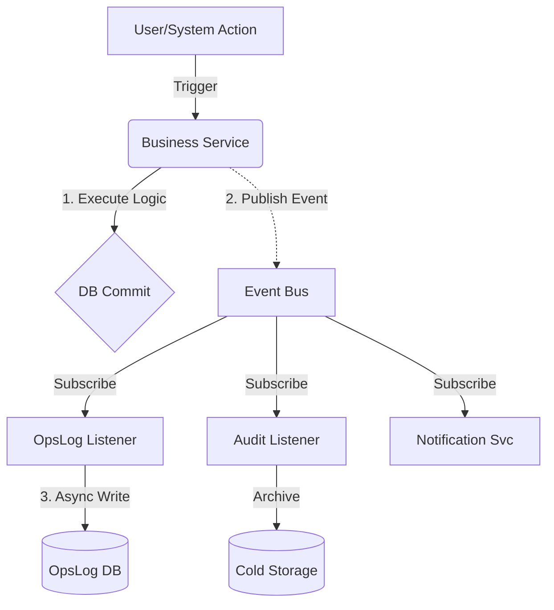

# 202601 운영로그 시스템 설계서 (Admin Ops Log Integration)

## 1. 개요 (Overview)

### 1-1. 배경 및 목적

현재 운영팀은 `[날짜]_운영일지.md` 파일을 로컬/문서함에서 수동으로 생성하고 관리하고 있습니다.
이로 인해 다음과 같은 비효율이 발생하고 있습니다:

1. **데이터 단절**: 어드민 상의 실제 지표(KPI, 지급 내역)를 수동으로 복사/붙여넣기 해야 함.
2. **컨텍스트 스위칭**: 어드민에서 작업하다가 별도 에디터로 가서 기록해야 함.
3. **가시성 부족**: 작성된 일지가 파일로 잠겨 있어, 어드민 대시보드나 다른 운영자가 실시간으로 확인하기 어려움.

본 설계서는 이 "운영 일지" 프로세스를 **어드민 시스템의 핵심 모듈**로 내재화하여,
**"행동(Operation)과 기록(Logging)의 일치"**를 달성하는 것을 목표로 합니다.

### 1-2. 핵심 요구사항 (User Request Extension)

1. **Integrated Writing & Context**:
   - 어드민 내 어디서든(사이드패널/위젯/전용페이지) 접근 가능한 글쓰기 환경.
   - **"오가닉(Organic) 연동"**: 로그에서 `user:123` 클릭 시 유저 상세 페이지로 이동, 반대로 유저 상세에서 "특이사항 기록" 시 로그에 자동 추가.
2. **Structured & Automated Input**:
   - **Dropdown Selection**: 대상(User, Team, Season 등)을 텍스트로 치는 게 아니라, DB 기반 드롭다운으로 선택하여 정확한 ID(FK) 매핑.
   - **Auto-Fill**: 선택된 컨텍스트(예: "골든아워")에 맞춰 템플릿과 필요 필드가 자동 세팅.
3. **Smart KPI Integration**:
   - `[Get KPI]` 버튼 클릭 시 매출, DAU, 이벤트 참여자 수 등을 실시간 쿼리로 가져와 테이블에 삽입.
4. **Markdown Compatibility**:
   - 최종 출력물은 익숙한 마크다운 형식을 유지하여 기존 보고 체계와 호환.

<a id="병렬작업"></a>

### 1-3. 병렬작업(Parallel Work) 진행 원칙

> 실개발 실행 체크리스트는 별도 문서: [202601운영로그설계체크리스트](202601운영로그설계체크리스트.md)

#### F. 감사 6단계 완료 후 후속 착수 범위
- **action_code 사전 최종 확정 + 승인 플로우**: BE/FE/테스트/Query Key 표 동기화, 미정의 코드는 ⚠️ 배지 유지
- **자동화/실시간 채널 개통**: Outbox/DLQ 워커 활성화, `/ws/admin/ops/events` 브로드캐스트 on, 모니터링 대시보드/알람 연결
- **고위험 UI 단계적 오픈**: 정책 스위치보드/대량 지급/브로드캐스트는 2-step Confirm + 권한 게이트 점검 후 릴리스
- **RTP v13.0 신규/주말 시나리오 반영**: action_code/프리셋 추가 및 QA 회귀 포함

운영로그 시스템은 “모든 감사/수정이 100% 완료된 후”에만 진행해야 하는 과업이 아닙니다.
다만 **의존성이 높은 요소는 잠깐 고정(Freeze)**하고, **리스크가 낮은 인프라부터 병렬로 선행**하는 것이 전체 리드타임을 줄입니다.

#### A. Freeze(선행 확정)해야 하는 범위

- **SoT/용어/키 체계**: `action_code` 체계(네이밍/Prefix), `ref_id` 멱등키 규칙, Immutable 로그 정책(`CORRECTION` 포함)
- **Admin API 컨벤션**: canonical `/admin/api/*` 유지(레거시 alias는 별도)
- **경제 SoT**: 금액 SoT(예: Vault Locked Balance) 등 “운영 로그가 참조/기록할 기준값”

#### B. 즉시 병렬로 시작해도 되는 범위(리스크 낮음)

> 현재 감사 5단계까지 마무리된 상태 기준, 아래 항목은 바로 병렬 착수 가능.

- 운영로그 **DB 스키마**(예: `OpsDailyLog`, `OpsLogEntry`) 및 마이그레이션(테이블/인덱스)
- **기본 CRUD API** (작성/조회/검색) + 권한(최소 Role 기반)
- 안전 규칙 구현: `ref_id` 멱등 처리, PII 마스킹, 수정/삭제 대신 `CORRECTION` 방식
- 어드민 “수동 기록”용 **Quick Ops Logger 1차 버전(MVP)** + Routine Tracker 슬롯 체크 + Golden Hour 토글 preset 연동(Confirm/토글 가드 포함)
- **Query Key Factory/낙관적 업데이트** 적용: `/admin/api/ops/log-entry` 기준으로 invalidate/setQueryData 정렬

#### C. 감사/수정 마무리 후에 붙이는 것이 좋은 범위(변경 가능성 높음)

- RTP 확장까지 포함한 **`action_code` 표준 사전(화이트리스트) 확정** 및 승인 워크플로우
- Outbox/DLQ, WebSocket 실시간 동기화 같은 **운영 영향이 큰 자동화/실시간 파이프라인**
- 잘못 누르면 즉시 장애로 이어질 수 있는 **실행형 UI**(정책 스위치보드/대량 발송/대량 지급)

#### D. 의사결정 기준(간단 룰)

- 감사/수정 작업이 **데이터 모델/용어/SoT를 흔들 가능성이 크면** → 기반 스펙만 Freeze 후 최소 인프라(MVP)부터
- 감사/수정 작업이 주로 **버그 수정/운영 안정화**이고 로그의 스키마/키 체계는 안정적이면 → 운영로그 인프라를 먼저 착수

#### E. 병렬 진행 체크리스트(권장)

- [ ] `ref_id`가 필요한 액션(지급/발송/배치)에 대한 멱등 기준 합의
- [ ] `meta_data` 타입별 스키마(검증/마스킹) 정의 완료
- [ ] 생성/수정 권한 + Confirm(이중 확인) UX 원칙 합의
- [ ] 초기에는 “수동 기록 중심”으로 시작하고, 자동화는 단계적으로 확장

---

## 2. 데이터 모델 설계 (Schema Design)

운영 로그를 단순 텍스트가 아닌 **관계형 데이터(RDB)**로 관리하여, 시스템 내 다른 모델(`User`, `Team`, `Item`)과 유기적으로 연결합니다.

### 2-1. OpsDailyLog (일일 메인 로그)

하루 하나의 메인 문서를 관리합니다.

| 필드명 | 타입 | 설명 | 관계 (Relations) |
|---|---|---|---|
| `date` | Date (PK) | 기준 일자 (예: 2026-01-10) | |
| `theme_title` | String | "오늘의 주력 테마" | |
| `manager_id` | Int (FK) | 작성 담당자 | `User(Admin)` |
| `status` | Enum | `DRAFT`, `PUBLISHED` | |
| `summary_md` | Text | (선택) 일일 요약/결론 | |
| `kpi_snapshot` | JSON | 마감 시점 확정 지표 | `DAU`, `Revenue` 등 |

### 2-2. OpsLogEntry (단위 액션 기록 - Structured)

**"모든 운영 행위는 데이터로 남는다."**
시스템 내 발생하는 모든 변경사항을 6하 원칙에 의거하여 정규화된 데이터로 저장합니다.

| 필드명 | 타입 | 설명 | 관계 & 상세 |
|---|---|---|---|
| `id` | BigInt | PK | Auto Increment |
| `daily_log_date` | Date (FK) | 소속 일자 (파티셔닝 키) | `OpsDailyLog`와 연결 |
| `timestamp` | Datetime | 발생 정밀 시간 (UTC) | Index(`timestamp`) |
| `category` | Enum | `ROUTINE`, `EVENT`, `ISSUE`, `PAYOUT`, `SYSTEM`, `AUDIT`, `CS`, `MARKETING`, `NOTIFICATION`, `EXPERIMENT`, `ANALYTICS` | 대분류 |
| `action_code` | String | 표준 액션 코드 | 예: `USER_GRANT_TICKET`, `SYS_GOLDEN_HOUR_ON` |
| `target_model` | Enum | `USER`, `TEAM`, `SEASON`, `ITEM`, `VAULT`, `MISSION`, `SYSTEM`, `NONE` | 연동 리소스 타입 (Polymorphic) |
| `target_id` | String | 타겟 식별자 | `User.id` 등 (Index) |
| `meta_data` | JSON | **Context Data Payload** | 하단 JSON Schema 참조 |
| `is_automated` | Boolean | 자동화 여부 | `True`: System Trigger, `False`: Manual |
| `actor_id` | Int (FK) | 수행 주체 | `User(Admin).id` or `System(0)` |

### 2-3. JSON Schema for `meta_data`

이벤트 성격에 따라 `meta_data`에 저장되는 페이로드 구조를 엄격히 정의합니다.

**Type A. 자산 지급 (PAYOUT)**

```json
{
  "reason": "TICKET_ZERO_POLICY", // 지급 사유 코드
  "assets": [
    {"type": "TICKET", "item_code": "ROULETTE", "amount": 3},
    {"type": "CURRENCY", "code": "POINT", "amount": 1000}
  ],
  "balance_after": 1500, // 지급 후 잔액 (Traceability)
  "ref_id": "REQ-20260110-001" // 관련 요청 ID
}
```

**Type B. 시스템 이벤트 (SYSTEM_EVENT)**

```json
{
  "event_name": "GOLDEN_HOUR",
  "trigger_by": "ADMIN_MANUAL", // or "SCHEDULED"
  "config_snapshot": {
    "multiplier": 2.5,
    "duration_sec": 7200,
    "target_segment": "ALL"
  }
}

```

**Type C. DM/CS 기록 (CS_DM)**

```json
{
  "channel": "TELEGRAM", // TELEGRAM | SLACK | OTHER
  "template_id": "SCENARIO_A_HESITANT",
  "tracking_tag": "DM_20260111_SEG_A",
  "trigger": {
    "type": "RULE", // RULE | MANUAL
    "expression": "LastLogin > 72h AND VaultBalance > 0"
  },
  "status": "SENT", // SENT | REPLIED | CONVERTED | NO_RESPONSE
  "response_summary": "REPLIED",
  "ref_id": "DM-20260111-0001"
}
```

**Type D. 채널 브로드캐스트 (MARKETING_BROADCAST)**

```json
{
  "channel": "TELEGRAM_CHANNEL",
  "campaign_id": "RTP-5.2_WAKEUP",
  "message_id": "tg_msg_12345",
  "audience": "ALL_SUBSCRIBERS",
  "copy_variant": "A",
  "sent_at": "2026-01-11T12:30:00Z"
}
```

**Type E. 세그먼트 타게팅 실행 (SEGMENT_ACTION)**

```json
{
  "segment_key": "SEG_A_UNLUCKY_NEWBIE",
  "segment_query": "signup<24h AND play_count>=10 AND vault=0 AND wallet=0",
  "result_count": 23,
  "action": "BULK_GRANT", // BULK_GRANT | BULK_DM | BOTH
  "bundle": {
    "trial_token_amount": 3,
    "vault_locked_amount": 1000,
    "voucher_codes": ["VOUCHER_GOLD_KEY_1"]
  },
  "dry_run": false,
  "ref_id": "SEG-20260111-0007"
}
```

**Type F. 설문/가설 검증 (SURVEY)**

```json
{
  "survey_id": "RTP-2.2",
  "method": "DM",
  "reward": {"type": "VAULT_LOCKED", "amount": 3000},
  "questions": ["Q1", "Q2", "Q3"],
  "answer": {"Q1": "A", "Q2": "B", "Q3": "A"},
  "ref_id": "SURVEY-20260111-0010"
}
```

**Type G. A/B 테스트 (EXPERIMENT_AB)**

```json
{
  "experiment_id": "RTP-3.6_XP_MULTIPLIER",
  "variant": "B",
  "assignment": "HASH_USER_ID",
  "start_at": "2026-01-11T00:00:00Z",
  "end_at": null,
  "metrics": ["DAU", "SESSION_TIME", "DEPOSIT_CONVERSION"],
  "config_snapshot": {"base_game_xp": 2}
}
```

**Type H. 업적/배지 언락 (ACHIEVEMENT_UNLOCKED)**

```json
{
  "badge_key": "FIRST_PLAY",
  "reward": {"type": "VAULT_LOCKED", "amount": 1000},
  "unlocked_at": "2026-01-11T09:10:00Z"
}
```

**Type I. 룰렛/출석 스핀 (DAILY_SPIN)**

```json
{
  "streak_day": 7,
  "pool": "DAY7",
  "spin_result": "JACKPOT",
  "reward": {"type": "VAULT_LOCKED", "amount": 10000, "items": ["GOLD_KEY"]},
  "ref_id": "SPIN-20260111-0420"
}
```

**Type J. 잭팟 풀/추첨 (JACKPOT_EVENT)**

```json
{
  "jackpot_id": "WEEKLY",
  "pool_before": 120000,
  "pool_after": 121000,
  "delta": 1000,
  "reason": "PLAY_100_INCREMENT",
  "draw": {
    "is_drawn": false,
    "winners": []
  }
}
```

**Type K. 푸시/알림 발송 (NOTIFICATION_DISPATCH)**

```json
{
  "channel": "PUSH",
  "trigger": "INACTIVE_24H",
  "message": "금고에 {balance}원이 기다립니다",
  "target_count": 120,
  "success_count": 118,
  "ref_id": "PUSH-20260111-0003"
}
```

**Type L. 손실 만회/캐시백/보험 (LOSS_RECOVERY_PAYOUT)**

```json
{
  "policy": "WEEKLY_CASHBACK",
  "basis": {"net_loss": 200000, "rate": 0.05},
  "amount": 10000,
  "credited_to": "VAULT_LOCKED",
  "computed_at": "2026-01-13T00:00:00Z",
  "ref_id": "LR-20260113-0001"
}
```

### 2-3. Relation Mapping (활용 모델)

로그 작성 시 드롭다운으로 선택 가능한 연결 모델들입니다. (app/models/* 참조)

- **User / AdminUserProfile**: 유저 CS 처리 기록 (`target_model='USER'`)
- **Team / TeamSeason**: 팀 배틀 조작 및 정산 (`target_model='TEAM'`)
- **Item (Inventory)**: 아이템 지급/회수 (`target_model='ITEM'`)
- **Vault (Vault2)**: 금고 리셋/비상 조치 (`target_model='VAULT'`)
- **Mission / Reward**: 미션 오류 수정 (`target_model='MISSION'`)

### 2-4. Retention Event Mapping (RTP 연동)

`[20261월첫째주]retention_turnaround_plan.md`의 모든 이벤트를 수용하기 위한 매핑입니다.

| RTP Section | Event Name | Log Category | Target Model | Meta Data 예시 |
|---|---|---|---|---|
| RTP-3.1 | Ticket Zero Grant | `PAYOUT` | `USER` | `{"reason": "TICKET_ZERO", "amount": 3}` |
| RTP-3.2 | Golden Hour | `EVENT` | `SYSTEM` | `{"multiplier": 2.5, "duration_min": 120}` |
| RTP-3.3 | Macro Mission | `EVENT` | `MISSION` | `{"mission_key": "MACRO_PLAY_30", "completers": 5}` |
| RTP-3.4 | Daily Spin | `ROUTINE` | `USER` | `{"spin_result": "JACKPOT", "reward": 10000}` |
| RTP-3.5 | VIP Cashback | `PAYOUT` | `USER` | `{"tier": "GOLD", "rate": 0.05, "amount": 50000}` |
| RTP-4.2 | High-Touch DM | `CS` | `USER` | `{"template": "SCENARIO_A_HESITANT", "response": "REPLIED"}` |
| RTP-6.6 | Personalized Offer | `EVENT` | `USER` | `{"offer_id": "DEPOSIT_BOOST", "conversion": true}` |

#### 2-4-1. RTP v13.0 전체 커버리지 매핑 (누락 0 목표)

> 목적: RTP의 “기능 구현” 자체가 아니라, **운영 실행/설정 변경/지급/커뮤니케이션/성과 측정**을 OpsLogEntry로 추적 가능하게 표준화합니다.

| RTP Ref | 운영 이벤트/행위 | category | action_code (예시) | target_model | meta_data 타입 |
|---|---|---|---|---|---|
| RTP-1 | 보유 자산 감사 수행(점검/결론 기록) | `AUDIT` | `AUDIT_INVENTORY_REVIEW` | `SYSTEM` | `SYSTEM_EVENT` |
| RTP-1 | 숨은 자산 “수동 활용” 실행(예: 신규에게 링크 DM) | `CS` | `CS_SEND_LINK` | `USER` | `CS_DM` |
| RTP-2.1 | 이탈 원인 분석/가설 기록 | `ANALYTICS` | `ANALYSIS_RETENTION_GAP_RECORDED` | `SYSTEM` | `SYSTEM_EVENT` |
| RTP-2.2 | 설문 DM 발송/응답 기록(+보상) | `CS` | `CS_SURVEY_DM` | `USER` | `SURVEY` |
| RTP-2.2 | 설문 응답 보상 지급 | `PAYOUT` | `USER_GRANT_SURVEY_REWARD` | `USER` | `PAYOUT` |
| RTP-3.1.1 | TicketZero 정책/한도 설정 변경(플래그/확률) | `SYSTEM` | `SYS_TRIAL_GRANT_POLICY_UPDATED` | `SYSTEM` | `SYSTEM_EVENT` |
| RTP-3.1.1 | 체험 티켓 지급(트리거/한도 결과 포함) | `PAYOUT` | `USER_TRIAL_GRANT` | `USER` | `PAYOUT` |
| RTP-3.1.2 | NewUserWelcome 노출 방식 변경(배너/모달/딥링크) | `SYSTEM` | `SYS_WELCOME_EXPOSURE_UPDATED` | `SYSTEM` | `SYSTEM_EVENT` |
| RTP-3.2.1 | 플레이 기본 XP 정책 변경(게임별) | `SYSTEM` | `SYS_GAME_BASE_XP_UPDATED` | `SYSTEM` | `SYSTEM_EVENT` |
| RTP-3.2.1 | 게임 플레이 결과 로그(필요 시) | `EVENT` | `GAME_PLAY_RECORDED` | `USER` | `SYSTEM_EVENT` |
| RTP-3.2.2 | 입금 XP 버프 정책 변경(STEP/XP_PER_STEP) | `SYSTEM` | `SYS_DEPOSIT_XP_RULE_UPDATED` | `SYSTEM` | `SYSTEM_EVENT` |
| RTP-3.2.3 | 연승 카운트 정책/보상룰 변경 | `SYSTEM` | `SYS_WIN_STREAK_RULE_UPDATED` | `SYSTEM` | `SYSTEM_EVENT` |
| RTP-3.2.3 | 연승 달성 보상 지급(3/5/10) | `PAYOUT` | `USER_WIN_STREAK_REWARD` | `USER` | `PAYOUT` |
| RTP-3.3.1 | Macro Mission 생성/활성화/변경 | `SYSTEM` | `SYS_MISSION_MACRO_UPDATED` | `MISSION` | `SYSTEM_EVENT` |
| RTP-3.3.1 | Macro Mission 달성 보상 지급 | `PAYOUT` | `USER_MISSION_MACRO_REWARD` | `USER` | `PAYOUT` |
| RTP-3.3.2 | 주간 잭팟 풀 증가(누적) | `EVENT` | `SYS_JACKPOT_POOL_INCREMENT` | `SYSTEM` | `JACKPOT_EVENT` |
| RTP-3.3.2 | 주간 잭팟 추첨 실행/당첨자 지급 | `PAYOUT` | `SYS_JACKPOT_DRAW_PAYOUT` | `USER` | `JACKPOT_EVENT` |
| RTP-3.4.1 | 업적 언락(+보상) | `EVENT` | `USER_ACHIEVEMENT_UNLOCKED` | `USER` | `ACHIEVEMENT_UNLOCKED` |
| RTP-3.4.2 | 일일 출석 룰렛 스핀 결과(+보상) | `ROUTINE` | `USER_DAILY_SPIN` | `USER` | `DAILY_SPIN` |
| RTP-3.4.3 | 라이브 피드 이벤트 게시(익명화) | `NOTIFICATION` | `FEED_EVENT_PUBLISHED` | `SYSTEM` | `SYSTEM_EVENT` |
| RTP-3.5.1 | VIP 티어 룰/등급 기준 변경 | `SYSTEM` | `SYS_VIP_TIER_RULE_UPDATED` | `SYSTEM` | `SYSTEM_EVENT` |
| RTP-3.5.1 | VIP 등급 변경(승급/강등) | `EVENT` | `USER_VIP_TIER_CHANGED` | `USER` | `SYSTEM_EVENT` |
| RTP-3.5.2 | 주간 캐시백 정산 실행/지급 | `PAYOUT` | `SYS_WEEKLY_CASHBACK_PAYOUT` | `USER` | `LOSS_RECOVERY_PAYOUT` |
| RTP-3.6 | A/B 테스트 생성/시작/종료 | `EXPERIMENT` | `EXP_AB_LIFECYCLE_UPDATED` | `SYSTEM` | `EXPERIMENT_AB` |
| RTP-3.6 | A/B 그룹 배정(유저) | `EXPERIMENT` | `EXP_AB_ASSIGNED` | `USER` | `EXPERIMENT_AB` |
| RTP-4.1 | 수동 지급 실행(정착지원/구조대/특진 등) | `PAYOUT` | `ADMIN_MANUAL_GRANT` | `USER` | `PAYOUT` |
| RTP-4.2 | 세그먼트 쿼리 실행/대상 확정 | `ANALYTICS` | `SEGMENT_QUERY_EXECUTED` | `SYSTEM` | `SEGMENT_ACTION` |
| RTP-4.2 | 세그먼트 일괄 지급/DM 실행 | `EVENT` | `SEGMENT_BULK_ACTION_EXECUTED` | `SYSTEM` | `SEGMENT_ACTION` |
| RTP-4.3 | 2주 운영 일정(플랜) 생성/수정 | `SYSTEM` | `OPS_SCHEDULE_UPDATED` | `SYSTEM` | `SYSTEM_EVENT` |
| RTP-4.4 | 하루 루틴 체크리스트 완료(09:00/12:30/18:00/21:00) | `ROUTINE` | `OPS_ROUTINE_CHECKED` | `SYSTEM` | `SYSTEM_EVENT` |
| RTP-5.1~5.3 | 텔레그램 채널 공지 발송(훅/웨이크업/전환) | `MARKETING` | `MARKETING_BROADCAST_SENT` | `SYSTEM` | `MARKETING_BROADCAST` |
| RTP-6.1 | Near Miss 연출(기능) 토글/정책 변경 기록 | `SYSTEM` | `SYS_NEAR_MISS_TOGGLE` | `SYSTEM` | `SYSTEM_EVENT` |
| RTP-6.2 | 푸시 디스패치(트리거별 발송) | `NOTIFICATION` | `NOTIFICATION_DISPATCHED` | `SYSTEM` | `NOTIFICATION_DISPATCH` |
| RTP-6.3 | 미스터리 박스/랜덤 보상 정책 변경 | `SYSTEM` | `SYS_MYSTERY_REWARD_RULE_UPDATED` | `SYSTEM` | `SYSTEM_EVENT` |
| RTP-6.4 | 리더보드 룰/보상 구조 변경 | `SYSTEM` | `SYS_LEADERBOARD_RULE_UPDATED` | `SYSTEM` | `SYSTEM_EVENT` |
| RTP-6.5 | 보험금/컴백 보너스 배치 실행 및 지급 | `PAYOUT` | `SYS_LOSS_RECOVERY_PAYOUT` | `USER` | `LOSS_RECOVERY_PAYOUT` |
| RTP-6.6 | 개인화 오퍼 생성/노출/전환 기록 | `EVENT` | `OFFER_PERSONALIZED_TRACKED` | `USER` | `SYSTEM_EVENT` |
| RTP-6.7 | 소셜 증거(당첨/출금 인증) 게시 기록 | `MARKETING` | `SOCIAL_PROOF_PUBLISHED` | `SYSTEM` | `SYSTEM_EVENT` |
| RTP-6.8 | “Just One More” 개입 트리거 기록(티켓 소진/무활동 등) | `NOTIFICATION` | `SESSION_EXTENSION_NUDGED` | `USER` | `NOTIFICATION_DISPATCH` |
| RTP-7.2/7.3 | DM 템플릿 사용/성과 기록(시나리오 A~J) | `CS` | `CS_DM_TEMPLATE_USED` | `USER` | `CS_DM` |

> 참고: RTP의 “UI/게임 기능 구현” 자체는 Product/Dev 범위이며, 운영로그는 **언제/누가/어떤 정책으로/누구에게/무슨 결과가 났는지**를 남기는 역할을 담당합니다.

---
---

## 3. 주요 기능 및 UX 설계 (Enterprise Command Center)

> **"어드민 패널이 곧 작전 지휘본부다."**
>
> 본 설계는 `retention_turnaround_plan.md`의 RTP-4 (1인 운영 매뉴얼)와 `admin_audit_plan_ko.md`의 전역 동기화 원칙을 통합하여, **마케팅 부서 수준의 실시간 운영 환경**을 구축합니다.

---

### 3-1. 대시보드 통합: Operations Command Center

기존 `AdminDashboardPage`를 **실시간 운영 지휘소(Command Center)**로 확장합니다.
단순 지표 확인을 넘어, **"관측 → 판단 → 행동 → 기록"**이 한 화면에서 이루어지는 워크플로우를 구현합니다.

#### A. 핵심 위젯 레이아웃 (Widget Grid)

```
┌─────────────────────────────────────────────────────────────────────┐
│  📊 KPI Command Panel (상단 고정)                                   │
│  ┌─────────┬─────────┬─────────┬─────────┬─────────┐               │
│  │  DAU    │ Revenue │ Deposit │ Withdraw│ Churn   │               │
│  │   47    │ ₩1.2M   │  ₩800K  │  ₩200K  │   3명   │               │
│  │  ▲12%   │  ▼8%    │  ▲15%   │  ▼50%   │🔴 위험  │               │
│  └─────────┴─────────┴─────────┴─────────┴─────────┘               │
├────────────────────────────────────────────────────────────────────┤
│  ⏰ Time-Based Routine Tracker (RTP-4.4 하루 루틴 연동)             │
│  ┌──────────────────────────────────────────────────────────────┐  │
│  │ 09:00 ☑ 어제 정산 확인   │ 14:00 ☐ 오후 세그먼트 DM           │  │
│  │ 10:00 ☑ 신규가입자 체크  │ 21:30 🔴 골든아워 FORCE_ON (NOW!)  │  │
│  │ 11:00 ☑ 이직자 DM 발송   │ 23:00 ☐ 일일 마감 리포트           │  │
│  └──────────────────────────────────────────────────────────────┘  │
├────────────────────────────────────────────────────────────────────┤
│  🎯 Segment Targeting Panel (RTP-4.2 심화 라이프사이클 개입)        │
│  ┌──────────────────────────────────────────────────────────────┐  │
│  │ [A] 운 없는 뉴비 (12명) [📤 Trial Bundle 일괄 지급]           │  │
│  │ [B] 멈춰버린 등반가 (8명) [📤 특진 골드키 지급]                │  │
│  │ [C] 아이쇼핑족 (23명) [📤 1:1 미끼 DM 발송]                   │  │
│  │ [D] 휴면 VIP (5명) [📤 골드 복귀 패키지]                      │  │
│  └──────────────────────────────────────────────────────────────┘  │
├───────────────────────────────────┬────────────────────────────────┤
│  📡 Live Event Feed               │  📝 Quick Ops Logger          │
│  ┌───────────────────────────┐    │  ┌─────────────────────────┐   │
│  │ 22:31 🔥 골든아워 시작       │    │  │ [특이사항 메모 입력...]│   │
│  │ 22:35 💰 user_123 출금승인   │    │  │ ─────────────────────│   │
│  │ 22:40 🎰 user_456 잭팟당첨   │    │  │ [📎유저 태그] [🏷 카테고리]│   
│  │ 22:45 ⚠️ 이상 패턴 감지      │    │  │ [✓ 로그 저장]         │   │
│  └───────────────────────────┘    │  └─────────────────────────┘   │
└───────────────────────────────────┴────────────────────────────────┘
```

### 3-2. 운영일지/플랜 자동 연동 (RTP + Daily Ops Log)

- **목표**: `[날짜]_운영일지.md` 수동 작성/관리 대신 OpsLog 기반으로 자동 생성·동기화하여 “행동=기록”을 완성.
- **입력 소스**: (1) RTP 일정/체크리스트 (예: 4.3 Week 1 Day6), (2) 일일 루틴 체크박스, (3) DM/지급 실행 이벤트, (4) Golden Hour 설정 변경.

#### A. 루틴 체크리스트 자동 로깅 (RTP-4.4)
- 예약 슬롯 정의: 09:00, 14:00, 16:00, 18:00, 20:30, 22:30 등 운영일지에 명시된 시간대를 `ops_routine_slots` 테이블로 관리.
- UI: Time-Based Routine Tracker에서 체크 시 `OpsLogEntry(category='ROUTINE', action_code='OPS_ROUTINE_CHECKED')` 자동 생성.
- 메타 예시:
```json
{
  "slot": "20:30",
  "task": "GOLDEN_HOUR_FORCE_ON",
  "status": "DONE",
  "ref_plan": "RTP-4.3-D6"
}
```

#### B. 골든아워(주말 2.5배) 실행 기록
- Preset: Weekend Golden Hour (20:30 FORCE_ON → 22:30 FORCE_OFF, multiplier 2.5).
- 액션 코드: `SYS_GOLDEN_HOUR_TOGGLE` (ON/OFF) + `SYS_GOLDEN_HOUR_MULTIPLIER_SET`.
- 메타 예시:
```json
{
  "manual_override": "FORCE_ON",
  "multiplier": 2.5,
  "start_at": "2026-01-11T20:30:00+09:00",
  "end_at": "2026-01-11T22:30:00+09:00",
  "reason": "WEEKEND_CARE_D6"
}
```
- 결과 기록: 종료 시점에 참여자 수/총 적립액을 `kpi_snapshot`에 반영하고 `OpsLogEntry(category='EVENT', action_code='GOLDEN_HOUR_SUMMARY')`로 집계 저장.

#### C. 설문/DM + 즉시 보상 워크플로우 (RTP-2.2, 일일지 D6)
- 대상 선택 UI: 세그먼트 쿼리 또는 CSV 업로드 → `target_list_id` 발급.
- 발송/응답 상태별 액션 코드:
  - `CS_SURVEY_DM_SENT` (meta: survey_id, target_count, ref_plan)
  - `CS_SURVEY_RESPONSE_RECORDED` (meta: answers, response_time)
  - `USER_GRANT_SURVEY_REWARD` (meta: reward=VAULT_LOCKED 3000, ref_id)
- 금고 임계점 DM(8.5k/9.2k 등)도 동일한 CS_DM 스키마로 기록, `tracking_tag`에 `VAULT_THRESHOLD_DM` 부여.

#### D. 수동 지급/이벤트 체크리스트 연동
- 일일지의 지급 테이블(예: 설문 응답 3,000P)과 OpsLog 동기화: 지급 UI에서 실행 시 자동으로 체크박스 완료 처리 및 `ref_id` 공유.
- 금고 임계점 유저 돌파 유도(“2명 이상 돌파”)는 KPI Widget에 목표값을 표시하고, 달성 시 `OPS_TARGET_REACHED` 로그 생성.

#### E. 템플릿/액션 사전 보강
- RTP v13.0 신규/주말 시나리오 사전 등록: `action_code`에 Weekend Golden Hour, 설문 보상, 퀴즈 이벤트 등을 미리 포함하여 누락 0 목표 유지.
- 관리자 가이던스: 각 Preset 실행 시 “로그가 자동 생성됨” 배지 노출로 수동 기록 실수를 차단.

### 3-3. 프론트 단계별 체크리스트 & 상태 동기화 규칙

- **우선순위 구현 단계 (UI → API 연동 포인트)**
  1) Quick Ops Logger MVP: 사이드패널/모달에서 단일 로그 작성 → `POST /admin/api/ops/log-entry`.
  2) Routine Tracker: 시간 슬롯 체크 → `OPS_ROUTINE_CHECKED` 자동 호출 (`POST /admin/api/ops/log-entry`).
  3) Golden Hour Preset: ON/OFF + 배수 변경 버튼 → `SYS_GOLDEN_HOUR_TOGGLE`, `SYS_GOLDEN_HOUR_MULTIPLIER_SET` API 호출.
  4) Survey/DM 패널: 발송/응답/보상 → `CS_SURVEY_DM_SENT`, `CS_SURVEY_RESPONSE_RECORDED`, `USER_GRANT_SURVEY_REWARD`.
  5) Import 옵션(후순위): 업로드 → 파싱 → 백필 `POST /admin/api/ops/log-entry/bulk`.

- **React Query 키/캐시 전략**
  - `opsLogKeys.list(date)` / `opsLogKeys.detail(id)` / `opsLogKeys.dailyLog(date)`로 계층화.
  - Routine/GH/Survey 액션 후: `invalidateQueries(opsLogKeys.list(date))` + 낙관적 업데이트(optimistic) → 실패 시 롤백.
  - Live Feed/실시간: WebSocket 수신 시 `queryClient.setQueryData`로 prepend, 200건 이상은 trim.

- **낙관적 업데이트 가이드**
  - 성공 기준: 2xx 응답 시 확정, 4xx/5xx 시 원복 + 토스트(실패 사유 노출).
  - 멱등 `ref_id` 사용 시 중복 생성 방지: 동일 `ref_id` 존재하면 캐시 갱신만.

- **BE/FE 정렬 원칙**
  - 액션 코드/Query Key/엔드포인트를 동일 표로 관리(`action_code` ↔ `opsLogKeys.*` ↔ `/admin/api/ops/*`), 티켓 생성 시 링크 필수.

- **에러/권한/확인 UX 규칙**
  - 권한 부족: “권한이 없습니다. 관리자에게 요청하세요.” (Toast + Disable 유지)
  - 파괴적 액션(GH 토글, 대량 지급): 2-step Confirm 모달 + `ref_id` 표시.
  - Validation 오류: 필드 하이라이트 + 인라인 메시지, 서버 오류는 상단 토스트.

#### A-2. 확장 위젯 레이아웃 (RTP v13.0 확장)

> RTP v13.0에서 추가된 축(설문/채널/푸시/AB/손실회복/잭팟/오퍼/개입 트리거)을 “관측→판단→행동→기록” 루프에 넣기 위한 확장안입니다.

```
┌────────────────────────────────────────────────────────────────────────┐
│  🧭 Policy & Experiment Control (운영 스위치보드)                         │
│  [Near Miss ON/OFF] [XP 배율 A/B] [GoldenHour MULTI] [MysteryRule]      │
│  [Leaderboard Rule] [JustOneMore Nudge Rule]                             │
├────────────────────────────────────────────────────────────────────────┤
│  🧪 Experiment Monitor              │  🔔 Notification / Broadcast Queue │
│  - RTP-3.6_XP_MULTIPLIER: A/B       │  - PUSH: INACTIVE_24H (118/120)    │
│  - Deposit Bonus Copy: A/B          │  - TG Channel: RTP-5.2_WAKEUP sent │
├───────────────────────────────────┬────────────────────────────────────┤
│  🧾 Survey Tracker (RTP-2.2)       │  💸 Loss Recovery Jobs (RTP-6.5/3.5)│
│  - Sent 15 / Replied 6 / Conv 2    │  - Weekly Cashback: DONE 120 users  │
│  - Answer Split: Q1(A/B)           │  - Insurance Payout: RUNNING        │
├───────────────────────────────────┴────────────────────────────────────┤
│  🏆 Jackpot / Leaderboard Snapshot                                    │
│  - Weekly Jackpot Pool: ₩121,000   - Today TOP10: …                    │
└────────────────────────────────────────────────────────────────────────┘
```

#### B. 위젯별 상세 사양

| 위젯명 | 데이터 소스 | 갱신 주기 | 인터랙션 | RTP 연동 |
|---|---|---|---|---|
| **KPI Command Panel** | `/admin/api/dashboard/metrics` | 5분 (WebSocket 푸시 권장) | 클릭 시 상세 드릴다운 | - |
| **Time-Based Routine Tracker** | `OpsDailyLog.routines` + (신규) `/admin/api/ops/checklist/today` | 분 단위 하이라이트 | 체크박스 토글 → 자동 로그 | RTP-4.4 |
| **Segment Targeting Panel** | `/admin/api/segments` + `/admin/api/crm/segment-detail` | 1시간 | 액션 버튼 → Bulk Grant/DM | RTP-4.2 |
| **Live Event Feed** | WebSocket `/ws/admin/ops/events` | 실시간 | 클릭 시 유저 상세 이동 | RTP-3.4 |
| **Quick Ops Logger** | (신규) `POST /admin/api/ops/log-entry` | 즉시 | 자유 입력 → OpsLogEntry 생성 | - |

**추가 위젯 (RTP v13.0 확장)**

| 위젯명 | 데이터 소스 | 갱신 주기 | 인터랙션 | RTP 연동 |
|---|---|---|---|---|
| **Policy & Experiment Control** | `/admin/api/ui-config` + `/admin/api/feature-schedule` + (신규) `/admin/api/ops/experiments/active` | 1분 | 토글/수정 → 정책 변경 로그 자동 기록 | RTP-3.6, 6.1~6.4, 6.8 |
| **Experiment Monitor** | (신규) `/admin/api/ops/experiments/summary` | 5~15분 | 실험 상세/변형 전환 → 로그 + KPI 드릴다운 | RTP-3.6 |
| **Notification Queue** | `/admin/api/dashboard/notifications/nudge` + (신규) `/admin/api/ops/notifications/dispatches/recent` | 1~5분 | 재발송/중지/샘플 미리보기 → 로그 기록 | RTP-6.2, 6.8 |
| **Broadcast Queue** | `/admin/api/crm/messages` + (신규) `/admin/api/ops/marketing/broadcasts/recent` | 1~5분 | 채널 공지 발송/수정 → 로그 기록 | RTP-5 |
| **Survey Tracker** | `/admin/api/surveys/{survey_id}/stats` + `/admin/api/surveys/{survey_id}/responses` | 10분 | 응답 보기/보상 지급/재촉 DM → 로그 기록 | RTP-2.2 |
| **Loss Recovery Jobs** | `/admin/api/economy/stats` + (신규) `/admin/api/ops/loss-recovery/jobs/recent` | 5~30분 | 배치 실행/재실행/결과 보기 → 로그 기록 | RTP-6.5, 3.5.2 |
| **Jackpot Snapshot** | (신규) `/admin/api/ops/jackpot/weekly/status` | 1~5분 | 추첨 실행/당첨자 확인/지급 → 로그 기록 | RTP-3.3.2 |
| **Leaderboard Snapshot** | `/admin/api/ranking/{day}` | 5~30분 | 룰 변경/보상 분배 실행 → 로그 기록 | RTP-6.4 |

> 엔드포인트 표기 원칙: 이 코드베이스의 Admin API canonical prefix는 `/admin/api/*`입니다. 레거시 `/api/admin/*` 호출은 서버 미들웨어가 대부분 `/admin/api/*`로 자동 매핑합니다(단, 일부 예외 경로는 원본 유지).

#### C. Global Sync 적용 (admin_audit_plan 연동)

`admin_audit_plan_ko.md`의 **Query Key Factory 패턴** 및 **Smart Invalidation**을 적용합니다.

- **Optimistic Update**: 체크박스 토글 시 UI 즉시 반영, 서버 응답 대기 없음.
- **Cross-Widget Sync**: Segment Panel에서 액션 실행 → KPI Panel + Live Feed 동시 갱신.
- **Cache Strategy**: `opsLogKeys.list(date)`, `opsLogKeys.detail(id)` 계층적 키 관리.

---

### 3-2. 운영 일지 상세 페이지: Smart Editor Pro

경로: `/admin/ops/logs/{date}`

> **"단순 기록이 아닌, 실행과 기록의 일체화"**

#### A. 섹션형 블록 에디터 (Notion-Like UX)

| 블록 타입 | 설명 | 자동화 요소 |
|---|---|---|
| **🎯 오늘의 테마** | H1 크기 입력 필드. 일지 제목 및 핵심 목표. | 템플릿 선택 시 자동 채움 |
| **⏰ 루틴 타임라인** | 시간대별 체크리스트 (Vertical Timeline UI) | 완료 시 `OpsLogEntry(category='ROUTINE')` 자동 생성 |
| **👥 타겟 유저 쿼리** | SQL-Like 세그먼트 빌더 또는 프리셋 선택 | 결과 테이블 자동 삽입 |
| **💬 DM 발송 기록** | 발송 대상 테이블 + 템플릿 선택 + 발송 버튼 | 발송 완료 → `OpsLogEntry(category='CS')` + 응답률 집계 |
| **📊 KPI 스냅샷** | `[Fetch KPI]` 버튼으로 실시간 데이터 삽입 | 마감 시 자동 스냅샷 저장 (`OpsDailyLog.kpi_snapshot`) |
| **🚨 이상/이슈 로그** | 자유 텍스트 + 태그 (`#긴급`, `#버그`, `#CS`) | `OpsLogEntry(category='ISSUE')` 생성 |
| **💰 지급/정산 기록** | 지급 대상 선택 (Dropdown Search) + 금액 | `OpsLogEntry(category='PAYOUT')` + `meta_data` 자동 매핑 |
| **🧪 A/B 테스트 카드** | 실험 선택/변형/기간/지표 설정 | `OpsLogEntry(category='EXPERIMENT')` + `meta_data=EXPERIMENT_AB` |
| **🔔 푸시/알림 발송** | 트리거/메시지/대상 수/성공률 기록 | `OpsLogEntry(category='NOTIFICATION')` + `meta_data=NOTIFICATION_DISPATCH` |
| **📣 채널 브로드캐스트** | 채널/카피/캠페인/발송 결과 기록 | `OpsLogEntry(category='MARKETING')` + `meta_data=MARKETING_BROADCAST` |
| **🧾 설문(가설 검증)** | 설문ID/문항/응답/보상 처리 | `OpsLogEntry(category='CS')` + `meta_data=SURVEY` (+ 필요 시 `PAYOUT`) |
| **💸 손실 만회 배치** | 보험/컴백/캐시백 정산 실행/결과 | `OpsLogEntry(category='PAYOUT')` + `meta_data=LOSS_RECOVERY_PAYOUT` |
| **🏆 잭팟/추첨 관리** | 풀 증감/추첨 실행/당첨자/지급 기록 | `OpsLogEntry(category='EVENT' or 'PAYOUT')` + `meta_data=JACKPOT_EVENT` |
| **🧭 정책 변경 기록** | Near Miss/미스터리박스/리더보드/JustOneMore 룰 토글 | `OpsLogEntry(category='SYSTEM')` + `meta_data=SYSTEM_EVENT` |

#### A-2. 블록 → 로그 타입 매핑 가이드 (RTP 확장)

- “실행한 사실”만 남기면 분석이 불가능해지므로, 블록 저장 시에는 항상 `action_code`와 `meta_data` 타입을 고정합니다.
- 예: A/B 테스트 생성/변경은 `action_code=EXP_AB_LIFECYCLE_UPDATED` + `meta_data=EXPERIMENT_AB`, 푸시 발송은 `action_code=NOTIFICATION_DISPATCHED` + `meta_data=NOTIFICATION_DISPATCH`.

#### B. 세그먼트 빌더 (RTP-4.2 통합)

`retention_turnaround_plan.md`의 Segment Targeting Protocol을 직접 실행할 수 있는 UI입니다.

```
┌─────────────────────────────────────────────────────────────────┐
│  📋 세그먼트 쿼리 빌더                                           │
├─────────────────────────────────────────────────────────────────┤
│  [프리셋 선택 ▼]                                                 │
│  ┌─────────────────────────────────────────────────────────┐    │
│  │ ☐ [A] 운 없는 뉴비: 가입 24h 내 + 잔액 0 + 플레이 10+     │    │
│  │ ☐ [B] 멈춰버린 등반가: Level 4-5 + 48h XP 미획득         │    │
│  │ ☐ [C] 아이쇼핑족: 로그인 3일+ + 입금 0                   │    │
│  │ ☐ [D] 임계점 유저: 금고 8,000~9,999원                   │    │
│  │ ☐ [VIP] 휴면 고래: 누적입금 100만+ + 7일 미접속          │    │
│  └────────────────────────────────────────────────────────┘    │
│                                                                │
│  또는 커스텀 조건:                                              │
│  [vault_locked_balance] [>=] [8000] [AND]                      │
│  [last_login_at] [<] [7 days ago]                              │
│                                                                │
│  [🔍 쿼리 실행] → 결과: 23명                                    │
│  ┌──────────────────────────────────────────────────────────┐  │
│  │ ID  │ 닉네임    │ 금고잔액 │ 최근접속 │ 액션               │  │
│  │ 123 │ 사장님A  │ ₩8,500  │ 3일 전  │ [📤DM] [💰지급]     │  │
│  │ 456 │ VIP고래  │ ₩9,200  │ 5일 전  │ [📤DM] [💰지급]     │  │
│  └──────────────────────────────────────────────────────────┘  │
│                                                                │
│  [📤 일괄 DM 발송] [💰 일괄 Trial Bundle 지급] [📋 로그에 기록] │   
│────────────────────────────────────────────────────────────────┘
```

#### C. DM 발송 통합 (RTP-7 연동)

`retention_turnaround_plan.md`의 High-Touch 1:1 DM 가이드를 시스템화합니다.

| 필드 | 설명 | 자동화 |
|---|---|---|
| **템플릿 선택** | `SCENARIO_A_HESITANT`, `SCENARIO_B_INACTIVE` 등 | 변수 자동 치환 (`{{nickname}}`, `{{vault_balance}}`) |
| **발송 채널** | Telegram (기본), Slack (내부) | 봇 API 연동 |
| **추적 태그** | `DM_20260111_SEG_A` | 응답률/전환율 집계용 |
| **결과 기록** | `SENT`, `REPLIED`, `CONVERTED`, `NO_RESPONSE` | `OpsLogEntry.meta_data.response` 자동 업데이트 |

---

### 3-3. 템플릿 시스템: Context-Aware Presets

운영 컨텍스트에 따라 **일지 구조와 루틴이 자동으로 세팅**됩니다.

| 템플릿 ID | 적용 조건 | 포함 루틴 | 기본 테마 |
|---|---|---|---|
| `WEEKDAY_NORMAL` | 월~금 (이벤트 없음) | 오전 점검, 3회 DM, 골든아워 | "일일 운영" |
| `WEEKEND_INTENSIVE` | 토~일 | 오전/오후 DM, 2회 골든아워, 야간 모니터링 | "주말 집중 운영" |
| `EVENT_JACKPOT_DAY` | VaultProgram.event_active | 잭팟 발동, 채널 공지, VIP 케어 | "잭팟 이벤트 D-Day" |
| `NEW_CAMPAIGN_LAUNCH` | 캠페인 시작일 | 사전 점검, 중간 피드백, 마감 리포트 | "신규 캠페인 런칭" |

**Auto-Suggest 로직**:

- 시스템이 현재 날짜, 요일, 활성 이벤트를 감지하여 **권장 템플릿**을 자동 제안.
- 운영자는 원클릭으로 적용하거나 커스텀 수정 가능.

---

### 3-5. 전역 입력 표준: Hybrid Input (Editable Combobox)

> **"시스템은 제안하고, 운영자가 결정한다."**
>
> 소규모 운영 환경에서는 사전 정의된 옵션만으로 모든 상황을 커버할 수 없습니다.
> **드롭다운 선택 + 직접 입력**이 가능한 **Editable Combobox** 패턴을 전역 표준으로 적용합니다.

#### A. 적용 대상 필드 (Global Scope)

| 필드 유형 | 드롭다운 프리셋 예시 | 직접 입력 허용 | 유효성 검증 |
|---|---|---|---|
| **일자 (Date)** | `오늘`, `어제`, `이번 주 시작` | ✅ `YYYY-MM-DD` 수동 입력 | 날짜 형식 체크 |
| **시간 (Time)** | `09:00`, `14:00`, `21:30 (골든아워)` | ✅ `HH:MM` 수동 입력 | 24시간 형식 체크 |
| **기간 (Duration)** | `1시간`, `2시간`, `24시간`, `7일` | ✅ `30분`, `90분` 등 자유 입력 | 분/시간/일 파싱 |
| **금액/수량 (Amount)** | `1,000`, `5,000`, `10,000`, `50,000` | ✅ 숫자 직접 입력 | 최소/최대값 경고 |
| **유저 선택 (User)** | 최근 접촉 유저 5명, 세그먼트 상위 10명 | ✅ `user_id`, `닉네임`, `@telegram` 검색 | 존재 여부 API 체크 |
| **보상 타입 (Reward)** | `POINT`, `TRIAL_TOKEN`, `GOLD_KEY` | ✅ 신규 타입 직접 입력 (경고 표시) | Enum White-list 권장 |
| **템플릿 (Template)** | `SCENARIO_A`, `SCENARIO_B`, `VIP_RETURN` | ✅ 완전 커스텀 메시지 작성 | 필수 변수 누락 경고 |
| **태그 (Tag)** | `#긴급`, `#정산`, `#CS`, `#이벤트` | ✅ 새 태그 즉시 생성 가능 | - |

**RTP v13.0 확장 입력 필드 (운영로그/스위치보드 공통)**

| 필드 유형 | 드롭다운 프리셋 예시 | 직접 입력 허용 | 유효성 검증 |
|---|---|---|---|
| **카테고리 (category)** | `ROUTINE`, `PAYOUT`, `CS`, `MARKETING`, `NOTIFICATION`, `EXPERIMENT` | ✅ (권한자만) | Enum 제한 + 역할 기반 권한 |
| **액션 코드 (action_code)** | `ADMIN_MANUAL_GRANT`, `CS_DM_TEMPLATE_USED`, `NOTIFICATION_DISPATCHED` | ✅ (고급 모드) | Prefix/화이트리스트 + 미정의 코드는 ⚠️ 배지 |
| **타겟 모델 (target_model)** | `USER`, `MISSION`, `SYSTEM` | ✅ (권한자만) | Enum 제한 + target_id 존재 체크 |
| **세그먼트 키 (segment_key)** | `SEG_A_UNLUCKY_NEWBIE` 등 | ✅ (신규 세그먼트 생성) | 키 형식 + 쿼리 프리뷰/실행 가능 여부 |
| **설문 ID (survey_id)** | `RTP-2.2` | ✅ | `/admin/api/surveys/{id}` 존재 여부 |
| **실험 ID (experiment_id)** | `RTP-3.6_XP_MULTIPLIER` | ✅ | 활성 기간/변형 값 검증 |
| **캠페인 ID (campaign_id)** | `RTP-5.2_WAKEUP` | ✅ | 채널/카피 버전/대상 정의 누락 검증 |
| **알림 트리거 (trigger)** | `INACTIVE_24H`, `SESSION_EXTENSION_NUDGE` | ✅ | 트리거 파라미터 스키마 검증 |
| **정책 키 (policy_key)** | `NEAR_MISS`, `MYSTERY_REWARD_RULE`, `LEADERBOARD_RULE` | ✅ | 현재값 diff 프리뷰 + 적용 범위 경고 |
| **참조 ID (ref_id)** | `REQ-YYYYMMDD-###` | ✅ | 멱등키/중복 방지(동일 ref_id 재요청 차단) |
| **Payload (meta_data)** | 타입별 폼 생성(`CS_DM`, `SURVEY`, `EXPERIMENT_AB`...) | ✅ (폼 기반) | JSON Schema validation + PII 자동 마스킹 |

#### B. UI/UX 패턴 (Editable Combobox)

```
┌─────────────────────────────────────────────────────────────┐
│  📋 시간 입력 필드 예시                                      │
├─────────────────────────────────────────────────────────────┤
│  ┌─────────────────────────────────────────────────┐        │
│  │ 21:30 (골든아워)                               ▼ │        │
│  └─────────────────────────────────────────────────┘        │
│    ┌─────────────────────────────────────────────────┐      │
│    │ 🕐 09:00 (오전 점검)                            │      │
│    │ 🕐 14:00 (오후 DM)                              │      │
│    │ 🔥 21:30 (골든아워) ← 현재 선택                  │      │
│    │ 🌙 23:59 (마감)                                 │      │
│    ├─────────────────────────────────────────────────┤      │
│    │ ⌨️ 직접 입력: [22:00        ]  [✓ 적용]         │      │
│    └─────────────────────────────────────────────────┘      │
│  💡 프리셋 외 시간도 직접 입력 가능합니다.                    │
└─────────────────────────────────────────────────────────────┘
```

**확장 패턴: “액션 코드 + 페이로드(meta_data)” 동시 편집**

> RTP v13.0 확장 위젯/블록은 대부분 “무엇을 했다(action_code)”와 “근거/맥락(meta_data)”를 같이 남겨야 감사/통계가 됩니다.

```
┌──────────────────────────────────────────────────────────────────────┐
│  🧾 OpsLog Draft                                                     │
├──────────────────────────────────────────────────────────────────────┤
│  [category ▼]  CS                                                    │
│  [action_code ▼] CS_DM_TEMPLATE_USED                                 │
│  [target_model ▼] USER     [target_id 🔎] user_id / nickname / @tg   │
│                                                                      │
│  [meta_data 타입 ▼] CS_DM                                            │
│  ┌───────────────────────────────────────────────────────────────┐   │
│  │ template_id: [SCENARIO_A_HESITANT ▼]                           │   │
│  │ tracking_tag: [DM_20260111_SEG_A________]                      │   │
│  │ status: [SENT ▼]                                               │   │
│  │ ref_id: [DM-20260111-0001_____]                                │   │
│  └───────────────────────────────────────────────────────────────┘   │
│                                                                      │
│  [JSON 미리보기]  {"channel":"TELEGRAM", ... }                     │
│  [✓ 저장]  [↩ 되돌리기]                                              │
└──────────────────────────────────────────────────────────────────────┘
```

**확장 패턴: “신규 값 만들기(Create New) + 경고 배지”**

- 예: 새 `campaign_id`, 새 `segment_key`, 새 `action_code`는 생성 가능하지만, 생성 즉시 ⚠️ 배지를 붙이고 “검수 필요” 상태로 저장(추후 승인 워크플로우 확장 가능).

#### C. 구현 원칙

1. **프리셋 우선 노출**: 자주 사용되는 값을 드롭다운 상단에 배치.
2. **직접 입력 영역 하단 고정**: "직접 입력" 필드는 드롭다운 최하단.
3. **실시간 유효성 검증**: 직접 입력 시 형식 오류를 **즉시 인라인 경고**로 표시.
4. **히스토리 학습**: 운영자가 자주 입력하는 커스텀 값은 **자동으로 프리셋에 추가** (opt-in).
5. **Unknown Value 허용**: 시스템에 정의되지 않은 값도 입력 가능 + **⚠️ 경고 배지** 표시.

6. **action_code 우선(SoT)**: 모든 기록은 `action_code`가 1차 분류 키이며, `category`는 UI 필터/그룹핑 보조로 사용.
7. **meta_data 타입 고정**: 저장 시 `meta_data`는 타입(`CS_DM`, `SURVEY`, `EXPERIMENT_AB` 등)을 먼저 선택하고, 폼 기반 입력으로 JSON을 생성.
8. **스키마 버전 관리**: `meta_data`에는 필요 시 `schema_version`(예: `1`)를 포함해 향후 확장 시 하위 호환을 보장.
9. **멱등키(ref_id) 의무화(중요 액션)**: 지급/브로드캐스트/푸시/배치 실행은 `ref_id`를 필수로 하여 중복 실행을 방지.
10. **권한/확인(Confirm) 게이트**: `PAYOUT`, `MARKETING_BROADCAST`, `NOTIFICATION` 실행은 2단계 확인(요약→확정)과 권한 체크를 기본.
11. **PII 최소화**: 입력 단계부터 마스킹/금칙어 감지(전화번호 등)를 적용하고, 원문이 필요하면 별도 보안 저장소로 분리.
12. **Immutable 로그 원칙**: 수정/삭제 대신 `CORRECTION`(상쇄) 로그를 추가하는 방식만 허용.

---

### 3-5-1. 최소 권한/Confirm/실시간 규칙 (RTP v13.0 동기화)

- **Role Scope (제안)**
  - `ROUTINE`/`AUDIT`/`SYSTEM` 조회·기록: `ROLE_OPERATOR` 이상
  - `PAYOUT`/`SEGMENT_*`/`ADMIN_MANUAL_GRANT`/`SYS_*PAYOUT`: `ROLE_MANAGER` 이상
  - `MARKETING_BROADCAST`/`NOTIFICATION_DISPATCH`/`EXPERIMENT_AB`: `ROLE_ADMIN` 이상
- **2-Step Confirm 필수 액션**: `PAYOUT` 전류(`ADMIN_MANUAL_GRANT`, `SYS_LOSS_RECOVERY_PAYOUT`, `SYS_WEEKLY_CASHBACK_PAYOUT`, `SYS_JACKPOT_DRAW_PAYOUT`, `USER_TRIAL_GRANT`, `USER_WIN_STREAK_REWARD`), `SEGMENT_BULK_ACTION_EXECUTED`, `MARKETING_BROADCAST_SENT`, `NOTIFICATION_DISPATCHED`
- **Outbox 적재 대상(비동기/재시도)**: 지급/발송/대량 실행 계열 (`PAYOUT*`, `SEGMENT_BULK_ACTION_EXECUTED`, `MARKETING_BROADCAST_SENT`, `NOTIFICATION_DISPATCHED`, `SYS_LOSS_RECOVERY_PAYOUT`, `SYS_WEEKLY_CASHBACK_PAYOUT`)
- **WebSocket 브로드캐스트 대상**: 운영 대시보드 Live Feed 업데이트가 필요한 액션 (`OPS_ROUTINE_CHECKED`, `SYS_GOLDEN_HOUR_*`, `SEGMENT_*`, `MARKETING_BROADCAST_SENT`, `NOTIFICATION_DISPATCHED`, `CS_*`, `PAYOUT*`, `EXP_AB_*`, `JACKPOT_EVENT`)
- **WebSocket/Outbox 페이로드 최소 필드**: `action_code`, `category`, `target_model`, `target_id`, `meta_data`, `actor_id`, `ref_id`, `timestamp`

---

## 4. Technical Implementation (Event-Driven Architecture)

### 4-1. Architecture Overview

**"Organic Logging"**을 구현하기 위해 **Event Bus Pattern**을 도입합니다. 비즈니스 로직(Service)은 로그 시스템을 직접 호출하지 않고, 이벤트를 발행(Publish)만 합니다.



  **확장 설계 포인트 (RTP v13.0 대응)**

  - **Admin API Prefix**: 관리자 API는 `/admin/api/*`가 canonical이며, 레거시 `/api/admin/*`는 서버에서 대부분 alias 처리.
  - **이벤트 분류(대표)**: `CS_DM`, `MARKETING_BROADCAST`, `NOTIFICATION_DISPATCH`, `SURVEY`, `EXPERIMENT_AB`, `SEGMENT_ACTION`, `JACKPOT_EVENT`, `LOSS_RECOVERY_PAYOUT`.
  - **Outbox(권장)**: “운영 실행/지급/발송” 계열은 DB 커밋과 함께 Outbox에 이벤트를 적재하고, 워커가 재시도/중복 제거를 수행(멱등키=`ref_id`).
  - **DLQ(권장)**: 이벤트 처리 실패는 Dead-Letter Queue(또는 fail 테이블)에 적재하여 운영자가 Command Center에서 재처리.
  - **실시간 동기화**: 처리 완료 이벤트는 WebSocket(`/ws/admin/ops/events`)로 브로드캐스트하여 위젯/에디터가 즉시 갱신.

### 4-2. Backend Implementation (FastAPI)

**Observer Pattern**을 활용하여 결합도를 낮추고 확장성을 확보합니다.

1. **Event Definition**: 모든 중요 행위를 `BaseEvent`를 상속받는 클래스로 정의.

    ```python
    @dataclass
    class GoldenHourTriggeredEvent(BaseEvent):
        admin_id: int
        multiplier: float
        timestamp: datetime
    ```

    **RTP 확장 이벤트 예시(개념)**

    - `AdminDmSentEvent` → `meta_data=CS_DM`
    - `SurveyResponseRecordedEvent` → `meta_data=SURVEY`
    - `ExperimentLifecycleUpdatedEvent` → `meta_data=EXPERIMENT_AB`
    - `NotificationDispatchedEvent` → `meta_data=NOTIFICATION_DISPATCH`
    - `MarketingBroadcastSentEvent` → `meta_data=MARKETING_BROADCAST`
    - `SegmentBulkActionExecutedEvent` → `meta_data=SEGMENT_ACTION`
    - `JackpotPoolChangedEvent` / `JackpotDrawnEvent` → `meta_data=JACKPOT_EVENT`
    - `LossRecoveryPayoutExecutedEvent` → `meta_data=LOSS_RECOVERY_PAYOUT`

2. **Event Bus (`app/core/event_bus.py`)**:
    - `FastAPI.BackgroundTasks` 또는 `Celery`를 사용하여 비동기 처리.
    - 메인 트랜잭션 성공 후 실행(Post-Commit Hook) 보장.

  **권장: 멱등/재시도 규약**

  - `ref_id`가 있는 이벤트는 리스너에서 “이미 처리됨”을 먼저 확인(중복 실행 방지)
  - `PAYOUT/MARKETING/NOTIFICATION`는 최소 1회 기록이 남도록 재시도 정책 적용

3. **Log Listener (`app/listeners/ops_log_listener.py`)**:
    - 이벤트를 수신하여 `OpsLogEntry` 스키마로 변환 후 DB 저장.
    - `meta_data` 필드에 이벤트 Payload 자동 매핑.

  **리스너 표준 출력(권장 필드)**

  - `category`, `action_code`, `target_model`, `target_id`, `actor_id`, `is_automated`
  - `meta_data`: 위 2-3의 타입 중 하나로 저장(폼/스키마 기반)

  **기존 라우트 연계 포인트(현 코드베이스 기준)**

  - 대시보드: `/admin/api/dashboard/*` (예: metrics, events-status, notifications/nudge)
  - 설문: `/admin/api/surveys/*` (stats, responses 등)
  - CRM 메시지(텔레그램 fan-out 포함): `/admin/api/crm/messages`
  - 세그먼트: `/admin/api/segments`, `/admin/api/crm/segment-detail`
  - 정책/스케줄: `/admin/api/ui-config`, `/admin/api/feature-schedule`

  **(신규) 운영로그 모듈 라우트 제안(컨벤션 정렬)**

  - `POST /admin/api/ops/log-entry` (Quick Logger / 블록 저장)
  - `GET /admin/api/ops/logs?date=YYYY-MM-DD` (일자별 조회)
  - `GET /admin/api/ops/logs/{id}` (상세)

### 4-3. Frontend Integration (Live Widget)

- **WebSocket**: `/ws/admin/ops/events` 채널을 통해 실시간 로그 업데이트.
- **Optimistic UI**: 운영자가 수동 기록 시, 서버 응답 대기 없이 UI에 즉시 반영.

**확장: 실시간 이벤트 계약(권장)**

- event payload(예):
  - `id`, `timestamp`, `category`, `action_code`, `target_model`, `target_id`
  - `meta_data`(타입별 JSON), `ref_id`(있으면)

**확장: 위젯/블록 캐시 동기화(권장)**

- “저장 성공/이벤트 수신” 시 아래를 기준으로 Smart Invalidation 수행
  - `opsLogKeys.list(date)` 갱신
  - `opsLogKeys.detail(id)` 갱신
  - 대시보드 위젯별 요약은 `action_code/category` 기반으로 부분 invalidate

**확장: 실행형 블록의 안전장치**

- 브로드캐스트/푸시/지급/배치 실행 블록은:
  - 1) Dry-run(가능 시) → 2) 영향도 요약(대상 수/금액) → 3) Confirm 후 실행
  - 실행 요청에는 `ref_id`를 포함하고, 실패 시 재시도는 동일 `ref_id`로만 허용

### 4-4. Implementation Blueprint (Repo-Oriented)

> 목적: 4-1~4-3의 개념 설계를 “우리 코드베이스 구조”에 맞게 **실제로 어떻게 구현/진행할지**로 내립니다.
> 이 섹션은 “어떤 파일/모듈을 만들고, 어떤 순서로 연결할지”를 SoT로 삼습니다.

#### 4-4-1. 프로젝트 디렉토리 기준(SoT)

- **Backend (FastAPI)**: `app/`
  - 라우트: `app/api/admin/routes/` (파일명 패턴: `admin_*.py`)
  - 라우터 등록: `app/api/admin/__init__.py` (canonical prefix `/admin/api/*`)
  - 모델: `app/models/`
  - 스키마(Pydantic): `app/schemas/`
  - 서비스(비즈니스 로직): `app/services/`
  - 공통/유틸: `app/core/`, `app/utils/`
- **DB Migration (Alembic)**: `alembic/versions/`
- **Frontend (React/Vite Admin)**: `src/admin/`
  - 페이지: `src/admin/pages/` (예: `AdminOpsDashboard.tsx`)
  - API 클라이언트: `src/admin/api/` (파일명 패턴: `admin*Api.ts`)
  - 타입: `src/admin/types/`
  - UI 컴포넌트: `src/admin/components/`
- **Tests**: `tests/` (백엔드 회귀/권한/멱등 규약 검증)

#### 4-4-2. MVP 구현 순서(리스크 최소 / 병렬 가능)

**Phase 0 (MVP: 수동 기록 중심, 자동화 없음)**

1) **DB 테이블/인덱스 먼저**
   - `admin_ops_daily_logs` (일자 PK)
   - `admin_ops_log_entries` (BigInt PK)
   - 권장 인덱스(예):
     - `(daily_log_date, timestamp)`
     - `(target_model, target_id)`
     - `(action_code)`
     - `(category)`
     - `(ref_id)` **UNIQUE** (NULL 허용; MySQL은 UNIQUE + NULL 다중 허용)
   - CORRECTION(상쇄) 설계(권장 최소안):
     - `correction_of_id`(nullable) 또는 `correction_of_ref_id`(nullable)를 추가하여 “어떤 로그를 상쇄했는지”를 명시

2) **Admin Ops Log API (CRUD) 추가**
   - 신규 라우트 파일(제안): `app/api/admin/routes/admin_ops_logs.py`
   - 라우터 등록: `app/api/admin/__init__.py`에 `include_router()` 추가
   - 서비스(제안): `app/services/ops_log_service.py`
   - 스키마(제안): `app/schemas/ops_log.py`
   - 모델(제안): `app/models/ops_daily_log.py`, `app/models/ops_log_entry.py`

3) **Frontend: Quick Logger + 리스트 뷰(최소)**
   - 빠른 도입 포인트: `src/admin/pages/AdminOpsDashboard.tsx`에 “Quick Ops Logger + 최근 로그” 패널을 추가
   - API 클라이언트(제안): `src/admin/api/adminOpsLogApi.ts`
   - 타입(제안): `src/admin/types/adminOpsLog.ts`
   - 캐시 키(권장): `opsLogKeys.list(date)`, `opsLogKeys.detail(id)` (admin_audit_plan의 Query Key Factory 패턴을 따름)

**Phase 1 (연동: 템플릿/권한 강화)**

- `OpsDailyLog.status=PUBLISHED` 전환 시 “마감 스냅샷” 고정 규약을 적용
- 권한: VIEW/WRITE 분리 + `PAYOUT/MARKETING/NOTIFICATION`는 Confirm 강제

**Phase 2 (자동화: 이벤트 발행/수집 시작)**

- 기존 서비스/라우트(예: 지급/발송/배치)에 “이벤트 발행”을 추가하고 OpsLog Listener가 기록
- 초기에는 “중요 액션만” 제한적으로 연결(운영 리스크 최소)

**Phase 3 (신뢰성: Outbox/DLQ/WS)**

- Outbox + 워커 재시도 + DLQ + WebSocket 브로드캐스트를 도입
- 이 단계부터 “실행형 위젯/스위치보드”를 점진적으로 활성화

> 참고: 위 단계는 6장 Migration Strategy의 Phase 1~3과 정렬되며, 4-4는 파일/모듈 단위의 구체 설계입니다.

#### 4-4-3. API 규약(멱등/충돌/권한) — 필수

**1) POST /admin/api/ops/log-entry (생성/멱등)**

- Request(권장 필드):
  - `daily_log_date`, `category`, `action_code`, `target_model`, `target_id`
  - `meta_data`(타입별 payload), `ref_id`(중요 액션은 필수)
- 멱등 처리(권장):
  - 동일 `ref_id`가 이미 존재하고 **payload가 동일**하면 → 기존 엔트리를 `200 OK`로 반환(중복 실행 방지)
  - 동일 `ref_id`가 존재하나 **payload가 다르면** → `409 Conflict` (운영 사고 방지)
- 권한(권장):
  - 읽기: `ADMIN_VIEWER+`
  - 쓰기: `ADMIN_MANAGER+`
  - `PAYOUT/MARKETING/NOTIFICATION` 계열은 Confirm + ref_id 필수

**2) GET /admin/api/ops/logs (리스트/필터)**

- Query(권장): `date`, `category`, `action_code`, `target_model`, `target_id`, `ref_id`
- Pagination(권장): `cursor` 또는 `(timestamp,id)` 기반

**3) CORRECTION(상쇄) 처리(권장 최소안)**

- 삭제/수정은 금지하고 “상쇄 엔트리”를 추가
- 구현 방식 예시(둘 중 택1):
  - (A) `POST /admin/api/ops/log-entry`로 `action_code=OPS_LOG_CORRECTION` + `meta_data`에 `correction_of_id` 포함
  - (B) 전용 엔드포인트 `POST /admin/api/ops/logs/{id}/corrections` 제공

#### 4-4-4. Frontend 연결(실제 진행)

- 1차 목표: 운영자가 “기록”을 남기는 흐름을 끊김 없이 제공
  - `AdminOpsDashboard.tsx`에 Quick Logger 폼 + 최근 로그 리스트(오늘/어제 필터)부터 시작
- 2차 목표: Smart Editor(일지 상세) 도입
  - 신규 페이지(제안): `src/admin/pages/OpsLogDetailPage.tsx` (또는 기존 페이지 구조에 맞춰 이름 결정)
- 3차 목표: 실시간 동기화
  - WebSocket 이벤트 수신 → `opsLogKeys.list(date)` / `opsLogKeys.detail(id)` invalidate

---

## 5. Data Governance & Compliance

**엔터프라이즈급 데이터 관리 원칙**을 적용하여 운영 로그의 신뢰성과 안전성을 보장합니다.

### 5-1. Retention Policy (보관 주기)

- **Hot Data (1년)**: `OpsLogEntry` 테이블 보관. 즉시 조회 및 통계 분석 가능.
- **Cold Data (3년)**: 1년 경과 로그는 S3/Glacier로 아카이빙 후 DB에서 삭제 (Partitioning).
- **Audit Trail (영구)**: 금융 관련(`PAYOUT`) 중요 로그는 별도 Audit 테이블에 영구 보관.

### 5-2. Access Control (권한 관리)

- **Read**: `ADMIN_VIEWER` 이상 권한 보유자만 열람 가능.
- **Write**: `ADMIN_MANAGER` 이상. (단, `SYSTEM` 이벤트는 권한 체크 제외)
- **Modify/Delete**: **불가 (Immutable)**. 오기입 시 `CORRECTION` 타입의 새로운 로그로 상쇄(Compensate) 기록만 허용.

### 5-3. Sensitive Data Masking

- 로그 저장 시 PII(개인식별정보)는 자동 마스킹 처리.
  - 예: `User: 010-1234-5678` -> `User: 010-****-5678`

---

## 6. Migration Strategy

### Phase 1: Foundation (Day 1-2)

- DB 테이블(`admin_ops_daily_logs`, `admin_ops_log_entries`) 생성.
- 기본 CRUD API 및 Admin UI (Smart Editor) 구현.
- Manual Logging 기능 오픈.

### Phase 2: Interconnection (Day 3-5)

- Event Bus 모듈 구현 (`app/core/event_bus.py`).
- 핵심 이벤트 3종(`GoldenHour`, `TicketZero`, `VipLevelUp`) 리스너 연동.
- RTP 이벤트 자동 수집 시작.

### Phase 3: Intelligence (Day 6+)

- KPI Dashboard 위젯 연동.
- Weekly Report 자동 생성 기능 (로그 기반 요약).
- Slack/Telegram 알림 봇 연동.

---

## 7. 결론

본 설계는 단순한 일지 작성을 넘어, **CC 프로젝트의 운영 중추 신경망(Central Nervous System)**을 구축하는 과정입니다.
"기록하는 수고"를 0으로 만들고, "데이터 자산"의 가치를 극대화하여 **2026 리텐션 턴어라운드**를 강력하게 지원할 것입니다.
