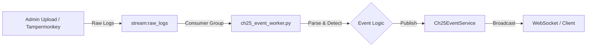

# 로그 파이프라인 상세 설계서 (v3: 3-Hour Interval Worker)

**"3시간 단위 운영 패턴에 맞춘 준실시간(Semi-Realtime) 파이프라인"**

사용자의 운영 주기(3시간 간격)를 수용하면서, 기술적으로는 **Worker 기반의 이벤트 처리**를 통해 향후 완전 자동화까지 대비하는 유연한 구조입니다.

---

## 1. 아키텍처: Redis Worker Pattern

파일 삭제 후 재수립된 아키텍처입니다. **"입력은 3시간마다, 처리는 즉시"** 수행합니다.

---

## 2. 상세 구현 사양 (Implementation Spec)

### A. 큐 (Queue)
*   **Source**: `stream:raw_logs` (Redis Stream)
    *   3시간마다 로그가 한꺼번에 들어와도 순서대로 버퍼링됩니다.
    *   Payload: `{ "source": "admin_upload", "raw_text": "...", "timestamp": ... }`

### B. 워커 (Worker): `app/workers/ch25_event_worker.py`
새로 구현할 전용 워커입니다. `main.py`의 Startup 이벤트에 연결됩니다.

1.  **Consume**: `stream:raw_logs`를 `xreadgroup`으로 읽습니다.
2.  **Parse**:
    *   입력된 Raw Text(또는 JSON)를 파싱하여 `User`, `BetAmount`, `Result` 추출.
    *   DB 매핑: 닉네임 -> `user_id` 변환 (캐싱 활용).
3.  **Detect Logic**:
    *   **Streak Check**: 최근 3시간 내 연패 횟수 계산.
    *   **Asset Check**: 기간 내 자산 변동률 계산.
4.  **Publish**:
    *   이벤트 조건 충족 시: `await Ch25EventService.publish_event(event_type, payload)` 호출.
    *   이 호출이 기존에 구현된 WebSocket(`ch25_events`)을 통해 프론트엔드로 전파됩니다.

---

## 3. 운영 시나리오 (3-Hour Cycle)

1.  **13:00 (Ingest)**: 운영자가 10:00~13:00 로그를 긁어서 업로드 (또는 봇이 자동 전송).
2.  **13:01 (Process)**: 워커가 쌓인 3시간 치 로그를 고속 처리 (예상 소요시간 < 5초).
3.  **13:02 (Action)**:
    *   시스템이 "방금 들어온 로그에서 5연패 유저 10명 발견" 알림 발송.
    *   운영자는 대시보드에서 확인 후 `Send Gift` 버튼 클릭.

---

## 4. 필요한 개발 작업 (To-Do)

1.  **`app/workers/ch25_event_worker.py` 생성**: Redis Stream Consumer 구현.
2.  **`main.py` 수정**: 워커 시작/종료 라이프사이클 연결.
3.  **Event D TO 정의**: `Ch25EventService`가 받을 페이로드 구조 확정.

이 설계는 **"3시간 간격 수동 운영"**으로 시작하지만, 기술적으로는 **"완전 실시간 자동화"**와 동일한 코드를 사용하므로 언제든 전환이 가능합니다.
