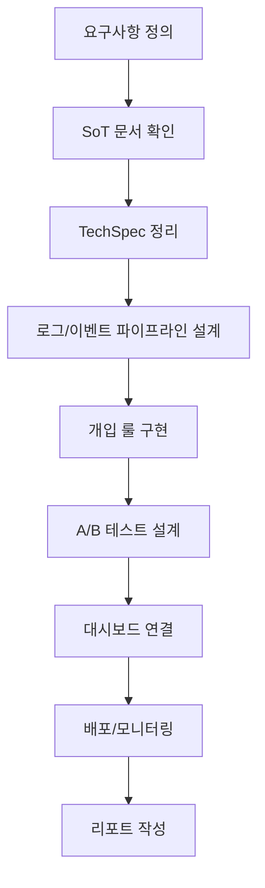

# Golden 업데이트 실행 스케줄 & 순서도 (v1)

본 문서는 **기존 게임 시스템 업데이트**를 위한 실행 스케줄과 Mermaid 순서도를 제공합니다.

---

## 1) 실행 스케줄 (4단계)

| 단계 | 기간 | 목표 | 산출물 |
| --- | --- | --- | --- |
| **Phase 1: 설계 확정** | W1 | 문서/규칙 확정 | TechSpec 업데이트, KPI 정의 |
| **Phase 2: 데이터/로그 준비** | W2 | 이벤트/로그 수집 준비 | 로그 스키마, 센서 로직 설계 |
| **Phase 3: 개입 로직 구현** | W3 | 개입/보상 자동화 | DDA, Free Spin, Cashback 룰 |
| **Phase 4: 검증/배포** | W4 | A/B 테스트 + 배포 | 대시보드, 결과 보고서 |

---

## 2) 단계별 상세 일정 & 체크리스트

### Phase 1: 설계 확정 (W1)
- [x] KPI 정의(D1/D7, OT/OD, ARPU/LTV)
- [x] SoT 문서 확인 (경제/스키마/알림)
- [x] TechSpec 갭 점검 (DDA/Free Spin/ROI/A-B)
- [x] 실험군/대조군 정의 초안
- 산출물: TechSpec 업데이트, KPI 문서
KPI 정의: golden_ab_test_framework_v1.md
SoT 문서 확인/연계: golden_system_metadata_integration_v1.md
TechSpec 갭 정리:
DDA: golden_dda_algorithm_v1.md
Free Spin: golden_free_spin_probability_impact_v1.md
ROI: golden_ltv_roi_automation_v1.md
A/B: golden_ab_test_framework_v1.md
실험군/대조군 정의 초안: golden_ab_test_framework_v1.md

### Phase 2: 데이터/로그 준비 (W2)
- [x] 이벤트 수집 포인트 정의 (연패/자산 급감/세션)
- [x] 로그 스키마/파이프라인 설계 (상세 설계 완료)
- [x] Redis/WebSocket 트리거 경로 확인 (현재 구독: `feed:public`, `ops:ws` / `ch25_events` 구독 경로 없음)
- [x] 외부 로그 + 내부 로그 병렬 파이프라인 연결 (stream 기반)
- [x] 대시보드 수집 지표 확정
- 산출물: `golden_event_definition_v1.md`, `golden_log_pipeline_spec_v1.md`, `golden_dashboard_metrics_v1.md`
*ch25_events로 발행**은 Redis Pub/Sub에서 ch25_events 채널로 이벤트 메시지를 publish한다는 뜻입니다.
예: 이벤트 프로세서가 LOSS_STREAK/ASSET_DEPLETION을 감지하면 ch25_events에 payload를 발행하고, FastAPI가 그 채널을 subscribe해야 실시간 개입(WS/토스트 등)으로 이어집니다.

### Phase 3: 개입 로직 구현 (W3)
- [x] 무료 스핀/캐시백/미션 룰 적용 범위 확정
- [x] 개입 룰 배포(Feature Flag 포함)
- [x] 예외/롤백 경로 검증
- [x] 실험 트래픽 분배 전략 확정
- 산출물: DDA/Reward 룰 적용
  - 롤백: `CH25_INTERVENTION_ENABLED=false` 또는 `CH25_INTERVENTION_ROLLOUT_PCT=0`

### Phase 4: 검증/배포 (W4)
- [x] A/B 테스트 설계/대시보드 준비
- [ ] 모니터링 지표/알람 기준 설정
- [ ] 시스템 유기적 연동 점검 (체크리스트 적용)
- [ ] 배포 체크리스트 완료
- [ ] 결과 리포트 작성
- 산출물: 대시보드, 결과 보고서

### Phase 4 보강: 미반영 항목 순차 적용 계획
- [x] DDA 알고리즘 적용 (`golden_dda_algorithm_v1.md`)
  - 트리거 조건 확정(연패/자산급감/지루함)
  - 게임별 승률 보정 범위/횟수 제한(악용 방지)
  - 적용 대상 게임/구간(룰렛/주사위/복권) 명시
  - 실험군만 활성화(컨트롤 제외)
- [x] Adaptive Engine 적용 (`golden_adaptive_engine_v1.md`)
  - Sentiment Sensor 최소 필드 정의(연패, 세션 손실, 이탈 점수)
  - 페르소나 태깅 기준(NEW/CAUSAL/VIP/CHURN_RISK)
  - 상태 전이 규칙(BORED/FRUSTRATED/IN_FLOW)
  - 개입 API 시그널 매핑(LOSS_STREAK/ASSET_DEPLETION/SESSION_END)
- [x] predicted_ltv/ROI 자동화 (`golden_ltv_roi_automation_v1.md`)
  - predicted_ltv 입력 소스/갱신 주기 정의
  - Cmax 산식 적용 및 상한 캡(유저/일)
  - ROI 계산 로그 저장(보상 비용 vs LTV)
  - 신규/저활성 LTV 컷 예외 규칙
- [x] 가변 보상 알고리즘 (`golden_variable_reward_algorithm_v1.md`)
  - 보상 빈도/가치 함수 파라미터 범위 확정
  - 반복 지급 감쇠 로직(연속 N회 감쇠)
  - 세그먼트별 보상 타입 매핑(Free Spin vs Cashback vs Mission)
  - A/B와 충돌 방지(그룹별 정책 고정)
- [x] DB 마이그레이션(`user_retention_state` 등, `golden_db_migration_plan_v1.md`)
  - 테이블 생성 + 인덱스 추가 계획
  - 마이그레이션 적용/롤백 절차 확정
  - 초기 데이터 백필/검증 쿼리 정의
  - 운영 반영 전 스테이징 검증

> 메모: `user_retention_state` 등 **스키마 필드 반영 완료** (마이그레이션 적용됨)
> 배치 실행: `update_predicted_ltv_daily.py` 적용 완료

---

## 3) 체크리스트 (운영/개발 공통)
- [x] KPI 정의(D1/D7, OT/OD, ARPU/LTV)
- [x] SoT 문서 확인 (경제/스키마/알림)
- [x] 실시간 이벤트 파이프라인 준비
- [x] 외부 로그 + 내부 로그 병렬 파이프라인 연결 (stream 기반)
- [x] 대시보드 수집 지표 확정
- [ ] 개입 룰 배포(무료 스핀/캐시백/미션)
- [ ] A/B 테스트 설계/대시보드 준비
- [x] 롤백 계획 수립

---

## 4) Mermaid 실행 순서도

---

## 5) 산출물 연결
- TechSpec: `golden_dda_algorithm_v1.md`, `golden_free_spin_probability_impact_v1.md`
- A/B: `golden_ab_test_framework_v1.md`
- ROI: `golden_ltv_roi_automation_v1.md`

---

## 6) 리서치 → 테크/코드/운영 적용 체크리스트 (확장)

> 기준: **테크(문서)** / **코드(레포 증거)** / **운영(이번 세션 실행 증거)**
> - 운영 미확인은 **“미확인(증거 없음)”**으로 표기

### A. 시스템 진화 로드맵
- 데이터 수집(로그/이벤트) 
  - 테크: 확인 ([docs/09_marketing/golden/02_tech_spec/golden_log_pipeline_spec_v1.md](docs/09_marketing/golden/02_tech_spec/golden_log_pipeline_spec_v1.md))
  - 코드: 확인 ([app/workers/ch25_event_worker.py](app/workers/ch25_event_worker.py))
  - 운영: 미확인(증거 없음)
- 실시간 엔진(WS/Stream)
  - 테크: 확인 ([docs/09_marketing/golden/02_tech_spec/golden_realtime_architecture_v1.md](docs/09_marketing/golden/02_tech_spec/golden_realtime_architecture_v1.md))
  - 코드: 확인 ([app/services/ch25_event_service.py](app/services/ch25_event_service.py))
  - 운영: 미확인(증거 없음)
- AI 자동화(predicted_ltv/ROI)
  - 테크: 확인 ([docs/09_marketing/golden/02_tech_spec/golden_ltv_roi_automation_v1.md](docs/09_marketing/golden/02_tech_spec/golden_ltv_roi_automation_v1.md))
  - 코드: 부분 확인 (predicted_ltv 배치만 존재) ([scripts/update_predicted_ltv_daily.py](scripts/update_predicted_ltv_daily.py))
  - 운영: **이번 세션 적용 완료** (배치 실행)

### B. Gap Analysis (예측/트리거 확장)
- 사용자 상태 필드(리텐션 상태)
  - 테크: 확인 ([docs/09_marketing/golden/02_tech_spec/golden_adaptive_engine_v1.md](docs/09_marketing/golden/02_tech_spec/golden_adaptive_engine_v1.md))
  - 코드: 확인 ([app/models/user_retention_state.py](app/models/user_retention_state.py))
  - 운영: **이번 세션 적용 완료** (마이그레이션 적용)
- Dynamic Task/Intervention API
  - 테크: 확인 ([docs/09_marketing/golden/02_tech_spec/golden_adaptive_engine_v1.md](docs/09_marketing/golden/02_tech_spec/golden_adaptive_engine_v1.md))
  - 코드: 부분 확인 (publish 파이프라인만 존재) ([app/services/ch25_event_service.py](app/services/ch25_event_service.py))
  - 운영: 미확인(증거 없음)
- Predictive Re-engagement
  - 테크: 확인
  - 코드: 미확인
  - 운영: 미확인

### C. Goldilocks 진단
- 승/패/연패 실시간 감지
  - 테크: 확인 ([docs/09_marketing/golden/02_tech_spec/golden_dda_algorithm_v1.md](docs/09_marketing/golden/02_tech_spec/golden_dda_algorithm_v1.md))
  - 코드: 확인 ([app/workers/ch25_event_worker.py](app/workers/ch25_event_worker.py))
  - 운영: 미확인(증거 없음)
- DDA 적용(룰렛/주사위/복권)
  - 테크: 확인 ([docs/09_marketing/golden/02_tech_spec/golden_dda_algorithm_v1.md](docs/09_marketing/golden/02_tech_spec/golden_dda_algorithm_v1.md))
  - 코드: 확인 ([app/services/roulette_service.py](app/services/roulette_service.py), [app/services/dice_service.py](app/services/dice_service.py), [app/services/lottery_service.py](app/services/lottery_service.py))
  - 운영: 미확인(증거 없음)
- 심리 상태 저장(BORED/FRUSTRATED)
  - 테크: 확인 ([docs/09_marketing/golden/02_tech_spec/golden_adaptive_engine_v1.md](docs/09_marketing/golden/02_tech_spec/golden_adaptive_engine_v1.md))
  - 코드: 확인 ([app/workers/ch25_event_worker.py](app/workers/ch25_event_worker.py))
  - 운영: 미확인(증거 없음)

### D. 사용자 페르소나
- 세그먼트/상태 태깅
  - 테크: 확인 ([docs/09_marketing/golden/02_tech_spec/golden_adaptive_engine_v1.md](docs/09_marketing/golden/02_tech_spec/golden_adaptive_engine_v1.md))
  - 코드: 확인 (스키마 준비) ([app/models/user_retention_state.py](app/models/user_retention_state.py))
  - 운영: **이번 세션 적용 완료** (마이그레이션 적용)
- 가변 보상 알고리즘
  - 테크: 확인 ([docs/09_marketing/golden/02_tech_spec/golden_variable_reward_algorithm_v1.md](docs/09_marketing/golden/02_tech_spec/golden_variable_reward_algorithm_v1.md))
  - 코드: 미확인
  - 운영: 미확인

### E. ROI/증명 로깅
- ROI 로그 테이블
  - 테크: 확인 ([docs/09_marketing/golden/02_tech_spec/golden_ltv_roi_automation_v1.md](docs/09_marketing/golden/02_tech_spec/golden_ltv_roi_automation_v1.md))
  - 코드: 확인 ([app/models/retention_roi_log.py](app/models/retention_roi_log.py))
  - 운영: **이번 세션 적용 완료** (마이그레이션 적용)
- Reward_Size ≤ Cmax 강제
  - 테크: 확인
  - 코드: 미확인
  - 운영: 미확인

> 운영 증거: 이번 세션에서 `alembic upgrade head` 및 `update_predicted_ltv_daily.py --apply` 실행 완료.

---

## 7) Phase 4 실행 절차 (단계별)

### Step 1. 모니터링 지표/알람 기준 설정
- [ ] 대시보드 지표와 매핑 확인 (LOSS_STREAK/ASSET_DEPLETION/SESSION_END, 실험군 분배)
- [ ] 알람 기준 임계치 정의 (일/주 이벤트 급증 기준)
- [ ] 운영 메모에 기준 기록

#### Step 1-1. 지표 매핑 (대시보드 ↔ 이벤트)
- LOSS_STREAK: 이벤트 수 (일/주) → `LOSS_STREAK 이벤트 수`
- ASSET_DEPLETION: 이벤트 수 (일/주) → `ASSET_DEPLETION 이벤트 수`
- SESSION_END: 이벤트 수 (일/주) → `SESSION_END 이벤트 수`
- 실험군 분배: Control/FreeSpin/Cashback/Mission → `실험군 분배 비율`
- 참조: [docs/09_marketing/golden/04_report/golden_dashboard_metrics_v1.md](docs/09_marketing/golden/04_report/golden_dashboard_metrics_v1.md)

#### Step 1-2. 알람 기준(초안)
- 일 단위 급증: 전일 대비 +X% (TBD)
- 주 단위 급증: 최근 4주 평균 대비 +Y% (TBD)
- 실험군 분배 편차: 목표 분배 대비 ±Z%p (TBD)

#### Step 1-3. 운영 메모 기록
- 기준 확정일:
- 담당자:
- 적용 범위:

### Step 2. 시스템 유기적 연동 점검 (체크리스트 적용)
- [ ] 내부 로그 → `stream:raw_logs` 발행 확인
- [ ] 외부 로그 → `stream:raw_logs` 발행 확인
- [ ] 워커 이벤트 감지 확인
- [ ] `ch25_events` publish 확인
- [ ] WS 수신/UI 토스트 확인

#### Step 2-1. 점검 체크리스트 참조
- 참조 문서: [docs/09_marketing/golden/04_report/golden_system_integration_checklist_v1.md](docs/09_marketing/golden/04_report/golden_system_integration_checklist_v1.md)
- 증거 유형: Redis 키 스냅샷 / WS 수신 로그 / UI 토스트 캡처

#### Step 2-2. 결과 기록
- 점검 일시:
- 담당자:
- 요약:
- 이슈/조치:

### Step 3. 배포 체크리스트 완료
- [ ] Feature Flag 상태 확인
- [ ] 롤백 플래그 검증
- [ ] 운영 안전장치(쿨다운/어뷰징/Fail-Open) 확인

#### Step 3-1. 배포 전 필수 확인
- Feature Flag: `CH25_INTERVENTION_ENABLED`, `CH25_DDA_ENABLED`
- Rollback: `CH25_INTERVENTION_ENABLED=false` 또는 `CH25_INTERVENTION_ROLLOUT_PCT=0`
- 안전장치: 쿨다운/어뷰징 필터/Fail-Open

#### Step 3-2. 결과 기록
- 확인 일시:
- 담당자:
- 비고:
  - CH25 플래그 확인됨 (CH25_INTERVENTION_ENABLED/CH25_DDA_ENABLED/ROLLOUT_PCT)
  - 쿨다운 키 확인됨 (`ch25_events:cooldown:*`)
  - Fail-Open 확인됨 (Redis 중지 상태에서도 `/` 200)
  - 롤백 플래그/어뷰징 필터는 추가 확인 필요

### Step 4. 결과 리포트 작성
- [ ] 지표 스냅샷 정리 (일/주)
- [ ] 실험군 분배 결과 요약
- [ ] 이슈/개선점 기록

#### Step 4-1. 리포트 구성
- 지표 스냅샷: LOSS_STREAK/ASSET_DEPLETION/SESSION_END, 실험군 분배
- 기간: 일/주
- 이슈/개선점: 원인/조치/재발 방지

#### Step 4-2. 기록 위치
- 리포트 문서: [docs/09_marketing/golden/04_report/golden_execution_v1.md](docs/09_marketing/golden/04_report/golden_execution_v1.md)

### Step 5. “증거 없음” 항목 운영 검증
- [ ] 로그/WS/UI/DB 증거 캡처
- [ ] 체크리스트 항목 상태 갱신(미확인 → 확인됨)

#### Step 5-1. 증거 수집 계획
- 참조 문서: [docs/09_marketing/golden/04_report/golden_missing_evidence_implementation_plan_v1.md](docs/09_marketing/golden/04_report/golden_missing_evidence_implementation_plan_v1.md)
- 증거 유형: 로그 캡처 / WS 수신 / UI 캡처 / DB row

#### Step 5-2. 상태 갱신
- 대상 체크리스트: 6) 리서치 → 테크/코드/운영 적용 체크리스트 (확장)
