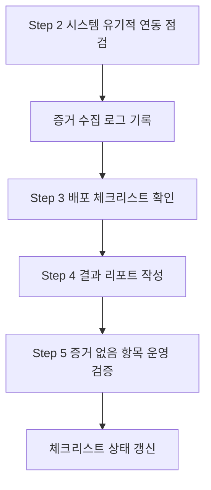

# Phase 4 이후 진행 순서도 & 가이드 (v1)

본 문서는 **Phase 4(검증/배포)** 이후 남은 작업의 **순서도**와 **실행 가이드**를 제공합니다.

---

## 1) 진행 순서도 (Mermaid)

---

## 2) 단계별 가이드

### Step 2. 시스템 유기적 연동 점검
- 문서: [docs/09_marketing/golden/04_report/golden_system_integration_checklist_v1.md](docs/09_marketing/golden/04_report/golden_system_integration_checklist_v1.md)
- 목표: 내부/외부 로그 → 워커 감지 → `ch25_events` 발행 → WS/UI 수신 증거 확보
- 산출물: 증거 캡처 + 체크리스트 기록

### Step 3. 배포 체크리스트 완료
- 문서: [docs/09_marketing/golden/04_report/golden_execution_schedule_v1.md](docs/09_marketing/golden/04_report/golden_execution_schedule_v1.md)
- 목표: Feature Flag/롤백/안전장치 상태 확인
- 산출물: 배포 체크 기록(일시/담당자)

### Step 4. 결과 리포트 작성
- 문서: [docs/09_marketing/golden/04_report/golden_execution_v1.md](docs/09_marketing/golden/04_report/golden_execution_v1.md)
- 목표: 지표 스냅샷, 실험군 분배 결과, 이슈/개선점 기록
- 산출물: 리포트 업데이트

### Step 5. “증거 없음” 항목 운영 검증
- 문서: [docs/09_marketing/golden/04_report/golden_missing_evidence_implementation_plan_v1.md](docs/09_marketing/golden/04_report/golden_missing_evidence_implementation_plan_v1.md)
- 목표: 로그/WS/UI/DB 증거 확보 후 상태 갱신
- 산출물: 체크리스트 상태 “미확인 → 확인됨” 갱신

---

## 3) 증거 수집 기준(요약)
- Redis: `stream:raw_logs`, `ch25:state:*`
- WS: `/api/ws/events` 수신 로그
- UI: 토스트/개입 노출 스크린샷
- DB: 관련 테이블 row 스냅샷

---

## 4) 완료 기준
- Step 2~5 체크리스트 모두 **확인됨**
- 리포트 업데이트 완료
