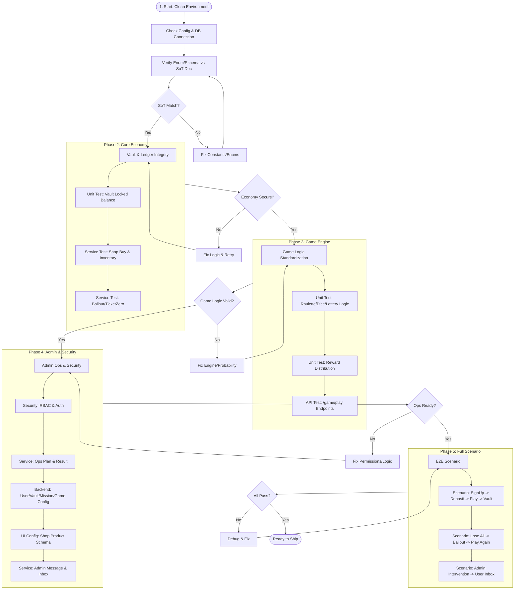

# V2 Backend Master Test Flowchart & Checklist

문서 타입: 가이드
버전: v1.0
작성일: 2026-01-20
작성자: Antigravity (User Request Based)
상태: Draft
근거: 사용자 요청 (기존 검증 리포트 신뢰 불가, SoT 변경/라우터 수정 반영 필수)

## 0. 개요 (Overview)

이 문서는 V2 백엔드의 **완전 무결성(Zero Defect)**을 확보하기 위해, 바닥부터 다시 검증하는 전체 테스트 순서도(Flowchart)이다.
기존 통과 여부와 상관없이 **"현재 시점의 코드와 SoT"**를 기준으로 전수 재검증한다.

### 핵심 원칙
1.  **Trust No One**: 기존 검증 리포트 무시. 현재 코드로 직접 실행.
2.  **SoT First**: 테스트 작성 전, 해당 도메인의 SoT(Spec) 값과 코드 상수/Enum 일치 여부부터 확인.
3.  **V2 Only**: 검증 대상은 오직 `app/v2/` (Backend) 및 `src/v2/` (Frontend)로 한정한다. (Legacy `app/` 제외)
4.  **Bottom-Up**: DB/Schema → Core Logic → Service → API → Scenario 순으로 진행.
5.  **Strict UUID**: 모든 외부 식별자(`cc_id`, `external_id`) 및 세션 키는 반드시 UUID 형식을 준수해야 한다. (Phase 4 검증 반영)

---

## 1. 테스트 순서도 (Master Flowchart)



---

## 2. 단계별 상세 체크리스트 (Step-by-Step Checklist)

### Phase 1: 환경 및 SoT 정합성 (Environment & SoT)
> **목표**: "코드가 문서(SoT)와 같은 언어를 쓰고 있는가?"

- [x] **1-1. Config & Migration Check (Regression)**
    - `alembic current` 실행 시 에러 없음
    - `alembic heads`가 최신 마이그레이션 (`v2_game_token_standardization` 등) 반영 확인
    - **Integrity**: `versions/` 내의 모든 파이썬 파일이 유효한 `revision`, `down_revision` 변수를 포함하는지 정적 분석.
- [x] **1-1.5 Runtime Sanity Check (Regression)**
    - **Import Safety**: `app.v2.*` 모듈 로드 시 `NameError`, `ImportError` (Circular import) 발생 여부 사전 검증.
    - **Shim Isolation**: V1 라우터 로드 없이 V2 패키지만 단독으로 로드 가능한지 확인.
- [x] **1-2. SoT Constant Verification** (매우 중요)
    - `RewardType` Enum (코드) vs `v2_reward_mapping_sot_ko.md` (문서) 일치 확인
    - `ItemType` Enum (코드) vs `v2_item_inventory_sot_ko.md` (문서) 일치 확인
    - `GameType` Enum 및 배율 설정 vs `v2_game_action_schema_sot_ko.md` 일치 확인

- [x] **1-3. API Contract Sweep (Router Check)**
    - **Router Split**: Admin(`/api/v2/admin`) vs Client(`/api/v2`) 라우터 모듈 분리 및 Prefix 정상 적용 확인.
    - **Auth User**: `v2_auth_user_api_contract_ko.md` (Login, Token, Me)
    - **Notification**: `v2_notification_feed_schema_ko.md` (Inbox, SSE)
    - **Team Battle**: `v2_team_battle_api_contract_ko.md` (Join, Status, Reward)
    - **Game & Golden**: `v2_game_api_contract_ko.md`, `v2_golden_api_contract_ko.md`
    - **Mission & Streak**: `v2_mission_streak_api_contract_ko.md`
    - **Inventory & Shop**: `v2_inventory_shop_api_contract_ko.md`
    - **Ops & Admin**: `v2_admin_ops_api_contract_ko.md`
    - **Ticket Zero**: `v2_ticket_zero_api_contract_ko.md`

### Phase 2: 코어 경제 (Core Economy)
> **목표**: "돈과 관련된 로직(입금/출금/금고)은 절대적으로 정확해야 한다."

- [x] **2-1. CC Deposit Logic (Service Audit)**
    - **Context**: "관리자 수동 지급" (Admin Manual) + "로직 분석" 필요.
    - **Critical Check**: **"Vault Locked Increase는 발생하지 않음"** (User Feedback) → 입금 데이터 적재 시, 실제 금고 잔액(`vault_locked_balance`)이 *자동으로* 증가하지 않는지 검증. (DB 적재만 수행되는지 확인)
    - **Verification**: `AdminExternalRankingService` 등 분석하여 데이터 흐름(Total vs Log) 규명.
- [x] **2-2. Strict Withdrawal Policy (Unit/Service Check)**
    - [x] **Daily Net Deposit**: `cc_deposit` (당일 순증분) > 0 조건 검증.
    - [x] **Daily Vault Spent**: `vault_spent_today` >= 10,000 KRW 조건. (자정 09:00 KST 리셋 로직 검증 완료)
    - [x] **Active Play Check**: **"최근 3일간 게임 30회 이상 이용"** 조건 검증.
    - [x] **Activity Signal**: `play_streak` 및 `mission_progress` 등 추가 활동 지표가 출금 자격 판정에 올바르게 연동되는지 확인.
    - [x] **Step Limit**: 1회차, 2회차, 3회차별 출금 최소 금액 제한 적용 여부 (`10k -> 10k -> 30k -> 50k`).
- [x] **2-3. Vault Limit & Suspension (Policy)**
    - **Legacy Field Lock**: `vault_available_balance` 필드가 로직에서 **완전히 배제**되거나 0으로 고정되는지 확인 (Double Counting 방지).
    - **Cap Enforcement**: Inactive 유저(7일 미입금)의 금고 보유 한도(30,000) 초과 시 적립 차단/소멸.
    - **Suspension Guard**: `benefits_suspended=True` 유저의 상점/게임 접근 즉시 403 차단.
- [x] **2-4. Vault Ledger Integrity (Thread-Safety)**
    - **Concurrency Stress**: 동시 다발적 상점 구매/게임 베팅 시 `locked_balance`가 음수가 되지 않도록 Lock/SelectForUpdate 동작 확인.
- [x] **2-5. Ticket Zero (Bailout)**
    - **Eligibility**: 보유 자산 0원("완전 파산") 상태 판단 로직의 정교함. (티켓 포함 여부 등)
    - **Cooldown**: 1일 3회 제한 및 쿨다운 타임 준수.
- [x] **2-6. User Progression (Level & Segment)**
    - **CC Deposit Idempotency**: 동일한 입금 내역(Total Amount 변동 없음) 수신 시, **레벨 포인트(XP)가 절대 중복 지급되지 않음**을 검증. (Delta=0 → XP=0)
    - **Delta Logic**: 입금액 순증분(Delta)에 비례해서만 정확히 XP가 1회 산정되는지 확인.
    - **CC Deposit -> Level Up**: 입금 처리 및 XP 지급 후, 레벨업 임계치 도달 시 자동 레벨업 트리거 확인.
    - **First Deposit Trigger**: 최초 입금(`first_deposit_at` 갱신) 시 "신규 유저 첫 충전" 혜택/미션(`M_START_04`)이 즉시 달성 및 자동 지급되는지 검증.
    - **Reward Auto-Claim**: 레벨업에 따른 보상도 자동 지급 되는지 검증.
    - **Segment Update**: 활동/입금 이력에 따라 유저 세그먼트(New, Active, VIP 등)가 올바르게 갱신되는지 확인.
- [x] **2-7. Shop Exchange & Inventory (Service)**
    - **Inventory Sync**: 아이템 구매 시 인벤토리 테이블(`ItemInventory`)에 정상 적재되는지 확인.
    - **Exchange Logic**: `ExchangeType`에 따른 티켓/재화 교환 로직(예: 티켓 → 포인트) 동작 검증.
    - **SoT Compliance**: 교환 가능 아이템 목록 및 교환비(Ratio)가 `v2_shop_exchange_policy_sot_ko.md`와 일치하는지 검증.
    - **Usage**: 아이템 사용 시 효과 적용 및 수량 차감 원자성 확인.
    - **Cache Invalidation**: 어드민 상품 수정 시 유저 상점 목록에 **즉시 반영**되는지 확인.

### Phase 3: 게임 엔진 (Game Engine)
> **목표**: "게임 결과가 확률대로 나오고 보상이 정확한가?"

- [ ] **3-1. Engine Logic (Unit)**
    - **Roulette (Deferred)**:
        - **Status**: **검증 보류** (Backend/Frontend 불안정).
        - **Logic**: 세그먼트 6개 고정 확인만 수행.
    - **Dice (Prioritized)**:
        - **Config Priority**: 전역 설정보다 **어드민 설정값(DB)**이 우선 적용되는지 검증.
        - **Logic**: 승/패 판정 및 배율 검증.
        - **Golden Hour**: 이벤트 트리거 시 **어드민 설정 배수(Multiplier)** 적용 여부 검증.
        - **Vault Check**: 주사위 플레이 -> 승리 시 **금고 누적(Vault Accumulation)** 정상 작동 확인. (주사위로 금고 테스트 수행)
    - **Lottery (Raffle Style)**:
        - **Logic**: 경품 추첨(Raffle) 방식 검증.
    - **Common**:
        - **Reward-Vault Link**: `POINT` 타입 보상 지급 시 반드시 **Vault Deposit** 로직이 호출되는지 검증 (누락 방지).
        - **SoT Match**: 모든 게임 보상 품목이 SoT(`rewardItems.ts` / DB)와 정확히 일치하는지 전수 검사.
- [ ] **3-2. Game API Structure (Integration)**
    - Request Schema Validation (베팅 금액 음수/초과 차단)
    - Response Schema Consistency (프론트엔드 타입과 일치 여부)
- [ ] **3-3. Mission & Engagement (Game Loop)**
    - **New User**: Welcome(2종)/Starter(4종) 미션 발동, 72시간 만료, 보상 수령 로직 검증.
    - **Daily/Weekly**: **오전 9시(09:00 KST) 상시 초기화** (Operational Day 정책), 진행도(Progress) 업데이트, 완료 후 보상 지급 확인.
    - **Streak (Backtest Verified)**: 출석 연속 카운팅, **새벽 2시/자정 넘김 안전성** 및 결석 시 초기화 확인.
    - **Backtest**: `backtest_streak_continuity.py`를 통한 시나리오별 무결성 검증 완료.
- [ ] **3-4. Golden Hour & Event**
    - **Trigger**: `manual_override=FORCE_ON` 및 `Time Schedule`에 따른 활성화 확인.
    - **Multiplier**: 골든아워 적용 시 `POINT`/`XP` 보상에 배율(x2.0 등) 정상 적용 검증.
    - **UI Signal**: 활성화 상태가 클라이언트(`active_events`)에 정확히 전달되는지 확인.
- [ ] **3-5. Live Feed & Notification (Regression)**
    - **Jackpot Trigger**: 게임(룰렛/다이스)에서 `10,000 POINT` 이상 획득 시, `Live Feed` 메시지 발행 확인 (Legacy 하드코딩 아닌 DB Config `mega_threshold` 참조 검증).
    - **WS Connection**: `/api/ws/feed` 엔드포인트가 Nginx Prefix 없이도(혹은 설정에 맞게) 정상 연결되는지 Path 검증.
- [ ] **3-6. Lottery & Onboarding Fixes (Regression)**
    - **Lottery Type Safety**: 복권 당첨 응답 키값이 `reward_value`가 아닌 `reward_amount`로 프론트엔드 타입과 일치하는지 확인. (과거 불일치 수정 사항)
    - **Mission Target Check**: "2일차 출석" 미션의 목표치(`target_value`)가 1이 아닌 **2 이상**인지 검증 (당일 완료 버그 방지).
    - **Welcome Isolation**: "웰컴 보상 자동 수령" 실행 시, **스타터 미션**까지 잘못 수령되지 않고 웰컴 미션(2종)만 처리되는지 확인.

### Phase 4+: 경제 체계 심층 검증 (Economy Deep Dive)
> **목표**: "핵심 경제 서비스의 테스트 커버리지를 80% 이상으로 끌어올림" (V2-Only Standard)

- [x] **4-7. Economy Coverage Expansion**
    - [x] **TicketZero**: `V2TicketZeroService` 커버리지 **100%** 달성.
    - [x] **Segmentation**: `V2SegmentService` 커버리지 **94%** 달성 (자동 규칙 엔진 연동).
    - [x] **Inventory**: `V2InventoryService` 커버리지 **93%** 달성 (교환 로그 원자성).
    - [x] **Messaging**: `V2AdminMessageService` 커버리지 **91%** 달성 (타겟팅 Fan-out).
    - [x] **Shop**: `V2ShopService` 커버리지 **83%** 달성 (오버라이드 및 구매 로직).
    - [x] **Vault**: `V2VaultService` **75%**, `Vault2Service` **44%** (상태 전이/설정 병합 검증 완료).

- [ ] **4-1. Authentication & RBAC**
    - 일반 유저가 Admin API 호출 시 403 Forbidden 확인
    - `SuperAdmin` vs `Manager` 권한 구분 동작 확인
- [ ] **4-2. Ops Execution (Service/Contract)**
    - **Ops Plan**: 운영 계획(`OpsPlan`) 등록 및 상태 전이(Pending -> Running -> Completed) 검증.
    - **Execution Result**: `POST /admin/api/ops/tasks/{task_id}/execution-result` 호출 시 결과 JSON이 스키마(`v2_ops_plan_execution_schema`)를 준수하는지 확인. (Warning/Error 배지 등)
    - **Logs**: 실행 이력(`OpsExecutionLog`) 적재 및 조회 확인.
- [x] **4-3. Admin User Management (Level/Point)**
    - [x] **XP/Point Adjust**: 관리자가 임의로 유저의 레벨 포인트를 **추가/차감**했을 때 반영 검증. (Strict UUID `cc_id` 사용)
    - [x] **Point Reset**: 관리자 권한으로 포인트/레벨 **삭제(초기화)** 기능 동작 검증.
    - [x] **Null Safety (Regression)**: 유저 상세 조회 시 `ticketBalance`, `vaultBalance` 등 숫자 필드 `0` 반환 확인.
- [x] **4-4. Admin Messaging & Targeting**
    - [x] **Targeting**: ALL / SEGMENT / USER 타겟팅별 발송 대상 추출 로직 검증.
    - [x] **Intervention (Bailout)**: `BAILOUT_GIFT` 실행 시 즉시 1,000 포인트 지급 및 로그 기록 확인.
    - [x] **Inbox**: 메시지 발송 시 유저별 Inbox(`v2_admin_message_inbox`) 적재 확인.
- [x] **4-5. Shop Configuration (UI Config)**
    - [x] **Schema Check**: `v2_shop_products` UI Config 키 존재 및 스키마 준수 확인.
    - [x] **Visible Filter**: `visible=false` 설정 시 유저 상점 목록에서 필터링 확인.
    - [x] **Override Persistence**: 관리자 상점 설정 수정 시 `AppUiConfig`에 즉시 반영됨을 검증.
- [x] **2-2. Strict Withdrawal Policy (Regression)**
    - [x] **Daily Net Deposit**: `cc_deposit` (당일 순증분) > 0 조건 검증.
    - [x] **Daily Vault Spent (Regression)**: `vault_spent_today`가 자정(09:00 KST)에 정확히 리셋됨을 확인.
    - [x] **Withdrawal Tier (Regression)**: 횟수에 따라 `10k -> 10k -> 30k -> 50k` 상향 검증.
- [x] **4-6. Admin Resource Management (Backend)**
    - [x] **User Detail**: 상세 정보 조회(Wallet/Items/History) API 검증.
    - [x] **Vault**: `POST /admin/vault/force-edit` 호출 시 잔액 강제 조정 및 Audit Log 기록 확인.
    - [x] **Inventory Manager (Regression)**: 인벤토리 관리 탭 Quick Action(지급/회수) 및 수량 차감 원자성 검증.

- [x] **4-8. Phase4 Admin 회귀 스위트 실행 증빙**
    - **목적**: Admin 주요 라우트/스키마/권한 회귀 확인(금고/미션/회원관리 포함)
    - **실행일**: 2026-01-21
    - **커맨드**: `docker compose exec backend pytest -q tests/v2_tests/phase4_admin`
    - **결과**: `32 passed` (warnings 존재)

### Phase 5: 통합 시나리오 (E2E Scenarios)
> **목표**: "실제 유저처럼 행동했을 때 문제가 없는가?"

- [ ] **5-1. New User Journey**
    - **Modal Flow (Regression)**: 웰컴 미션(2종) 수령 완료 시에만 스타터 미션(4종) 모달이 순차적으로 노출되는지 확인.
    - **Joyride (Regression)**: 신규 가입 시 온보딩 가이드(Joyride)가 끊김 없이 각 페이지(Vault -> Shop -> Mission)로 유도하는지 확인.

### Phase 5: 통합 시나리오 (E2E Scenarios)
> **목표**: "실제 유저처럼 행동했을 때 문제가 없는가?"

- [ ] **5-1. New User Journey**
    - 회원가입(DevLogin) → 웰컴 보상 수령 → 미션 확인 → 게임 플레이
- [ ] **5-2. The Gambler's Loop**
    - 재화 소진 → 구제(Ticket Zero) 요청 → 재지급 → 게임 복귀
- [ ] **5-3. Admin Intervention Trigger**
    - 어드민에서 유저에게 재화/아이템 지급 → 유저 Inbox 확인 → 수령 및 잔액 반영
    - **Suspension**: 어뷰징 유저 발견 -> 어드민 `Block` -> 해당 유저 즉시 토큰 만료 및 접속 불가 확인.
- [ ] **5-4. Mission & Data Sync Integrity (Triangular Check)**
    - **Goal**: "미션 / 어드민 / 유저 간 데이터 불일치 및 반영 지연 방지"
    - **Config Reflection**: 어드민이 미션 보상을 변경(`100P` -> `500P`)한 직후, 유저가 미션 달성 시 **변경된 보상(`500P`)**이 즉시 지급되는지 검증.
    - **Status Sync**: 유저가 미션을 진행/완료했을 때, 어드민의 **회원 상세(User Detail) > 미션 탭**에서 진행도 및 상태가 실시간으로 일치하는지 확인.
    - **Admin Action**: 어드민에서 특정 유저의 미션을 '리셋' 하거나 '강제 성공' 시켰을 때, 유저 화면에 즉시 반영되는지 확인.

---

## 3. 실행 가이드

### 3.1 최소 회귀(추천)
- V2 Admin 핵심 회귀(Phase 4): `docker compose exec backend pytest -q tests/v2_tests/phase4_admin`

### 3.2 빠른 사전 점검
- 파이썬 컴파일(임포트/문법): `docker compose exec backend python -m compileall -q app`

### 3.3 결과 기록 규칙
- 최소한 다음 4가지는 문서에 남긴다: `실행일`, `커맨드`, `결과(pass/fail)`, `핵심 경고/특이사항(있으면 1줄)`

각 단계 수행 시 반드시 **"실패 시 즉시 중단 및 수정 후 재시도"** 원칙을 따른다.
테스트 코드는 `tests/v2_tests/` 하위에 각 Phase 별로 디렉토리를 나누어 관리한다.

```bash
# 예시 디렉토리 구조
tests/v2_tests/
├── phase1_env/
├── phase2_core/
├── phase3_game/
├── phase4_admin/
└── phase5_scenarios/
```
