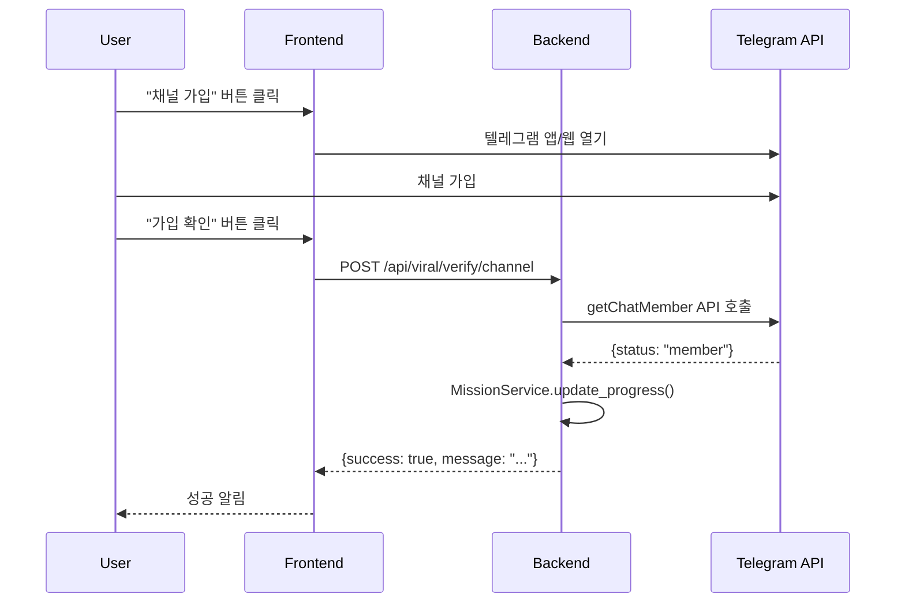
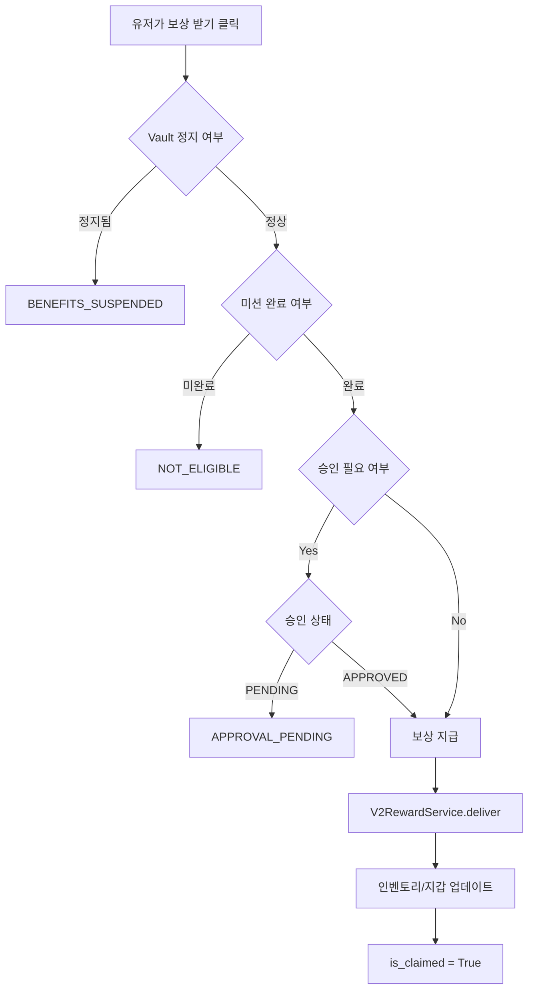

# 신규유저 채널 가입 미션 기술 문서

**작성일**: 2026-01-31
**카테고리**: Mission / Viral
**우선순위**: 핵심 기능

---

## 개요

신규 유저(가입 후 7일 이내)를 대상으로 한 채널 가입 유도 미션입니다.
- 텔레그램 채널 가입: 피자 기프티콘 10,000원
- CC 채널 가입: 2,000 포인트

Telegram Bot API를 통한 **실시간 자동 검증**을 사용합니다.

---

## 1. 미션 구성

### 1.1 데이터베이스 스키마

**테이블**: `mission`
**시드 파일**: `alembic/versions/20260130_2100_seed_core_game_mission_admin.py`

#### 텔레그램 채널 가입 미션
```python
{
    "title": "신규 텔레그램 채널가입",
    "description": "텔레그램 채널에 가입하고 피자 기프티콘 10,000원을 받으세요!",
    "category": MissionCategory.NEW_USER,
    "logic_key": "NEW_USER_TELEGRAM_JOIN",
    "action_type": "JOIN_TELEGRAM_CHANNEL",
    "target_value": 1,
    "reward_type": MissionRewardType.PIZZA_GIFTICON_10000,
    "reward_amount": 1,
    "xp_reward": 0,
    "auto_claim": False,              # 수동 클레임
    "requires_approval": True,        # 관리자 승인 필요
    "is_active": True,
}
```

#### CC 채널 가입 미션
```python
{
    "title": "신규 CC채널가입",
    "description": "CC 공식 채널에 가입하고 2,000 포인트를 받으세요!",
    "category": MissionCategory.NEW_USER,
    "logic_key": "NEW_USER_CC_CHANNEL_JOIN",
    "action_type": "JOIN_CC_CHANNEL",
    "target_value": 1,
    "reward_type": MissionRewardType.POINT,
    "reward_amount": 2000,
    "xp_reward": 0,
    "auto_claim": False,              # 수동 클레임
    "requires_approval": False,       # 자동 승인
    "is_active": True,
}
```

### 1.2 Action Type Aliases

**파일**: `app/v2/services/mission_service.py:23-35`

```python
ACTION_TYPE_ALIASES = {
    "JOIN_CHANNEL": [
        "SUBSCRIBE_CHANNEL",
        "CHANNEL_JOIN",
        "JOIN_TELEGRAM_CHANNEL",
        "JOIN_CC_CHANNEL"
    ],
    "JOIN_TELEGRAM_CHANNEL": [
        "TELEGRAM_JOIN",
        "TG_CHANNEL_JOIN"
    ],
    "JOIN_CC_CHANNEL": [
        "CC_CHANNEL_JOIN",
        "OFFICIAL_CHANNEL_JOIN"
    ],
}
```

**목적**: 여러 액션 타입을 하나의 미션으로 처리 가능

---

## 2. 채널 링크 설정

### 2.1 텔레그램 채널

#### 환경 변수
**파일**: `.env`
```bash
TELEGRAM_CHANNEL_USERNAME=-1003462656986
```

#### 애플리케이션 설정
**파일**: `app/core/config.py`
```python
telegram_channel_username: str | None = Field(
    None,
    validation_alias=AliasChoices(
        "TELEGRAM_CHANNEL_USERNAME",
        "telegram_channel_username",
    ),
)
```

#### 프론트엔드 기본값
**파일**: `src/v2/components/mission/MissionCard.tsx:215-218`
```tsx
const channelUrl = (mission as any).metadata?.channel_url || "https://t.me/cc_jm_official";
tg.openTelegramLink(channelUrl);
```

**우선순위**:
1. `mission.metadata.channel_url` (DB에서 미션별 설정 가능)
2. `https://t.me/cc_jm_official` (기본값)

### 2.2 CC 채널

**현재 상태**: 별도 환경 변수 없음
**추정**: 텔레그램 채널과 동일한 채널 사용

---

## 3. 트리거 및 검증

### 3.1 사용자 플로우



### 3.2 검증 API

**엔드포인트**: `POST /api/viral/verify/channel`
**파일**: `app/api/routes/viral.py:55-98`

```python
@router.post("/verify/channel", summary="Verify Telegram Channel Subscription")
def verify_channel(
    payload: ChannelVerifyRequest,
    current_user: V2User = Depends(deps.get_current_user),
    db: Session = Depends(deps.get_db)
):
    # 1. Telegram ID 확인
    if not current_user.telegram_id:
        raise HTTPException(status_code=400, detail="TELEGRAM_NOT_LINKED")

    # 2. 환경 변수에서 채널 정보 가져오기
    target_channel = settings.telegram_channel_username

    # 3. Telegram Bot API로 멤버십 실시간 확인
    is_member = service.check_chat_member(target_channel, current_user.telegram_id)

    # 4. 미션 진행 업데이트
    if is_member:
        ms = MissionService(db)
        updated = ms.update_progress(current_user.id, "JOIN_CHANNEL", 1)
        return {
            "success": True,
            "message": "채널 가입이 확인되었습니다!",
            "updated_missions": len(updated)
        }
    else:
        return {
            "success": False,
            "message": "채널 가입을 확인할 수 없습니다.",
            "updated_missions": 0
        }
```

### 3.3 Telegram Bot API 검증

**파일**: `app/services/notification_service.py:135-160`

```python
def check_chat_member(self, channel_username: str, user_id: int) -> bool:
    """
    Telegram Bot API getChatMember를 사용하여 실시간 검증
    """
    if not self.bot_token:
        return False

    url = f"{self.api_base}/getChatMember"
    try:
        resp = httpx.get(
            url,
            params={"chat_id": channel_username, "user_id": user_id},
            timeout=5,
        )
        resp.raise_for_status()
        data = resp.json()

        if not data.get("ok"):
            return False

        status = data.get("result", {}).get("status")
        # 허용 상태: creator, administrator, member, restricted
        # 거부 상태: left, kicked
        return status in ["creator", "administrator", "member", "restricted"]
    except Exception:
        return False
```

**API 엔드포인트**: `https://api.telegram.org/bot<TOKEN>/getChatMember`
**파라미터**:
- `chat_id`: 채널 ID (예: `-1003462656986`)
- `user_id`: 유저의 Telegram ID

**응답**:
```json
{
  "ok": true,
  "result": {
    "status": "member",
    "user": {
      "id": 123456789,
      "is_bot": false,
      "first_name": "Jimin"
    }
  }
}
```

---

## 4. 신규 유저 판정

**파일**: `app/v2/services/mission_service.py:69-86`

```python
def _is_new_user(self, user_id: int) -> bool:
    """Check if user is considered 'New User' (within 7 days of creation)."""
    user = self.db.execute(select(V2User).where(V2User.id == user_id)).scalar_one_or_none()
    if not user:
        return False

    if not user.created_at:
        return False

    now_tz = datetime.now(timezone.utc)
    created_at = user.created_at
    if created_at.tzinfo is None:
        created_at = created_at.replace(tzinfo=timezone.utc)

    diff = now_tz - created_at
    return diff.days < 7
```

**기준**:
- `V2User.created_at` 기준
- **7일 이내**: 신규 유저
- **7일 이후**: 신규 유저 미션 표시 안 됨

**적용 위치**: `mission_service.py:481-483`
```python
if mission.category == MissionCategory.NEW_USER:
    if not self._is_new_user(user_id):
        continue  # 신규 유저가 아니면 스킵
```

---

## 5. 보상 지급

### 5.1 지급 프로세스



### 5.2 보상 지급 로직

**파일**: `app/v2/services/mission_service.py:306-428`

```python
def claim_reward(self, user_id: int, mission_id: int) -> Tuple[bool, str, int]:
    """Claim reward for a completed mission."""

    # 1. Vault 정지 체크
    from app.v2.services.vault_service import V2VaultService
    is_suspended, _ = V2VaultService.is_benefits_suspended(self.db, user_id)
    if is_suspended:
        return False, "BENEFITS_SUSPENDED", 0

    # 2. 미션 완료 여부
    if not progress or not progress.is_completed:
        return False, "NOT_ELIGIBLE", 0

    # 3. 승인 체크 (텔레그램 채널 가입만 해당)
    if mission.requires_approval and status_value != "APPROVED":
        return False, "APPROVAL_PENDING", 0

    # 4. 이미 수령 여부
    if progress.is_claimed:
        return False, "ALREADY_CLAIMED", 0

    # 5. 보상 지급
    reward_service = V2RewardService()

    # 텔레그램 채널: PIZZA_GIFTICON_10000
    # CC 채널: POINT (2000)
    reward_service.deliver(
        self.db,
        user_id=user_id,
        reward_type=target_reward_type,
        reward_amount=target_amount,
        meta={
            "reason": "MISSION_REWARD",
            "mission_id": mission_id,
            "mission_title": mission.title,
        },
        commit=False,
    )

    # 6. 클레임 플래그 설정
    progress.is_claimed = True
    self.db.commit()

    return True, str(mission.reward_type), target_amount
```

### 5.3 보상 종류별 처리

**파일**: `app/v2/services/reward_service.py`

| 보상 타입 | 텔레그램 채널 | CC 채널 |
|-----------|--------------|---------|
| **Reward Type** | PIZZA_GIFTICON_10000 | POINT |
| **Amount** | 1 | 2000 |
| **테이블** | `user_inventory_item` | `vault_ledger` |
| **실제 지급** | 기프티콘 인벤토리 추가 | 볼트 포인트 적립 |

---

## 6. 관리자 승인 프로세스

### 6.1 텔레그램 채널 가입 미션만 해당

**설정**: `requires_approval=True`

**승인 상태**:
- `NONE`: 미션 미완료
- `PENDING`: 미션 완료, 승인 대기 중
- `APPROVED`: 승인됨 (보상 수령 가능)
- `REJECTED`: 거부됨 (보상 수령 불가)

### 6.2 관리자 승인 API

**파일**: `app/v2/api/admin/mission_routes.py`

```python
@router.post("/missions/progress/approve")
def approve_mission_progress(
    payload: MissionProgressApprovalRequest,
    db: Session = Depends(get_db),
    admin_info: tuple[int, str] = Depends(get_current_admin_info),
):
    progress = db.query(UserMissionProgress).filter(
        UserMissionProgress.user_id == payload.user_id,
        UserMissionProgress.mission_id == payload.mission_id
    ).first()

    if not progress:
        raise HTTPException(status_code=404, detail="PROGRESS_NOT_FOUND")

    progress.approval_status = payload.status  # APPROVED or REJECTED
    db.commit()

    return {"success": True}
```

---

## 7. 프론트엔드 구현

### 7.1 미션 카드 컴포넌트

**파일**: `src/v2/components/mission/MissionCard.tsx:200-240`

```tsx
// 채널 가입 미션 처리
if (
  actionType === "JOIN_CHANNEL" ||
  actionType === "SUBSCRIBE_CHANNEL" ||
  actionType === "CHANNEL_JOIN" ||
  actionType === "JOIN_TELEGRAM_CHANNEL" ||
  actionType === "JOIN_CC_CHANNEL"
) {
  if (!isJoined) {
    // Step 1: 채널 링크 열기
    const channelUrl =
      (mission as any).metadata?.channel_url || "https://t.me/cc_jm_official";
    tg.openTelegramLink(channelUrl);
    setIsJoined(true);
  } else {
    // Step 2: 가입 확인
    await verifyChannel({
      missionId: parseInt(mission.id),
      channelUsername: (mission as any).metadata?.channel_username,
    });
  }
}
```

**UI 상태**:
1. **미완료**: "채널 가입하기" 버튼
2. **채널 열림**: "가입 확인하기" 버튼
3. **완료**: "보상 받기" 버튼
4. **승인 대기 (텔레그램만)**: "승인 대기 중" 표시

### 7.2 미션 페이지

**파일**: `src/v2/pages/missions/MissionsPage.tsx`

```tsx
<Tabs defaultValue="daily">
  <TabsList>
    <TabsTrigger value="daily">일일</TabsTrigger>
    <TabsTrigger value="weekly">주간</TabsTrigger>
    <TabsTrigger value="new_user">신규</TabsTrigger>  {/* 여기에 표시 */}
  </TabsList>

  <TabsContent value="new_user">
    {newUserMissions.map((mission) => (
      <MissionCard key={mission.id} mission={mission} />
    ))}
  </TabsContent>
</Tabs>
```

**필터링**: `category === "NEW_USER"` && 신규 유저(7일 이내)

---

## 8. 에러 처리

### 8.1 일반적인 에러

| 에러 코드 | 원인 | 해결 방법 |
|-----------|------|-----------|
| `TELEGRAM_NOT_LINKED` | 텔레그램 ID 미연결 | 텔레그램 로그인 필요 |
| `NOT_ELIGIBLE` | 미션 미완료 | 채널 가입 후 검증 필요 |
| `APPROVAL_PENDING` | 승인 대기 중 (텔레그램만) | 관리자 승인 대기 |
| `ALREADY_CLAIMED` | 이미 보상 수령 | - |
| `BENEFITS_SUSPENDED` | Vault 정지 상태 | 정지 해제 필요 |

### 8.2 Telegram API 에러

**파일**: `app/services/notification_service.py`

```python
try:
    resp = httpx.get(url, params={...}, timeout=5)
    resp.raise_for_status()
except httpx.TimeoutException:
    logger.warning("Telegram API timeout")
    return False
except httpx.HTTPStatusError:
    logger.warning("Telegram API error: %s", resp.status_code)
    return False
except Exception as e:
    logger.error("Telegram API unexpected error: %s", e)
    return False
```

**대응**:
- 타임아웃(5초): `False` 반환
- HTTP 에러: `False` 반환
- 기타 에러: `False` 반환 + 로그

---

## 9. 관리 도구

### 9.1 어드민 미션 관리 페이지

**URL**: `https://cc-jm.com/admin/game/mission`
**파일**: `src/v2/admin/pages/game/MissionManagerPage.tsx`

**프리셋 미션**:
```tsx
{
  id: "new_user_telegram_join",
  label: "신규 텔레그램 채널가입",
  category: "NEW_USER",
  logicKey: "NEW_USER_TELEGRAM_JOIN",
  actionType: "JOIN_TELEGRAM_CHANNEL",
  targetValue: 1,
  rewardType: "PIZZA_GIFTICON_10000",
  rewardAmount: 1,
  requiresApproval: true,
}
```

**기능**:
- 미션 활성화/비활성화
- 보상 수량 조정
- 타겟 값 변경
- 미션 통계 조회

### 9.2 미션 진행 상황 조회

**API**: `GET /api/v2/admin/missions/progress`
**파라미터**: `user_id`, `mission_id`

**응답**:
```json
{
  "user_id": 123,
  "mission_id": 17,
  "current_value": 1,
  "is_completed": true,
  "is_claimed": false,
  "approval_status": "PENDING",
  "reset_date": "NON_RESET"
}
```

---

## 10. 테스트 시나리오

### 10.1 텔레그램 채널 가입 미션

```bash
# 1. 신규 유저 생성 (7일 이내)
POST /api/v2/telegram/auth
{
  "telegram_id": 123456789,
  "username": "testuser"
}

# 2. 미션 조회 (NEW_USER 탭에 표시되는지 확인)
GET /api/v2/mission/?category=NEW_USER
# 응답: NEW_USER_TELEGRAM_JOIN 미션 포함

# 3. 채널 가입 (텔레그램 앱에서 수동)

# 4. 가입 검증
POST /api/viral/verify/channel
{
  "missionId": 17,
  "channelUsername": "-1003462656986"
}
# 응답: {success: true, updated_missions: 1}

# 5. 미션 진행 확인
GET /api/v2/mission/?category=NEW_USER
# 응답: current_value=1, is_completed=true, approval_status=PENDING

# 6. 관리자 승인
POST /api/v2/admin/missions/progress/approve
{
  "user_id": 123,
  "mission_id": 17,
  "status": "APPROVED"
}

# 7. 보상 수령
POST /api/v2/mission/17/claim
# 응답: {success: true, reward_type: "PIZZA_GIFTICON_10000", amount: 1}

# 8. 인벤토리 확인
GET /api/v2/inventory
# 응답: PIZZA_GIFTICON_10000 아이템 추가됨
```

### 10.2 CC 채널 가입 미션

동일하지만 **6. 관리자 승인 단계가 생략**됨 (자동 승인)

---

## 11. 모니터링

### 11.1 주요 지표

- **신규 유저 수**: `SELECT COUNT(*) FROM v2_user WHERE created_at > NOW() - INTERVAL 7 DAY`
- **미션 완료율**: `UserMissionProgress` 테이블 집계
- **보상 수령률**: `is_claimed=True` 비율
- **승인 대기 건수**: `approval_status='PENDING'` 개수

### 11.2 로그

```python
# 미션 진행 업데이트
logger.info(
    "cc_deposit -> mission progress updated: user_id=%s action=CC_DEPOSIT delta=1",
    row.user_id
)

# 채널 검증 성공
logger.info("Channel verification success: user_id=%s channel=%s", user_id, channel)

# 보상 지급
logger.info("Mission reward claimed: user_id=%s mission_id=%s reward=%s", ...)
```

---

## 12. 관련 파일 목록

### 백엔드
- `app/v2/services/mission_service.py`: 미션 서비스
- `app/api/routes/viral.py`: 채널 검증 API
- `app/services/notification_service.py`: Telegram Bot API
- `app/v2/api/admin/mission_routes.py`: 관리자 미션 API
- `app/models/mission.py`: 미션 모델

### 프론트엔드
- `src/v2/components/mission/MissionCard.tsx`: 미션 카드 UI
- `src/v2/pages/missions/MissionsPage.tsx`: 미션 페이지
- `src/v2/hooks/useViralAction.ts`: 채널 검증 Hook
- `src/v2/admin/pages/game/MissionManagerPage.tsx`: 어드민 미션 관리

### 설정
- `.env`: 환경 변수
- `app/core/config.py`: 애플리케이션 설정
- `alembic/versions/20260130_2100_seed_core_game_mission_admin.py`: 미션 시드

---

## 변경 이력

- **2026-01-31**: 최초 작성 - 채널 가입 미션 전체 분석
