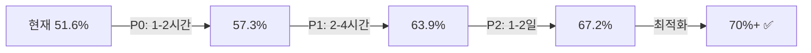

# 테스트 문서 디렉토리

**목적**: 테스트 관련 분석, 체크리스트, 이슈 트래킹

---

## 📚 문서 목록

### 🔴 긴급 (2026-02-07)

| 문서 | 설명 | 상태 | 우선순위 |
|------|------|------|----------|
| [테스트 실패 분석 보고서](./20260207_test_failure_analysis_report.md) | 166개 실패 + 129개 에러 도메인별 분석 | 🔴 분석 완료 | P0 |
| [테스트 수정 체크리스트](./20260207_test_fix_checklist.md) | 11개 Task, 예상 +95개 통과 | 🔴 진행중 | P0 |
| [테스트 재실행 증거 보고서](./20260207_test_rerun_evidence_report.md) | 최근 실패 로그 재실행 증거 및 공통 차단 이슈 고정 | 🔴 최신 | P0 |

---

## 🎯 핵심 요약

### 현재 상황 (2026-02-07 13:00 기준)

```
총 테스트: 611개
- ✅ 통과: 333개 (54.5%) (+18 개선)
- ❌ 실패: 163개 (26.7%)
- 🔴 에러: 129개 (21.1%)
- ⏭️ 스킵: 1개 (0.2%)
```

추가 재실행:
- `tests/v2/test_ops_smoke_core_routes.py` PASS (8)
- `tests/v2/test_ops_paste_import_game_log.py` PASS (4)
- `tests/v2/test_mission_sot.py` PASS (15)
- `tests/v2/test_golden_intervention_flow.py` PASS (5)
- `tests/v2/test_ops_hq_daily_deposit_import.py` PASS
- `tests/v2/test_ops_hq_margin_import.py` PASS
- `tests/v2/test_ops_paste_import_daily_deposit.py` PASS

### 목표

```
목표 커버리지: 70%+
목표 통과: 430개+
예상 소요: 1-2일
```

---

## 🗺️ 빠른 탐색

### 문제별로 찾기

| 문제 유형 | 문서 섹션 | 링크 |
|-----------|----------|------|
| 🔴 Import 에러 | 분석 보고서 §1 | [Ops 도메인](./20260207_test_failure_analysis_report.md#-1-ops-도메인-21개-문제) |
| 🔴 FK 참조 문제 | 분석 보고서 §2 | [Vault 도메인](./20260207_test_failure_analysis_report.md#-2-vault-도메인-28개-문제) |
| 🟡 Relationship 누락 | 체크리스트 P0-Task1 | [V2User 수정](./20260207_test_fix_checklist.md#-task-1-v2user-모델-relationship-추가) |
| 🟡 Mission FK | 분석 보고서 §3 | [Game 도메인](./20260207_test_failure_analysis_report.md#-3-game-도메인-14개-문제) |
| 🔴 ORM 초기화 차단 | 재실행 증거 §3~4 | [UserCashLedger 이슈](./20260207_test_rerun_evidence_report.md#3-실행-결과-요약) |

### 도메인별로 찾기

| 도메인 | 문제 수 | 우선순위 | 바로가기 |
|--------|---------|----------|----------|
| ⚙️ Ops | 21개 | 🔴 긴급 | [분석](./20260207_test_failure_analysis_report.md#-1-ops-도메인-21개-문제) \| [수정](./20260207_test_fix_checklist.md#-p0-즉시-수정-1-2시간---예상-35개-통과) |
| 🏦 Vault | 28개 | 🔴 긴급 | [분석](./20260207_test_failure_analysis_report.md#-2-vault-도메인-28개-문제) \| [수정](./20260207_test_fix_checklist.md#-task-5-vault-fk-마이그레이션-확인) |
| 🎮 Game | 14개 | 🟡 높음 | [분석](./20260207_test_failure_analysis_report.md#-3-game-도메인-14개-문제) |
| 👤 User | 8개 | 🟡 높음 | [분석](./20260207_test_failure_analysis_report.md#-4-user-도메인-8개-문제) |
| 💰 Economy | 20개 | 🟡 높음 | [분석](./20260207_test_failure_analysis_report.md#-5-economy-도메인-20개-문제) |

---

## 🚀 실행 가이드

### 1️⃣ 분석 보고서 읽기

```bash
# 터미널에서 읽기
cat docs/soT/00_test/20260207_test_failure_analysis_report.md | less

# 또는 에디터에서 열기
code docs/soT/00_test/20260207_test_failure_analysis_report.md
```

**핵심 섹션**:
- §1-5: 도메인별 실패 분석 (Ops/Vault/Game/User/Economy)
- §6-9: 기타 도메인 (Auth/Golden/Admin/TeamBattle)
- 우선순위 액션 플랜
- SoT 문서 매핑 표

### 2️⃣ 체크리스트 실행

```bash
# 체크리스트 열기
code docs/soT/00_test/20260207_test_fix_checklist.md
```

**작업 순서**:
1. P0 (1-2시간): Task 1~4 → +35개 통과
2. P1 (2-4시간): Task 5~7 → +40개 통과
3. P2 (1-2일): Task 8~10 → +20개 통과

### 3️⃣ 테스트 실행

```bash
# 전체 테스트
pytest tests/v2/ -q --tb=no

# 도메인별 테스트
pytest tests/v2/test_ops_*.py -v
pytest tests/v2/test_vault_*.py -v

# 커버리지 확인
pytest tests/v2/ --cov=app/v2 --cov-report=term
```

---

## 📊 진행 상황 대시보드

### P0 완료율: ✅✅✅✅ 4/4 (100%)

- [x] Task 1: V2User Relationship 추가
- [x] Task 2: 테스트 Import 수정 (4개 파일)
- [x] Task 3: Golden Daily Nudge 모델
- [x] Task 4: Game Log dedup_key 추가

### P1 완료율: ⬜⬜⬜⬜ 0/4 (0%)

- [ ] Task 5: Vault FK 마이그레이션
- [ ] Task 6: Team Battle FK 수정
- [ ] Task 7: Economy Inventory 수정
- [ ] Task 8: Auth Event FK 수정

### P2 완료율: ⬜⬜⬜ 0/3 (0%)

- [ ] Task 9: Admin API 구현
- [ ] Task 10: DB 마이그레이션 재실행
- [ ] Task 11: 최종 검증

---

## 🎯 목표 달성 로드맵



| 단계 | 예상 소요 | 누적 통과율 | 상태 |
|------|-----------|-------------|------|
| P0 완료 | 1-2시간 | 57.3% | ✅ 완료 |
| P1 완료 | 2-4시간 | 63.9% | ⬜ 대기중 |
| P2 완료 | 1-2일 | 67.2% | ⬜ 대기중 |
| **목표 달성** | **2-3일** | **70%+** | ⬜ 대기중 |

---

## 📌 중요 노트

### ⚠️ 주의사항

1. **SoT 문서 필수 확인**
   - 모든 변경사항은 SoT 문서와 대조 필수
   - 충돌 발견 시 문서에 명시

2. **마이그레이션 안전성**
   - FK 변경 전 데이터 백업
   - 고아 레코드 정리 필수
   - Rollback 계획 수립

3. **테스트 실행 최적화**
   - Task 완료 후 개별 테스트 실행
   - 전체 테스트는 Checkpoint에서만
   - CI/CD 영향도 고려

### 🔗 관련 SoT 문서

- [FK 마이그레이션 가이드](../00_user/아카이브/2026_01_31_multi_table_fk_fix.md)
- [V2 User SoT](../00_user/v2_user_sot_ko.md)
- [Spending Ledger SoT](../00_user/아카이브/2026_02_04_v2_integrated_spending_logic_ko.md)
- [Team Battle SoT](../00_game/v2_team_battle_sot_ko.md)
- [Mission SoT](../00_user/변경로그/v2_new_user_mission_logic_sot_ko.md)

---

## 📞 문의 및 지원

### 트러블슈팅

- **테스트 실패 분석**: [분석 보고서](./20260207_test_failure_analysis_report.md) 참조
- **수정 방법**: [체크리스트](./20260207_test_fix_checklist.md) 참조
- **SoT 충돌**: 관련 SoT 문서의 "정책/구현 충돌" 섹션 확인

### 업데이트 이력

- **2026-02-07 13:00**: 초기 분석 완료, 문서 생성
- **예정**: P0 완료 후 진행 상황 업데이트

---

**🎯 현재 목표**: P0 완료 → 57.3% 통과율 달성
