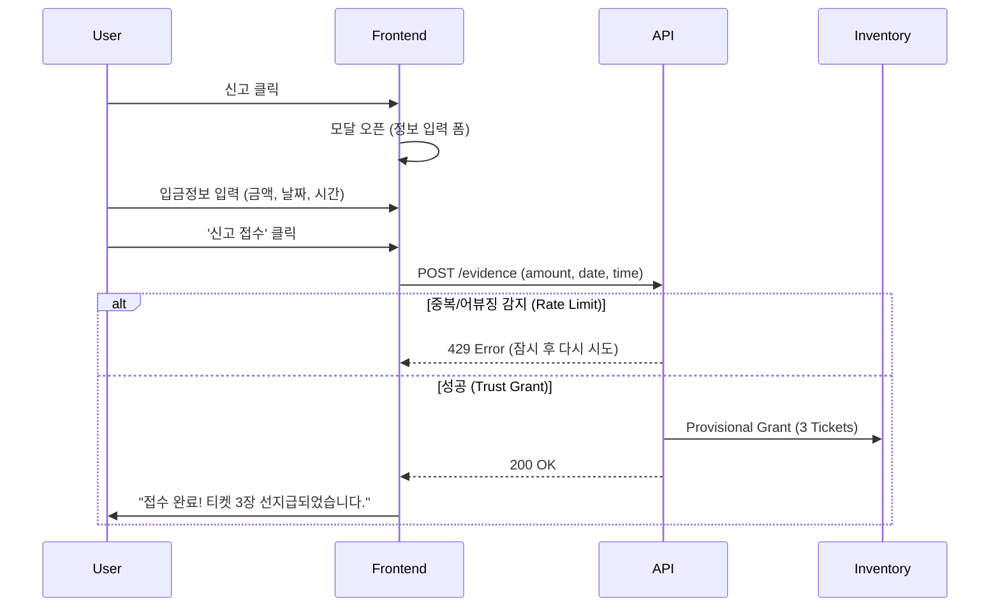

# 15. Latency Survival (지연 입금 선반영 시스템)

## 1. 개요 (Overview)
**Latency Survival**은 "돈은 보냈는데 아직 안 들어왔어요..."라는 유저의 경험을 개선하기 위한 **신뢰 기반 선지급 시스템(Trust-based Provisional Grant System)**입니다.
은행/블록체인 네트워크 지연으로 인한 이탈을 방지하기 위해, 유저가 제출한 증거(TX ID)를 신뢰하여 즉시 게임 재화를 지급하고, 사후 검증(Post-Verification)을 수행합니다.

### 핵심 가치
- **Trust First**: 유저를 먼저 믿고 지급합니다. (선지급 후검증)
- **Latency Mitigation**: 외부 요인(망 지연)에 의한 UX 저하를 시스템이 흡수합니다.
- **Evidence Based**: 모든 지급은 유저가 제출한 '증거(Evidence)'에 기반합니다.

---

## 2. 현재 구현 현황 (Current Implementation Status)

### 2.1 Backend (✅ 완료)
- **Service**: `app/v2/services/latency_survival_service.py`
    - **Provisional Grant**: TX ID 중복/Rate Limit 체크 후 즉시 보상(룰렛티켓 3장) 지급.
    - **Clawback**: 관리자 반려 시 지급된 재화 자동 회수 로직 구현됨.
    - **Verification**: 승인 시 상태 변경 (재화 유지).
- **Models**: `v2_user_deposit_evidence` 테이블 (status: PROVISIONAL/PENDING/VERIFIED/REJECTED).
- **Admin API**: `verify_evidence`, `reject_evidence` 엔드포인트 구현 추정.

### 2.2 Admin Frontend (✅ 완료)
- **Page**: `src/v2/admin/pages/economy/LatencySurvivalPage.tsx`
- **Features**:
    - **List**: 제출된 증거 목록 조회 (대기중/완료).
    - **Action**: 승인(Verify) 및 반려(Reject) 처리.
    - **UI**: TX ID 확인, 지급액 표시, 반려 사유 입력 모달.

### 2.3 User Frontend (✅ 구현 완료 - 2026-02-02)
- **Component**: `src/v2/components/user/LatencyReportModal.tsx`
- **Entry Point**: `src/v2/pages/vault/VaultPage.tsx` - "입금이 지연되고 있나요?" 링크
- **API**: `POST /api/v2/user/economy/latency/evidence`
- **Features**:
    - **Simple Form**: 입금액, 날짜, 시간만 입력 (TX ID 자동 생성)
    - **Policy Warning**: 주의사항 표시 + 동의 체크박스
    - **Instant Feedback**: 선지급 완료 메시지 + 보상 표시

---

## 3. 정책 및 로직 SoT (Policies & Logic)

### 3.1 지급 정책 (Grant Policy)
| 항목 | 값/정책 | 비고 |
| :--- | :--- | :--- |
| **선지급 보상** | `ROULETTE_TICKET` x 3 | 설정값 (`PROVISIONAL_REWARD_AMOUNT`) |
| **시간당 한도** | Max 3회 / User / Hour | 어뷰징 방지 (Rate Limit) |
| **중복 제한** | TX ID Unique Check | 동일 TX ID 재제출 방지 |

### 3.2 상태 전이 (State Transition)
1. **User Submit** → `PROVISIONAL` (즉시 지급 완료)
2. **Admin Review**:
    - **Approve** → `VERIFIED` (지급 유지, 로그 매칭)
    - **Reject** → `REJECTED` (즉시 회수 - Clawback)

### 3.3 회수(Clawback) 정책 및 로직
- **엄격한 재귀적 회수 (Strict Recursive Clawback)**:
    - 원금(Provisional Items) 뿐만 아니라, **해당 재화로 획득한 모든 파생 이익(Winnings)까지 철저하게 회수**합니다.
    - **FIFO 추적**: 선지급 시점 이후 발생한 게임 로그를 시간순으로 조회하여, 선지급된 수량(N개)만큼의 게임 결과를 특정합니다.
    - **LIFO 소비 가정 (LIFO Assumption)**: 유저가 기존에 보유하던 정상 티켓이 있더라도, 선지급된 티켓을 **우선 사용**한 것으로 간주합니다.
        - *논리*: 유저가 '입금 지연'을 신고하고 급하게 게임을 진행했으므로, 해당 플레이는 선지급된 재화에 의존한 것으로 판단함이 타당합니다.
    - **복합 회수**: 당첨된 포인트, 아이템 등을 모두 회수 대상에 포함시킵니다.
- **자산 부채(Asset Debt)**: 유저가 이미 재화를 사용/출금한 경우, **음수 잔액(Negative Balance)**을 강제로 적용하여 시스템 부채로 기록합니다.
- **강제 차감(Force Deduct)**: `reject_evidence` 수행 시 잔액 부족 여부와 관계없이 강제 차감(`force=True`)을 수행합니다.

### 3.4 SoT 요약
| 항목 | 정책 | 비고 |
| :--- | :--- | :--- |
| **Recursive Clawback** | **적용 (Strict)** | 원금 + 당첨금(Winnings) 모두 회수 |
| **Tracing Logic** | **FIFO (선입선출)** | 선지급 이후 최초 N판을 선지급분 사용으로 간주 |
| **Negative Balance** | **허용 (Clawback 한정)** | 시스템 부채로 기록, 추후 상환 유도 |
| **Admin Action** | **Force Deduct** | `allow_negative=True` 옵션 사용 |

---

## 6. 정책 안내 및 메시지 (User Communication)

### 6.1 신청 시 경고 (Application Warning)
지연 신고 모달에 아래 문구를 명시하여 동의를 받아야 합니다.

> **[주의사항 안내]**
> 1. **선지급 재화 우선 사용**: 본 요청 승인 시, 보유 중인 티켓보다 **선지급된 티켓이 우선 사용**된 것으로 간주됩니다.
> 2. **회수 정책**: 추후 허위 신고로 판명될 경우, 선지급된 티켓과 **해당 티켓으로 획득한 모든 당첨금(포인트/아이템)**이 전액 회수됩니다.
> 3. **잔액 차감**: 회수 시 잔액이 부족할 경우 **마이너스 잔액(부채)**으로 처리될 수 있습니다.

### 6.2 반려/회수 알림 (Rejection Notice)
반려 시 유저에게 발송되는 알림 메시지입니다.

> **[시스템 알림] 입금 지연 신고가 반려되었습니다.**
> 귀하가 제출한 TX ID가 유효하지 않거나 확인되지 않았습니다.
> - **회수 내역**: 선지급 티켓 및 관련 당첨금 전액
> - **현재 상태**: 회수로 인해 잔액이 조정되었습니다. (부족 시 마이너스 처리)
> 문의 사항은 고객센터를 이용해 주세요.

---

## 4. 추가 구현 계획 (Implementation Plan)

### 4.1 [User] 지연 신고 UI 상세 설계 (Basic Form)
유저가 알 수 있는 정보(입금액, 시간)만 입력받습니다. TX ID나 스크린샷 등 복잡한 요구사항을 제거합니다.

#### A. 진입점 및 모달 (Entry & Modal)
- **Component**: `LatencyReportModal.tsx`
- **Trigger**: "입금이 지연되고 있나요?" (링크/버튼).

#### B. 상세 로직 흐름도 (Implementation Flow)


#### C. 컴포넌트 명세 (Component Specs)
| Input | Type | Required | UX Guide |
| :--- | :--- | :--- | :--- |
| **입금액 (Amount)** | `Number` | **Yes** | "입금하신 금액을 입력해주세요." (예: 50000) |
| **입금일 (Date)** | `Date` | **Yes** | 오늘/어제 선택 (기본값: 오늘) |
| **시간 (Time)** | `Time` | **Yes** | "몇 시쯤 보내셨나요?" (HH:MM 선택) |
| *닉네임* | `String` | Auto | (로그인 유저 정보 자동 첨부) |

#### D. UX/UI 디테일
1. **Simple Input**: 복잡한 검증 없이, 유저가 기억하는 대략적인 정보만 받습니다.
2. **Trust Base**: 입력값이 정확하지 않아도(1~2분 오차 등), 우선 지급합니다.
3. **Admin Matching**: 관리자는 제출된 [금액/시간/유저] 정보를 보고 실제 입금 로그와 대조하여 승인/반려합니다.

---

## 7. 영향도 분석 및 대응책 (Impact Analysis & Countermeasures)

본 기능 구현 시 충돌이 예상되는 도메인과 코드베이스, 그리고 이에 대한 대응책입니다.

### 7.1 Inventory & Economy Domain (DB/Schema Impact)
- **충돌 요소**: `Force Deduct`로 인한 **음수 잔액(Negative Balance)** 발생.
- **DB 스키마 분석 (`UserGameWallet`)**:
    - **Type**: `Integer` (Signed). 기본적으로 음수를 지원하므로 Schema 변경 불필요.
    - **Constraints**: `UserGameWallet` 테이블 및 `UserGameWalletLedger`, `UserInventoryLedger` 모두 `CheckConstraint`가 없음. **Migration 불필요**.
    - **잠재 위험**: MySQL `UNSIGNED` 옵션 미사용 확인됨 (SQLAlchemy Default).
- **Application Risk**: 상점/게임 로직에서 음수 잔액 처리 미비 시 예외 가능성.
- **대응책**:
    - **Backend**: `inventory_service`는 `allow_negative=False`가 기본값. Clawback 시에만 `allow_negative=True` 사용.
    - **Frontend**: 잔액 표시 UI(`WalletBalance`)에서 음수 붉은색 처리.

### 7.2 Deposit & Payment Domain
- **충돌 요소**: **실제 입금 처리(WebHook)**와 **Provisional Grant**의 중복 보상 우려.
- **데이터 구조 분석**:
    - 입금 로그: `UserCashLedger` (id: Integer, reason="DEPOSIT_...").
    - 매핑: `V2UserDepositEvidence.matched_log_id` (Integer) -> `UserCashLedger.id`와 1:1 매핑 가능.
    - **결론**: ID 타입 일치(Integer). 별도 FK 설정 없이 Soft Link 사용 권장 (MSA/Module 분리 고려).
- **대응책**:
    - 어드민 매칭 시, `UserCashLedger` 중 최근 입금 내역을 조회하여 매칭.

### 7.3 Game Domain (Roulette)
- **충돌 요소**: **게임 로그 스키마 변경** 시 Clawback 추적 실패.
- **분석**: `V2RouletteLog`는 `reward_type`, `reward_amount` 컬럼 보유. `created_at` 인덱스 존재.
- **대응책**:
    - `LatencySurvivalService`의 `reject_evidence` 로직은 `V2RouletteLog`의 스키마에 강한 의존성을 가짐.
    - **Integration Test** 작성 필수.

### 7.4 Auth & Security
- **충돌 요소**: **Rate Limit 우회**.
- **대응책**:
    - IP가 아닌 **User ID** 기반 Rate Limit(`MAX_PROVISIONAL_PER_HOUR`) 적용으로 VPN 우회 무력화.
    - `v2_user_deposit_evidence` 테이블의 `created_at` 인덱스를 활용한 효율적 카운팅.
- **Feedback**:
    - 성공 시: "신고 접수 완료! 룰렛 티켓 3장이 선지급되었습니다." (Confetti 효과).
    - 실패 시: "이미 제출된 TX ID입니다" 또는 "잠시 후 다시 시도해주세요".

### 4.2 [Frontend] API 연동
- `src/v2/api/userApi.ts`에 `submitDepositEvidence` 함수 추가.
```typescript
interface SubmitEvidenceDto {
  tx_id: string;
  amount: number;
}
// POST /api/v2/user/economy/latency/evidence
```

### 4.3 [Admin] 매칭 편의성 개선
- 현재 어드민은 "Matched Log ID"를 수동으로 찾거나 로직이 단순화되어 있음.
- **개선**: `Verify` 모달에서 최근 24시간 내 미매칭 입금 로그(Deposit Log)를 조회하여 선택할 수 있는 Dropdown 제공.

---

## 5. 결론 (Conclusion)
Latency Survival 기능은 **"믿음의 속도(Speed of Trust)"**를 실현하는 강력한 도구입니다.
백엔드 로직은 견고하게 구축되어 있으나, 유저 접점(UI)의 부재로 인해 가동되지 않고 있습니다.
제시된 **4.1 User UI 구현**을 최우선 과제로 진행해야 합니다.
