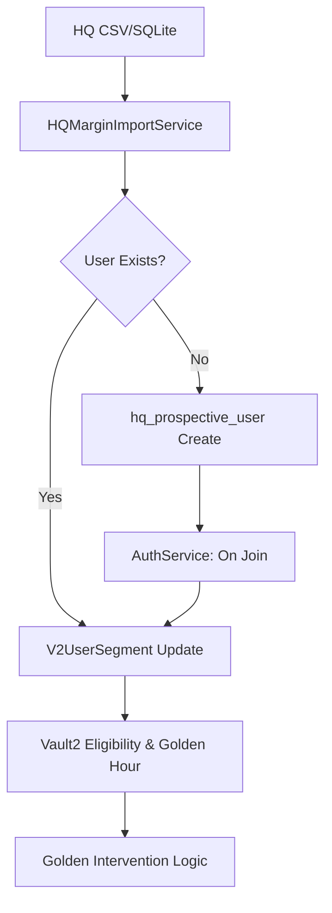

# HQ Margin 데이터 연동 상세 설계 - Phase 4: Golden Project 연동 및 정합성

**문서 타입**: Detailed Design / Learned SoT
**도메인**: Golden / Retention / Automation
**작성일**: 2026-01-31
**상태**: 설계 완료

---

## 1. 목적 (Objective)

본사 마진 데이터를 Golden V2 프로젝트의 핵심 로직(골든아워, 개입 서비스)과 완벽히 결합하여 데이터 기반의 '지능적 리텐션' 시스템을 완성함. 또한 V2 Native SOT 원칙을 강화하여 데이터 정합성 에러를 근절함.

---

## 2. 골든 프로젝트 연동 상세 (Golden Integration)

### 2.1 유저 가입 시 자동 혜택 부여 (`AuthService` 연동)
- **매칭 트리거**: `AuthService.register_user` 성공 직후 실행.
- **로직**: `hq_prospective_user`에서 해당 닉네임 조회 -> 존재 시 `V2UserSegment` 부여 및 `is_joined=True`.
- **효과**: 고가치 유저가 가입하자마자 "VIP 환영 골든아워" 등 선제적 개입(Intervention) 실행 가능.

### 2.2 본사 패턴 기반 골든아워 스케줄러 추천
- **연동 데이터**: 본사 SQLite(`charging_data.db`)의 실시간 충전 트렌드.
- **추천 알고리즘**:
  - 최근 30일간의 시간대별 충전량 합산 분석.
  - 충전 피크 타임(Peak Time) 앞뒤 1시간을 골든아워 최적 구간으로 제안.
  - 관리자 대시보드에서 "추천 적용" 버튼 하나로 골든아워 설정 자동화.

---

## 3. 데이터 정합성 기술 (Integrity & Safety)

### 3.1 V2 Native FK 준수
- 모든 세그먼트 데이터는 `V2User.id` (Integer PK)를 참조하도록 강제.
- `UserSegment` 테이블 사용 시 Legacy 시스템의 `user_id`를 혼용하지 않도록 코드 레벨에서 `V2User` 모델만 쿼리하도록 제한.

### 3.2 닉네임 매칭 안전장치 (Conflict Resolution)
- 닉네임 충돌 발생 시, `GoldenIntervention`을 즉시 실행하지 않고 `STATUS_PENDING`으로 분류하여 관리자 승인을 받도록 설계.
- 휴먼 에러 방지를 위해 매칭된 데이터의 원본 레코드(CSV Row)를 추적할 수 있는 `reference_id` 필드 활용.

---

## 4. 아키텍쳐 연동 구조

---

## 5. 단계별 검증
- [ ] 신규 유저 가입 시 잠재 VIP 데이터와 자동 매칭되어 혜택이 즉시 적용되는가?
- [ ] 본사 SQLite 데이터 분석 결과가 실제 골든아워 설정에 반영되는가?
- [ ] 닉네임 충돌 시 데이터 오염 없이 안전하게 예외 처리되는가?
- [ ] 모든 데이터가 `V2User.id` 기반의 정확한 FK 구조를 유지하는가?
