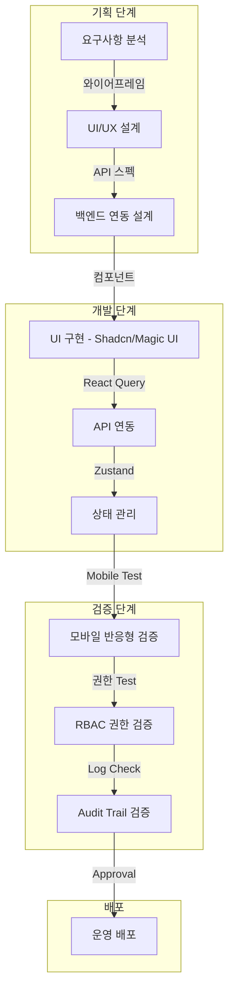

문서 타입: 계획서 (Master Plan)
버전: v2.0
작성일: 2026-01-20
작성자: Antigravity Agent
대상: 어드민 개발자, 운영팀
상태: SoT

# V2 Admin Master Plan (운영자 중심 CRM 관제 시스템)

## 1. 목적 (Purpose)
현재의 파편화된 어드민을 전면 개편하여, **"운영자가 데이터를 보고 즉시 행동(Intervention)할 수 있는 CRM 중심의 관제탑"**을 구축한다.
특히 **모바일(폰) 환경**을 최우선으로 고려하며, "Soft Obsidian(차분함)" 테마를 적용하여 운영 피로도를 낮춘다.

## 2. 범위 (Scope)
- **대상 (Target)**: `src/v2/admin/*` (신규 어드민)
- **제외 (Out of Scope)**: `src/admin/*` (구버전 - 유지보수만 진행)
- **우선순위**: **Mobile View (아이폰/갤럭시)** > PC 화면 확장 (PC에서 작업하는 시간이 많지만, 모바일 환경에서 접근/제어가 필수)

## 3. 용어 정의 (Definitions)
- **CRM 관제탑**: 유저 정보, 경제 시스템, 게임 로그를 한 곳에서 조회하고 즉각 조치할 수 있는 통합 운영 시스템.
- **360도 뷰**: 유저 클릭 시 [기본정보+지갑+금고+인벤토리+로그+메모]가 한 화면(Drawer/Sheet)에 통합 표시되는 UI 패턴.
- **Soft Obsidian**: 완전한 검정(#000)이 아닌, 깊이감 있고 부드러운 다크 테마 (#121214).
- **Slide-to-Approve**: 터치 실수를 방지하기 위해 버튼 대신 '밀어서 승인' 인터랙션을 적용한 UX 패턴.
- **Golden Radar**: 위기(연패, 올인)/기회(활성, 골든타임) 상태의 유저를 실시간으로 감지하여 표시하는 위젯.

---

## 4. 핵심 철학 (Core Philosophy: CRM Command Center)
**"운영자가 데이터를 보고 즉시 행동할 수 있게 하라 (See Data, Take Action Instantly)"**
V2 어드민은 단순한 관리 도구가 아니라, 유저의 상태를 실시간으로 감지하고 **개입(Intervention)**할 수 있는 **CRM 관제탑**이다.

### 4.1 Mobile First (모바일 우선)
- **하단 메뉴바 (Dock)**: 자주 쓰는 메뉴(유저, 금고, 로그)를 아이폰 하단 독처럼 배치.
- **Bottom Sheet**: 상세 정보는 하단에서 올라오는 시트로 표시 (모달 팝업 대신).
- **Touch-Friendly**: 모든 터치 영역 최소 40px 확보, 오터치 방지 인터랙션.

### 4.2 Data-Driven Action (데이터 기반 행동)
- **One-Click Drill-down**: 대시보드 지표 클릭 시 즉시 상세 화면으로 이동.
- **Inline Edit**: 목록에서 바로 수정 가능 (별도 페이지 이동 없이).
- **Batch Action**: 다중 선택 후 일괄 처리 (승인, 반려, 지급).

### 4.3 Safety First (안전 우선)
- **Slide-to-Approve**: 중요 액션(출금 승인, 강제 조정)은 밀어서 승인.
- **Double Confirm**: 삭제/차단 등 복구 불가 액션은 2단계 확인.
- **Audit Trail**: 모든 관리자 액션 로그 자동 적재.

---

## 5. 핵심 디자인 철학: "Soft Obsidian & Order"
**(Reference: Mobbin Premium Dark UI Patterns)**

참고디자인 링크:
- https://mobbin.com/sites/sections/2a5e8d2d-b16a-4f4d-9523-6a8b1f673dc9
- https://mobbin.com/sites/sections/a613e82c-cf1b-401f-b457-739b49ff775a

### 5.1 Color Palette (Soft Obsidian)
눈의 피로를 최소화하고 데이터 가독성을 높이는 **Warm Dark** 테마를 적용한다.
| Token | Hex / Value | 사용처 | 느낌 |
| :--- | :--- | :--- | :--- |
| **Background** | `#121214` (Zinc-950) | 전체 배경 | 완전한 블랙(#000)보다 깊이감 있고 부드러움 |
| **Surface** | `#18181B` (Zinc-900) | 카드/컨테이너 | 배경과 미세하게 구분되는 레이어 |
| **Border** | `rgba(255, 255, 255, 0.08)` | 경계선 | 1px의 아주 얇고 투명한 선 (Hairline) |
| **Primary (CTA)** | `#D2FD9C` (Luminous Lime) | 핵심 액션 (Submit) | 어두운 배경에서 가장 명시적인 주목도 (CC Brand) |
| **Text Main** | `#E4E4E7` (Zinc-200) | 주요 텍스트 | #FFF(White) 대신 사용하여 눈부심 방지 |
| **Text Muted** | `#A1A1AA` (Zinc-400) | 부가 정보 | 데이터 레이블, 설명 문구 |
| **Destructive** | `#FF453A` (iOS Red) | 삭제/반려/차단 | 명확한 경고 및 위험 신호 |
| **Success** | `#30D158` (iOS Green) | 승인/완료 | 긍정적 피드백 |
| **Warning** | `#FF9500` (iOS Orange) | 주의/대기 | 경고 상태 표시 |

### 5.2 Button & Action Design
"데이터를 다루는 도구"로서의 명확한 피드백과 실수를 방지하는 인터랙션을 제공한다.

- **Hierarchy (계층)**:
    - **Primary**: `bg-[#D2FD9C] text-black hover:opacity-90` (저장, 승인, 완료)
    - **Secondary**: `bg-white/10 text-white hover:bg-white/20` (취소, 닫기, 필터)
    - **Ghost**: `hover:bg-white/5 text-zinc-400` (더보기, 아이콘 버튼)
    - **Destructive**: `bg-red-500/10 text-red-500 border-red-500/20` (삭제, 차단)
- **Interaction (반응)**:
    - **Active Scale**: 버튼 클릭 시 `scale(0.98)`로 눌리는 물리적 느낌 제공.
    - **Loading State**: 로딩 중 `Opacity 0.7` + `Spinner` + `Cursor-not-allowed`.
    - **Haptic (Mobile)**: 중요 액션(승인/반려) 시 햅틱 피드백 연동 (Web Vibration API).
- **Shape**:
    - **Radius**: `rounded-lg` (8px) - 너무 둥글지 않은 단단한 느낌 (Order).
    - **Height**: `h-10` (40px) - 터치하기 충분한 영역 확보.
    - **Min Width**: `min-w-[100px]` - 주요 버튼 최소 너비.

### 5.3 Card & Surface Design
- **Layered Surface**: `bg-zinc-900` + `border border-white/8` 레이어 구분
- **Hover State**: 카드 호버 시 `bg-zinc-800/50` 적용
- **Focus Ring**: 포커스 시 `ring-2 ring-[#D2FD9C]/50` 적용
- **Shadow**: 어두운 배경이므로 그림자 최소화 (`shadow-none` 또는 `shadow-sm`)

---

## 6. 기술 스택 및 전략 (Tech Stack & Strategy)

### 6.1 Core Stack
- **Core**: React + Vite + Tailwind CSS
- **UI**: **Shadcn/UI** (기본 디자인), **Tanstack Table** (데이터 표)
- **Motion**: **Framer Motion** (페이지 전환, 모달 등장), **Magic UI** (대시보드 효과)
- **State**: **React Query** (Server State), **Zustand** (Client State)
- **Icons**: **Lucide React** (Consistent Icon Set)

### 6.2 Direction (개발 방향)
- **Clean Code**: 불필요한 `useEffect` 제거, 선언적 UI.
- **Responsive First**: 모바일 → 태블릿 → 데스크톱 순서로 개발.
- **Accessibility**: 키보드 네비게이션, 스크린 리더 지원.
- **Performance**: Lazy Loading, Debounce, Window Focus Refetch.

### 6.3 V1/V2 격리 전략 (Isolation Strategy)
- **목적**: V1 컴포넌트의 우발적 사용으로 인한 의존성 오염 및 스타일 충돌 방지.
- **정책**: `src/v2/**` 디렉토리 내에서는 `src/components`, `src/hooks`, `src/lib` 등 V1 경로의 Import를 엄격히 금지.
- **구현**: `eslint.config.js`에 `no-restricted-imports` 규칙 적용.
    ```javascript
    // eslint.config.js
    {
      files: ["src/v2/**/*.{ts,tsx}"],
      rules: {
        'no-restricted-imports': [
          'error',
          {
            patterns: [{
              group: ['@/components/*', '@/hooks/*', '@/lib/*', '@/utils/*'],
              message: 'V2 must not import from V1 paths.'
            }]
          }
        ]
      }
    }
    ```

### 6.4 Layout Structure (레이아웃 구조)
- **Mobile**: 하단 메뉴바 (**Dock**) + 바텀 시트 (Bottom Sheet)
- **PC**: 좌측 사이드바 + 우측 서랍 (Drawer)
- **Breakpoint**: `md:768px` 기준 레이아웃 전환

### 6.5 핵심 기능 요약
| 영역 | 개선 방향 | 비고 |
| :--- | :--- | :--- |
| **대시보드** | **한 줄 요약**: 복잡한 그래프 대신, "지금 중요한 것"만 한 문장으로 표시. | 가독성 4.5:1 유지 |
| **유저 관리** | **360도 뷰**: 유저 클릭 시 [정보+금고+로그]가 한 화면(서랍/시트)에 통합 표시. | 모달 팝업이되 라우팅 |
| **금고 관리** | **안전 장치**: 터치 실수를 막기 위한 **'밀어서 승인' 버튼 적용. | Emerald/Gold 컬러 |
| **설정 관리** | **쉬운 입력**: 모바일에서도 입력하기 편한 숫자 패드/토글 스위치 제공. | JSON 직접 수정 금지 |

---

## 7. 개발 워크플로우 (Development Workflow)

**전체 흐름**: 기획(Plan) → 개발(Implement) → 검증(Verify) → 배포(Deploy)



---

## 8. UI 컴포넌트 매핑 (Magic UI 활용)
운영자의 업무 효율을 높이기 위해 적절한 인터랙션을 사용하되, **과하지 않게(Minimal)** 적용한다.

### 8.1 관제 및 모니터링 (Monitoring)
| 컴포넌트 | 적용 위치 | 한글 명칭 | 효과/의도 |
| :--- | :--- | :--- | :--- |
| **Bento Grid** | 대시보드 | **카드형 배치** | 매출, 접속자 등 핵심 지표를 깔끔한 카드(격자) 형태로 정리. |
| **Pulsating Dot** | 골든 레이더 | **상태 신호등** | 위기(빨강)/기회(초록) 유저 카드에 작게 깜빡이는 점 표시. (집중 유도) |
| **Animated List** | 로그 피드 | **실시간 목록** | 게임 로그가 쌓일 때 눈이 어지럽지 않게 부드럽게 추가됨. |
| **Number Ticker** | 매출 카드 | **롤링 숫자** | 실시간 매출 변동 시 숫자가 도르륵 굴러가며 바뀜. (생동감) |

### 8.2 CRM 및 조작 (Action)
| 컴포넌트 | 적용 위치 | 한글 명칭 | 효과/의도 |
| :--- | :--- | :--- | :--- |
| **Dock** | 하단 메뉴 | **하단 메뉴바** | (모바일) 자주 쓰는 메뉴(유저, 금고, 로그)를 아이폰 하단처럼 배치. |
| **Sheet** | 유저 상세 | **사이드 시트** | 유저 클릭 시 오른쪽에서 슬라이드되는 상세 패널. |
| **Interactive Icon** | 버튼류 | **반응형 아이콘** | 승인/반려 버튼을 누르면 살짝 눌리는 느낌(애니메이션) 제공. |
| **Slide-to-Action** | 출금 승인 | **밀어서 승인** | 터치 실수 방지를 위한 아이폰 스타일 슬라이드 액션. |

### 8.3 데이터 시각화 (Data Visualization)
| 컴포넌트 | 적용 위치 | 한글 명칭 | 효과/의도 |
| :--- | :--- | :--- | :--- |
| **Area Chart** | 매출 추이 | **영역 차트** | 시간대별 매출 흐름 시각화. |
| **Bar Chart** | 설문 결과 | **막대 차트** | 응답 비율 비교 시각화. |
| **Progress** | 레벨/미션 | **진행률 바** | 진행 상태 시각적 표시. |
| **Badge** | 상태 표시 | **상태 배지** | 유저/트랜잭션 상태를 컬러 코드로 표시. |

---

## 9. 화면 리스트 및 이행 전략 (Screen List)

### 9.1 운영 대시보드 (Ops Dashboard)
| 화면명 | 파일 경로 | 설명 | 주요 컴포넌트 |
| :--- | :--- | :--- | :--- |
| **종합 대시보드** | `src/v2/admin/pages/dashboard/OpsDashboard.tsx` | 골든 레이더, 실시간 매출, 시스템 상태 요약 | `BentoGrid`, `NumberTicker`, `PulsatingDot` |
| **마케팅 센터** | `src/v2/admin/pages/dashboard/MarketingCenterPage.tsx` | 주요 KPI 및 마케팅 성과 지표 | `AreaChart`, `Card`, `Badge` |
| **운영 로그** | `src/v2/admin/pages/dashboard/OpsLogPage.tsx` | 운영 로그 조회 및 CSV 업로드 | `Table`, `Input(File)`, `ScrollArea` |
| **시스템 상태** | `src/v2/admin/pages/system/HealthPage.tsx` | 서버/DB 상태 신호등 표시 | `Card`, `Badge`, `PulsatingDot` |

**세부 기능 명세 (Ops Dashboard)**:

| 화면명 | 세부 기능 | UI 요소 |
| :--- | :--- | :--- |
| **OpsDashboard** | 1. 실시간 금고잔액 표시 <br> 2. 골든 레이더 위기/기회 유저 표시 <br> 3. 시스템 상태 신호등 <br> 4. Quick Action 버튼 (CSV, 메시지, 모달) | `BentoGrid`, `NumberTicker`, `PulsatingDot`, `QuickActionCard` |
| **MarketingCenterPage** | 1.신규 가입자 추이 <br> 3. 활성 유저 지표 <br> 4. 캠페인 성과 요약 | `AreaChart`, `Tabs`, `Card`, `Badge` |
| **OpsLogPage** | 1. 로그 검색 및 필터 <br> 2. CSV 파일 업로드 <br> 3. 로그 상세 보기 <br> 4. JSON 포맷 하이라이팅 | `Table`, `Command`, `Input(File)`, `LogViewer` |
| **HealthPage** | 1. API 서버 상태 <br> 2. DB 연결 상태 <br> 3. 외부 서비스 상태 <br> 4. 최근 에러 로그 | `Card`, `Badge`, `AnimatedList` |

### 9.2 회원 관리 (User Management)
| 화면명 | 파일 경로 | 설명 | 주요 컴포넌트 |
| :--- | :--- | :--- | :--- |
| **유저 목록** | `src/v2/admin/pages/users/UserListPage.tsx` | 검색/필터 테이블 | `TanstackTable`, `Command`, `Popover` |
| **유저 상세 (Drawer)** | `src/v2/admin/components/users/UserDetailDrawer.tsx` | 360도 통합 뷰 | `Sheet`, `Tabs`, `Avatar`, `Timeline` |
| **유저 세그먼트** | `src/v2/admin/pages/users/UserSegmentPage.tsx` | 고객 등급 분류 및 타겟팅 | `Table`, `Badge`, `Select` |

**세부 기능 명세 (User Management)**:

| 화면명 | 세부 기능 | UI 요소 |
| :--- | :--- | :--- |
| **UserListPage** | 1. 검색: 닉네임, CC_id, telegram_id, telegram_username <br> 2. 필터: 상태, 레벨 범위, 가입일 <br> 3. 정렬: 최근 접속, 레벨, 금고 잔액 <br> 4. 다중 선택 및 일괄 액션 | `TanstackTable`, `Command`, `Popover`, `Checkbox` |
| **UserDetailDrawer** | 1. **기본 정보**: 프로필, 가입일, 레벨/XP, 최근 접속, 기기 정보 <br> 2. **지갑 (Wallet)**: 티켓 보유량 조회/수정, 티켓 사용 로그, 게임 보상 내역 **(핵심)** <br> 3. **금고 (Vault)**: 현재 잔액, 누적 출금, 입금 내역, 강제 잔액 수정 <br> 4. **인벤토리 (Item)**: 기프티콘 및 모든 보상 아이템 <br> 5. **활동 로그**: 게임 플레이 및 입출금 이력 타임라인 <br> 6. **상담/메모**: 운영자 메모 <br> 7. **세그먼트**: 유저 등급 표시 <br> 8. **미션**: 수행 이력 조회/강제 완료 처리 | `Sheet`, `Tabs`, `Avatar`, `Timeline`, `Form`, `Badge` |
| **UserSegmentPage** | 1. 세그먼트 목록 및 정의 <br> 2. 유저 세그먼트 자동 분류 규칙 <br> 3. 세그먼트별 유저 수 통계 <br> 4. 타겟팅 캠페인 연동 | `Table`, `Badge`, `Dialog`, `Chart` |

### 9.3 경제 관리 (Economy Ops)
| 화면명 | 파일 경로 | 설명 | 주요 컴포넌트 |
| :--- | :--- | :--- | :--- |
| **금고 통합 관리** | `src/v2/admin/pages/economy/VaultControlPage.tsx` | 출금 승인/반려, 강제 조정 | `SlideToApprove`, `AlertDialog`, `Progress` |
| **CC 입금** | `src/v2/admin/pages/economy/CCDepositPage.tsx` | 외부 CC 입금 수동 확인/처리 | `Table`, `Button`, `Textarea`, `ShineBorder` |
| **티켓/인벤 관리** | `src/v2/admin/pages/economy/TicketInventoryPage.tsx` | 유저별 티켓/아이템 지급 및 회수 | `DataTable`, `Dialog`, `Input`, `Badge` |
| **상점 관리** | `src/v2/admin/pages/economy/ShopManagerPage.tsx` | 상품 라이브 제어 | `Switch`, `Card`, `Input` |

**세부 기능 명세 (Economy Ops)**:

| 화면명 | 세부 기능 | UI 요소 |
| :--- | :--- | :--- |
| **VaultControlPage** | 1. 탭: 출금승인 / 강제조정 / CC입금 / 리스크 <br> 2. 출금 대기 목록 (밀어서 승인) <br> 3. 강제 잔액 조정 (+면 입금, -면 출금) <br> 4. 리스크 유저 식별 및 잠금 <br> 5. 오입금/사고 처리용 강제 조정 | `Tabs`, `SlideToApprove`, `AlertDialog`, `Progress`, `Badge` |
| **CCDepositPage** | 1. 입금 대기 목록 <br> 2. 입금 시각 (KST 기준) <br> 3. 입금 횟수 표시 <br> 4. 메모 입력 <br> 5. 승인/반려 처리 | `Table`, `Button`, `Textarea`, `ShineBorder`, `Badge` |
| **TicketInventoryPage** | 1. 유저별 티켓/아이템 로그 조회 <br> 2. 아이템 수동 지급 다이얼로그 <br> 3. 티켓 사용 보상 내역 (게임 보상 로그) <br> 4. 타입별 배지 시각화 | `DataTable`, `Dialog`, `Input`, `Badge`, `DateRangePicker` |
| **ShopManagerPage** | 1. 상품 CRUD (SKU, 이름, 가격, 지급품, 수량) <br> 2. 진열 ON/OFF 토글 <br> 3. 일일 구매 제한 설정 <br> 4. 교환소 비율 관리 (Fragment ↔ Ticket) | `Switch`, `Card`, `Input`, `Table` |

### 9.4 게임 운영 (Game Ops)
| 화면명 | 파일 경로 | 설명 | 주요 컴포넌트 |
| :--- | :--- | :--- | :--- |
| **미션 관리** | `src/v2/admin/pages/game/MissionManagerPage.tsx` | 미션 분류 및 보상 설정 | `Tabs`, `Card`, `Switch`, `Accordion` |
| **레벨 관리** | `src/v2/admin/pages/game/LevelConfigPage.tsx` | XP 및 보상 테이블 | `Table(Editable)`, `Input`, `Select` |
| **룰렛 설정** | `src/v2/admin/pages/game/RouletteConfigPage.tsx` | 룰렛 확률 및 보상 배율 | `Slider`, `Input`, `Chart` |
| **주사위 설정** | `src/v2/admin/pages/game/DiceConfigPage.tsx` | 주사위 게임 설정 | `Slider`, `Input` |
| **복권 설정** | `src/v2/admin/pages/game/LotteryConfigPage.tsx` | 복권 회차/당첨번호 관리 | `DatePicker`, `InputOTP`, `Table` |
| **팀 배틀** | `src/v2/admin/pages/game/TeamBattleConfigPage.tsx` | 팀 배틀 시즌/매치 설정 | `Calendar`, `Select`, `Table` |

**세부 기능 명세 (Game Ops)**:

| 화면명 | 세부 기능 | UI 요소 |
| :--- | :--- | :--- |
| **MissionManagerPage** | 1. 카테고리 탭: DAILY, WEEKLY, NEW_USER, SPECIAL_EVENT <br> 2. 보상 매핑: 카테고리별 허용 보상 자동 필터링 <br> 3. 스트릭 관리: Day 1~7 보상 테이블, 반복 주기 설정 <br> 4. 미션 활성화/비활성화 토글 | `Tabs`, `Card`, `Switch`, `Accordion`, `Input` |
| **LevelConfigPage** | 1. XP 테이블: 레벨 1~20 구간별 필요 경험치 <br> 2. 레벨업 보상: 티켓/포인트 매핑 <br> 3. 적립률: CC 입금액 대비 XP 비율 (10만/20XP) <br> 4. 자동 저장 | `Table(Editable)`, `Input`, `Select`, `Toast` |
| **RouletteConfigPage** | 1. 세그먼트별 확률 조정 <br> 2. 보상 배율 설정 <br> 3. 시뮬레이션 차트 | `Slider`, `Input`, `Chart` |
| **LotteryConfigPage** | 1. 회차 생성 및 관리 <br> 2. 당첨번호 입력 (OTP 스타일) <br> 3. 추첨일 설정 <br> 4. 회차별 결과 조회 | `DatePicker`, `InputOTP`, `Table`, `Badge` |

### 9.5 마케팅 (Marketing)
| 화면명 | 파일 경로 | 설명 | 주요 컴포넌트 |
| :--- | :--- | :--- | :--- |
| **메시지 발송** | `src/v2/admin/pages/marketing/MessageSenderPage.tsx` | 전체/타겟 유저 대상 Push 발송 | `Textarea`, `Select`, `RadioGroup` |
| **설문조사** | `src/v2/admin/pages/marketing/SurveyPage.tsx` | 설문 생성 및 결과 분석 | `Tabs`, `Switch`, `BarChart` |

**세부 기능 명세 (Marketing)**:

| 화면명 | 세부 기능 | UI 요소 |
| :--- | :--- | :--- |
| **MessageSenderPage** | 1. 메시지 내용 입력 <br> 2. 대상 선택: 전체/세그먼트/개별 <br> 3. 타입 선택: Push/쪽지/모달 <br> 4. 발송 이력 조회 | `Textarea`, `Select`, `RadioGroup`, `Table` |
| **SurveyPage** | 1. 설문 활성화/비활성화 토글 <br> 2. 설문별 응답 통계 시각화 <br> 3. 응답자 목록 조회 <br> 4. 결과 CSV 다운로드 | `Tabs`, `Switch`, `BarChart`, `Table` |

### 9.6 시스템 설정 (System Settings)
| 화면명 | 파일 경로 | 설명 | 주요 컴포넌트 |
| :--- | :--- | :--- | :--- |
| **모달 노출 제어** | `src/v2/admin/pages/system/ModalControlPage.tsx` | 긴급 공지/이벤트 모달 전역 제어 | `Switch`, `Card`, `Preview` |

**세부 기능 명세 (System Settings)**:

| 화면명 | 세부 기능 | UI 요소 |
| :--- | :--- | :--- |
| **ModalControlPage** | 1. 전역 킬스위치 (전체 모달 OFF) <br> 2. 모달별 개별 ON/OFF <br> 3. 모달 미리보기 <br> 4. 노출 기간 설정 | `Switch`, `Card`, `DateRangePicker`, `Dialog` |

---
## 10. 이행 현황 (Implementation Status)

현재 V2 Admin 시스템의 핵심 관제 대시보드 및 공통 UI 라이브러리 구축이 완료되었습니다.

### 10.1 UI/UX 프레임워크 (완료)
- [x] **Soft Obsidian 테마**: `#121214` 기반 다크 모드 테마 적용 및 가이드라인 수립. (근거: `AdminLayout.tsx` 주 적용 및 `index.css` 변수화 완료)
- [x] **디자인 밀도 고도화**: 전체 간격 12px -> 8px 조정 완료 (2026-01-20).
- [x] **Magic UI 통합**: `NumberTicker`, `AnimatedList`, `PulsatingDot` 컴포넌트 구현 및 대시보드 적용. (근거: `src/v2/admin/components/ui/` 내 컴포넌트 실체 확인)
- [x] **공통 레이아웃**: 상단 헤더, 반응형 배리어블 그리드 레이아웃 구축. (근거: `AdminLayout.tsx` 모바일 하단 독 및 데스크톱 사이드바 전환 로직 확인)

### 10.2 핵심 대시보드 (진행 중)
- [x] **종합 대시보드 (OpsDashboard)**: 실시간 금고 잔액, 활성 유저, 퀵 액션 카드 구현. (**API 연동 완료**: `useOpsStatus` hook을 통한 실시간 데이터 동기화 완료)
- [x] **마케팅 센터 (MarketingCenter)**: UI 간소화 및 발송 폼 최적화 완료 (2026-01-20). (**API 미연동**: 현재 프론트엔드 UI 및 Mock 데이터 기반 레이아웃 작업 완료)
- [x] **운영 로그 (OpsLog)**: 로그 상세 보기(Sheet + LogViewer) 및 필터링 시스템 구축. (**API 미연동**: JSON 페이로드 시각화 UI 구현 완료)
- [x] **시스템 상태 (Health)**: 인프라 상태 모니터링 및 애니메이션 이벤트 피드 적용. (**API 연동 완료**: `useOpsStatus`를 이용한 DB/Redis/Worker 실시간 상태 관제)

### 10.3 회원 관리 (완료)
- [x] **회원 목록 (UserList)**: 검색/필터/정렬 및 다중 선택 일괄 액션. (**API 연동 완료**: `useAdminUserList` hooks 연결 완료)
- [x] **360도 상세 뷰 (UserDetail)**: 8개 탭 구조 통합 및 개입(Intervention) 시스템 연결. (**API 연동 완료**: `useAdminUserDetail`, `useUserTicketLogs` 등 10여 개 API 연동 완료)
- [x] **세그먼트 엔진 (Segment)**: AI 기반 유저 분류 목록 및 배치 실행 제어. (**API 연동 완료**: `useAdminSegmentStats`, `useRunSegmentBatch` 등 연동 완료)

### 10.4 다음 단계 (Next Steps)
- [ ] **경제 관리 (Economy Ops)**: '밀어서 승인' 기능이 포함된 금고 관리 및 출금 승인 시스템.
- [ ] **게임 관리 (Game Ops)**: 미션, 룰렛, 주사위 등 인게임 파라미터 제어 패널.

---
## 10. 어드민 전용 컴포넌트 목록 (Admin-Specific Components)

### 10.1 레이아웃 컴포넌트 (Layout)
| 컴포넌트 | 경로 | 용도 | 상태 |
| :--- | :--- | :--- | :--- |
| **AdminLayout** | `src/v2/admin/components/layout/AdminLayout.tsx` | 전체 레이아웃 (Sidebar + Content) | [x] |
| **AdminSidebar** | `src/v2/admin/components/layout/AdminSidebar.tsx` | 데스크톱 사이드바 | [x] |
| **AdminDock** | `src/v2/admin/components/layout/AdminDock.tsx` | 모바일 하단 메뉴바 | [x] |
| **AdminHeader** | `src/v2/admin/components/layout/AdminHeader.tsx` | 상단 헤더 (검색, 알림) | [x] |

### 10.2 대시보드 컴포넌트 (Dashboard)
| 컴포넌트 | 경로 | 용도 | 상태 |
| :--- | :--- | :--- | :--- |
| **BentoGrid** | `src/v2/admin/components/ui/BentoGrid.tsx` | KPI 및 위젯 배치용 그리드 | [x] |
| **QuickActionCard** | `src/v2/admin/components/ui/QuickActionCard.tsx` | 자주 쓰는 기능 바로가기 | [x] |
| **AdminChart** | `src/v2/admin/components/ui/AdminChart.tsx` | Recharts 래퍼 (Line, Area, Bar) | [x] |

### 10.3 CRM 컴포넌트 (CRM)
| 컴포넌트 | 경로 | 용도 | 상태 |
| :--- | :--- | :--- | :--- |
| **UserDetailDrawer** | `src/v2/admin/components/users/UserDetailDrawer.tsx` | 유저 360도 뷰 Drawer | [x] |
| **WalletEditor** | `src/v2/admin/components/users/WalletEditor.tsx` | 티켓 강제 수정 폼 | [x] |
| **CompactTable** | `src/v2/admin/components/ui/CompactTable.tsx` | 모바일용 초소형 테이블 | [x] |
| **StatusBadge** | `src/v2/admin/components/ui/StatusBadge.tsx` | 상태별 컬러 배지 | [x] |

### 10.4 액션 컴포넌트 (Action)
| 컴포넌트 | 경로 | 용도 | 상태 |
| :--- | :--- | :--- | :--- |
| **SlideToApprove** | `src/v2/admin/components/ui/SlideToApprove.tsx` | 밀어서 승인 버튼 | [x] |
| **LogViewer** | `src/v2/admin/components/ui/LogViewer.tsx` | JSON 로그 뷰어 (Syntax Highlighting) | [x] |

---

## 11. 연동 설계 (Integration Design)

### 11.1 API 매핑 (API Mapping)
| 페이지 | 주요 Hook | 엔드포인트 | 역할 |
| :--- | :--- | :--- | :--- |
| **OpsDashboard** | `useOpsStatus` | `GET /api/v2/admin/ops/status` | 시스템 상태/골든레이더 |
| **UserListPage** | `useAdminUsers` | `GET /api/v2/admin/users` | 유저 목록 검색/필터 |
| **UserDetailDrawer** | `useAdminUserDetail` | `GET /api/v2/admin/users/{id}` | 유저 360도 정보 조회 |
| **VaultControlPage** | `useAdminWithdrawals` | `GET /api/v2/admin/withdrawals` | 출금 대기 목록 조회 |
| **VaultControlPage** | `useApproveWithdrawal` | `POST /api/v2/admin/withdrawals/{id}/approve` | 출금 승인 |
| **CCDepositPage** | `useAdminDeposits` | `GET /api/v2/admin/deposits` | 입금 대기 목록 |
| **ShopManagerPage** | `useAdminProducts` | `GET /api/v2/admin/shop/products` | 상품 목록 |
| **MissionManagerPage** | `useAdminMissions` | `GET /api/v2/admin/missions` | 미션 목록 |
| **RouletteConfigPage** | `useRouletteConfig` | `GET /api/v2/admin/game/roulette` | 룰렛 확률/설정 조회 |

### 11.2 상태 관리 (Store State)
- **서버 상태 (React Query)**: `queryKey` 표준
    - `['admin', 'users']`: 유저 목록
    - `['admin', 'users', id]`: 유저 상세
    - `['admin', 'withdrawals', status]`: 출금 목록
    - `['admin', 'deposits']`: 입금 목록
    - `['admin', 'stats']`: 대시보드 통계 (10s polling)
    - `['admin', 'missions']`: 미션 목록
    - `['admin', 'products']`: 상품 목록
- **클라이언트 상태 (Zustand)**: `useAdminStore`
    - `isSidebarOpen`: 사이드바 토글 상태
    - `globalLoading`: 전역 로딩 인디케이터
    - `selectedUsers`: 다중 선택된 유저 ID 배열
    - `activeModal`: 현재 활성화된 모달

### 11.3 인증 및 권한 (Auth & Permission)
- **RBAC**: `useAdminAuth` 훅을 통해 권한 체크
    - `SUPER_ADMIN`: 모든 접근 가능 (Vault 강제 조정 포함)
    - `OPERATOR`: 조회 및 일반 처리 가능 (강제 조정 불가)
    - `VIEWER`: 읽기 전용 (조회만 가능)
- **Role SoT (우선순위)**:
    1) JWT `role` 또는 `roles[0]` 클레임
    2) `AdminUserProfile.tags`의 `ROLE_*` (예: `ROLE_SUPER_ADMIN`)
    3) 기본값: `ADMIN`
- **Token**: `Authorization: Bearer <token>` 헤더 필수
- **V2 Admin Login**: `/v2/admin/login` (성공 시 `/v2/admin/dashboard`)
- **Route Guard**: `ProtectedRoute` 컴포넌트로 비로그인/권한 없음 차단

### 11.4 에러 핸들링 (Error Handling)
- **에러 코드 매핑**:
    - `401 Unauthorized`: 토큰 만료 → 재로그인 유도
    - `403 Forbidden`: 권한 없음 → 접근 차단 안내
    - `404 Not Found`: 리소스 없음 → 목록으로 이동
    - `500 Server Error`: 서버 오류 → 재시도 안내
- **전역 에러**: `AxiosInterceptor`에서 공통 처리
- **Form 에러**: `react-hook-form` + Toast 메시지 표시
- **401 리다이렉트 규칙**:
    - 현재 경로가 `/v2/admin/*`이면 `/v2/admin/login`
    - 그 외에는 기존 로그인 페이지로 이동

### 11.5 라우팅 (Routing)
- `src/v2/router/V2AdminRoutes.tsx`
    - `/v2/admin/*` 경로 하위에 모든 어드민 라우트 배치
    - 비로그인 접근 차단: 토큰 없으면 `/v2/admin/login`
    - Fallback 리다이렉트는 **절대경로**(`/v2/admin/dashboard`)를 사용하여 `.../dashboard/dashboard` 누적 루프를 방지
- **주요 경로**:
    - `/v2/admin/dashboard`: 종합 대시보드
    - `/v2/admin/users`: 유저 관리
    - `/v2/admin/economy/vault`: 금고 관리
    - `/v2/admin/economy/shop`: 상점 관리
    - `/v2/admin/game/missions`: 미션 관리
    - `/v2/admin/system/modal`: 모달 제어

### 11.6 캐시 정책 (Cache Policy)
- **Stale Time**:
    - **통계/대시보드**: 0 (항상 최신)
    - **목록(List)**: 1분 (Window Focus 시 재요청)
    - **설정(Config)**: 5분 (잦은 변경 없음)
- **Refetch**:
    - **Window Focus**: 포커스 시 자동 재요청
    - **Polling**: 대시보드 지표 10초 주기

### 11.7 실시간 데이터 (Real-time)
- **Polling**: 대시보드 지표 (10초), 출금 대기 (30초)
- **WebSocket**: (추후 도입) 골든 레이더 실시간 알림

### 11.8 성능 최적화 (Performance)
- **Lazy Loading**: `React.lazy`로 페이지 단위 코드 분할
- **Debounce**: 검색어 입력 시 300ms 지연 요청
- **Virtualization**: 대용량 테이블에 `react-window` 적용

---

## 12. 검증 체크리스트 (Verification Checklist)

### 12.1 디자인 검증
- [x] **Color**: 배경색이 완전 검정(#000)이 아닌 **Soft Obsidian(#121214)**인가?
- [x] **Surface**: 카드와 배경 레이어가 구분되는가?
- [x] **Button Hierarchy**: Primary/Secondary/Ghost/Destructive 구분이 명확한가?
- [x] **Touch Target**: 버튼 최소 40px (h-10) 높이 확보했는가?

### 12.2 모바일 검증
- [x] **Dock**: 폰에서 하단 메뉴바(Dock)가 정상 표시되는가?
- [x] **Bottom Sheet**: 바텀 시트가 하단 메뉴와 겹치지 않는가?
- [x] **Touch**: 터치 영역이 충분히 넓은가? (40px 이상)
- [x] **Scroll**: 가로 스크롤 없이 세로 스크롤만 되는가?

### 12.3 기능 검증
- [x] **Slide-to-Approve**: 밀어서 승인이 정상 작동하는가?
- [x] **Search**: 검색/필터가 정상 작동하는가?
- [x] **CRUD**: 생성/조회/수정/삭제가 정상 작동하는가?
- [x] **Error Handling**: 에러 발생 시 적절한 UI 피드백이 표시되는가?

### 12.4 보안 검증
- [x] **RBAC**: 권한별 접근 제어가 정상 작동하는가?
- [x] **Audit Trail**: 관리자 액션 로그가 적재되는가?
- [x] **Double Confirm**: 위험한 액션에 2단계 확인이 적용되는가?

### 12.5 용어 검증
- [x] **Easy Korean**: 'Validation Error' 대신 '입력을 확인해주세요' 처럼 **쉬운 한글**을 썼는가?
- [x] **Consistency**: 같은 개념에 같은 용어를 사용했는가?

---

## 13. 와이어프레임 참조 (Wireframe Reference)

### 13.1 레퍼런스 디자인: Visitors UI (Next.js Visitors)
*User provided reference image (Visitors Dashboard 2x2 Grid)*
- **Card Style**:
    - **Deep Surface**: `#1C1C1E` (매우 어두운 회색) 배경.
    - **Color Coding**: 각 기능별 고유 컬러를 **아이콘 배경(Circle)**과 **텍스트**에 매칭.
        - `Analytics`: **Purple** (분석/통계)
        - `Realtime`: **Blue** (실시간/라이브)
        - `Performance`: **Orange** (성능/서버상태)
        - `Profiles`: **Green** (유저/프로필)
- **Typography**:
    - **Feature Title**: White, Bold, San-serif.
    - **Description**: Muted Grey, 13px, 읽기 편한 대비.
- **적용점 (To-Do)**:
    - **대시보드 Quick Action**: 단순 텍스트 버튼 대신, 위 레퍼런스처럼 **[아이콘+타이틀+설명]**이 있는 2x2 큰 카드 형태로 제작하여 주목도 향상.

### 13.2 와이어프레임 파일
| 파일명 | 설명 | 핵심 사양 |
| :--- | :--- | :--- |
| `admin-wireframe-1-user-management.html` | 회원 관리 | Compact Table, 360 Drawer, Search Spec |
| `admin-wireframe-2-vault-control.html` | 금고 제어 | Slide-to-Approve, Risk Indicator, 4단 탭 |
| `admin-wireframe-3-ops-dashboard.html` | 종합 대시보드 | Bento Grid, NumberTicker, Quick Actions |
| `admin-wireframe-4-mission-manager.html` | 미션 관리 | Streak Table, Reward Mapping |
| `admin-wireframe-5-shop-manager.html` | 상점 관리 | Live Product Grid, Exchange Editor |

### 13.3 와이어프레임 핵심 사양

#### 13.3.1 회원 관리 (`admin-wireframe-1`)
- **Compact Table**: 모바일 대응을 위해 행 높이 최소화, 핵심 컬럼(ID, 닉네임, 상태Badge, 레벨, 금고, 접속)만 노출.
- **360 Drawer**: 우측 오버레이 방식. 탭 네비게이션(기본/지갑/금고/인벤/로그/메모) 도입 **확정**.
- **Search Spec**: `닉네임, CC_id, telegram_id, telegram_username` 4가지 키워드 플레이스홀더 명시.

#### 13.3.2 금고 제어 (`admin-wireframe-2`)
- **Slide-to-Approve**: 터치 실수를 원천 차단하는 '밀어서 승인' 인터랙션 적용 (**Essential**).
- **Risk Indicator**: 리스크 유저(Red Dot/Background) 시각적 강조 및 '승인 잠금(Lock)' 처리.
- **Tab Layout**: `출금승인` / `강제조정` / `CC입금` / `리스크` 4단 탭 구조.

#### 13.3.3 종합 대시보드 (`admin-wireframe-3`)
- **Bento Grid**: 4px Grid 기반 카드 배치. (매출, 접속자, 시스템상태, 골든레이더).
- **Interactive Widgets**:
    - `NumberTicker`: 실시간 매출 롤링 효과.
    - `PulsatingDot`: 골든 레이더(위기/기회) 상태 점멸.
- **Quick Actions**: 자주 쓰는 기능(CSV업로드, 메시지, 모달제어) 바로가기 버튼 배치.

#### 13.3.4 미션 관리 (`admin-wireframe-4`)
- **Streak Table**: Day 1~7 보상 테이블을 **직접 수정(Input)** 가능한 형태로 구현. Day 7(Major) 강조.
- **Reward Mapping**: 보상 타입(`TICKET`/`POINT`/`BUNDLE`) 선택 시 수량 입력 UX.

#### 13.3.5 상점 관리 (`admin-wireframe-5`)
- **Live Product Grid**: 카드형 리스트. **ON/OFF 토글**로 즉시 진열 제어.
- **Exchange Editor**: 조각(Fragment) -> 티켓(Ticket) 교환 비율을 테이블에서 직접 수정.

---

## 14. 구현 순서도 (Implementation Roadmap)

### Step 1: Foundation (환경 설정)
- [x] **Theme Setup**: Soft Obsidian(`bg-[#121214]`) 테마 및 Typography(Pretendard) 적용
    - **파일**: `src/v2/admin/styles/globals.css`, `tailwind.config.js`
- [x] **Layout Shell**: Mobile Dock(하단 메뉴) + Desktop Sidebar 반응형 구조 구현
    - **파일**: `src/v2/admin/components/layout/*`
- [x] **Common UI**: `Shadcn/UI` 설치 및 커스텀(Rounded-lg, Warm Gray)
    - **파일**: `src/v2/admin/components/ui/*`
- [x] **API Client**: Axios 인스턴스 + 인터셉터 설정
    - **파일**: `src/v2/admin/api/client.ts`

### Step 2: Dashboard (운영 대시보드)
- [x] **2-1. OpsDashboard**
    - **UI**: `BentoGrid`, `NumberTicker`, `PulsatingDot`, `QuickActionCard`
    - **Hook**: `useOpsStatus`
    - **Features**: 골든 레이더, 실시간 매출, 시스템 상태
- [x] **2-2. MarketingCenterPage**
    - **UI**: `AreaChart`, `Tabs`, `Card`, `Badge`
    - **Hook**: `useMarketingStats`
    - **Features**: KPI 차트, 매출 추이, 캠페인 성과
- [x] **2-3. OpsLogPage**
    - **UI**: `Table`, `Command`, `Input(File)`, `LogViewer`
    - **Hook**: `useOpsLogs`
    - **Features**: 로그 검색, CSV 업로드, JSON 하이라이팅
- [x] **2-4. HealthPage**
    - **UI**: `Card`, `Badge`, `PulsatingDot`
    - **Hook**: `useSystemHealth`
    - **Features**: 서버/DB 상태, 에러 로그

### Step 3: User CRM (회원 관리)
- [x] **3-1. UserListPage**
    - **UI**: `TanstackTable`, `Command`, `Popover`, `Checkbox`
    - **Hook**: `useAdminUsers`
    - **Features**: 검색(닉네임/CC_id/telegram), 필터(상태/레벨), 다중 선택
- [x] **3-2. UserDetailDrawer**
    - **UI**: `Sheet`, `Tabs`, `Avatar`, `Timeline`, `Form`
    - **Hook**: `useAdminUserDetail`
    - **Features**: 360도 뷰 (기본정보/지갑/금고/인벤/로그/메모/미션)
- [x] **3-3. WalletEditor**
    - **UI**: `Dialog`, `Input(Number)`, `Form`
    - **Hook**: `useUpdateWallet`
    - **Features**: 티켓 강제 수정, 변경 사유 입력

### Step 4: Economy Ops (경제 관리)
- [x] **4-1. VaultControlPage**
    - **UI**: `Tabs`, `SlideToApprove`, `AlertDialog`, `Progress`, `Badge`
    - **Hook**: `useAdminWithdrawals`, `useApproveWithdrawal`
    - **Features**: 출금 승인/반려, 강제 조정, 리스크 식별
- [x] **4-2. CCDepositPage**
    - **UI**: `Table`, `Button`, `Textarea`, `ShineBorder`, `Badge`
    - **Hook**: `useAdminDeposits`, `useApproveDeposit`
    - **Features**: 입금 수동 승인, 메모 입력, 샤인 보더 강조
- [x] **4-3. TicketInventoryPage**
    - **UI**: `DataTable`, `Dialog`, `Input`, `Badge`, `DateRangePicker`
    - **Hook**: `useAdminInventory`, `useGrantItem`
    - **Features**: 유저별 로그, 아이템 지급, 타입별 배지
- [x] **4-4. ShopManagerPage**
    - **UI**: `Switch`, `Card`, `Input`, `Table`
    - **Hook**: `useAdminProducts`, `useUpdateProduct`
    - **Features**: 상품 ON/OFF, 가격 수정, 교환소 비율

### Step 5: Game Ops (게임 운영)
- [x] **5-1. MissionManagerPage**
    - **UI**: `Tabs`, `Card`, `Switch`, `Accordion`, `Input`
    - **Hook**: `useAdminMissions`, `useUpdateMission`
    - **Features**: 카테고리별 필터, 미션 활성화, 스트릭 보상 설정
- [x] **5-2. LevelConfigPage**
    - **UI**: `Table(Editable)`, `Input`, `Select`, `Toast`
    - **Hook**: `useLevelConfig`, `useUpdateLevel`
    - **Features**: XP 테이블, 레벨업 보상, 자동 저장
- [x] **5-3. Game Config Pages**
    - **RouletteConfigPage**: 확률/배율 슬라이더, 시뮬레이션 차트
    - **DiceConfigPage**: 주사위 설정
    - **LotteryConfigPage**: 회차 관리, 당첨번호 입력

### Step 6: Marketing & System
- [x] **6-1. MessageSenderPage**
    - **UI**: `Textarea`, `Select`, `RadioGroup`, `Table`
    - **Hook**: `useSendMessage`, `useMessageHistory`
    - **Features**: 타겟/타입별 발송, 발송 이력
- [x] **6-2. SurveyPage**
    - **UI**: `Tabs`, `Switch`, `BarChart`, `Table`
    - **Hook**: `useAdminSurveys`, `useSurveyResults`
    - **Features**: 활성화 토글, 응답 통계, CSV 다운로드
- [x] **6-3. ModalControlPage**
    - **UI**: `Switch`, `Card`, `DateRangePicker`, `Dialog`
    - **Hook**: `useModalConfig`, `useUpdateModal`
    - **Features**: 전역 킬스위치, 개별 모달 제어, 미리보기

### Step 7: Final Polish
- [x] **Easy Korean**: 용어 전수 검수 (한글화)
- [x] **Audit Link**: Toast(Action Feedback) 및 로그 적재 확인
- [x] **Mobile Test**: 모바일 반응형 최종 검증
- [x] **Permission Test**: RBAC 권한 최종 검증

---

## 15. 변경 이력
- v2.0 (2026-01-20, Antigravity Agent): Frontend Master Plan 구조에 맞춰 전면 재편집
    - 용어 정의 섹션 추가 (Section 3)
    - 핵심 철학 (CRM Command Center) 섹션 분리 (Section 4)
    - 개발 워크플로우 다이어그램 추가 (Section 7)
    - 화면별 세부 기능 명세 추가 (Section 9)
    - 어드민 전용 컴포넌트 목록 분리 (Section 10)
    - 연동 설계 세분화 - API/State/Auth/Error/Routing/Cache (Section 11)
    - 검증 체크리스트 세분화 (Section 12)
    - 와이어프레임 참조 섹션 정리 (Section 13)
    - 구현 순서도 상세화 - UI/Hook/Features 명시 (Section 14)
    - 섹션 번호 정리 및 구조 통일 (1~15번)
- v1.6 (2026-01-19, Antigravity Agent): System & Dashboard Ops 구현 완료
    - `OpsDashboard`: BentoGrid 기반 골든 레이더, 시스템 상태 통합 대시보드 구현
    - `ModalControlPage`: 전역 킬스위치 및 모달별 제어 UI 구현
    - `WalletEditor`: 유저 상세 내 지갑 수정 기능 연동
- v1.5 (2026-01-19, Antigravity Agent): Marketing Tools (`MessageSenderPage`, `SurveyPage`) 구현 완료
    - `useAdminMarketing.ts` 훅 및 API 구현
    - UI 컴포넌트 (`Label` 등) 추가 및 경로 표준화
- v1.4 (2026-01-19, Antigravity Agent): Game Ops & Inventory Ops 구현 완료
    - `MissionManagerPage`, `LevelConfigPage`, `TicketInventoryPage` 구현
    - `adminApi.ts`: Mission/Level/Inventory API 및 DTO 추가
    - `useAdminGame.ts`, `useAdminInventory.ts`: React Query 훅 생성
    - V2 경로 표준화 완료 (src/v2 격리, @/v2 alias 추가)
    - Economy Ops (`CCDepositPage`, `ShopManagerPage`) 구현 완료
- v1.3 (2026-01-19, Antigravity Agent): 구현 순서도(Roadmap) 추가
- v1.2 (2026-01-19, Antigravity Agent): 디자인 가이드(Soft Obsidian) 반영 및 용어 한글화
- v1.1 (2026-01-19, Antigravity Agent): Magic UI Ops 적용 전략 추가
- v1.0 (2026-01-19, Antigravity Agent): Artifact 기반으로 공식 문서화
