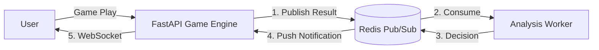

# Golden V2 실시간 아키텍처 (Real-time Architecture)

**문서 타입**: 아키텍처 / V2 Core SoT
**버전**: v2.3
**작성일**: 2026-01-18
**상태**: SoT (Source of Truth)
**프로젝트**: Golden V2

---

## 1. 개요 (Overview)
Golden V2의 핵심인 "실시간 개입(Real-time Intervention)"을 달성하기 위해, 기존의 Request-Response 구조를 **Event-Driven Pub/Sub 구조**로 확장합니다.

**핵심 변경 사항**:
1.  **Redis**가 단순 캐시가 아닌 **이벤트 버스(Event Bus)** 및 **상태 저장소**로 격상됩니다.
2.  **Analysis Worker**가 추가되어 게임 엔진의 부하 없이 복잡한 심리 분석을 수행합니다.
3.  **WebSocket**이 도입되어 유저에게 즉각적인 보상과 피드백을 전달합니다.

---

## 2. 아키텍처 흐름도 (Flow Definition)



---

## 3. 컴포넌트 상세 (Component Details)

### 3.1 FastAPI Game Engine (Publisher / Pusher)
- **역할**: 게임 로직 처리 및 결과 생성. WebSocket 연결 관리.
- **Action**:
    - 게임 결과 생성 직후 `Redis.publish(channel, event)` 실행.
    - `current_loss_streak` 등 단순 카운터는 Redis에서 직접 증가(Atomic Incr).
    - Worker로부터 수신된 개입 메시지를 해당 유저의 WebSocket으로 전송.

### 3.2 Redis (Event Bus & State Store)
- **역할**: 고속 데이터 버스 및 메모리 상태 저장소.
- **Channels**:
    - `golden:v2:events:game`: 모든 게임 결과 스트림.
    - `golden:v2:events:intervention`: 분석 결과(개입) 스트림.
- **Keys**:
  - `golden:v2:user:{user_id}:loss_streak` (Int): 연속 패배 횟수.
  - `golden:v2:user:{user_id}:session_start_balance` (Int): 세션 시작 잔액.
  - `golden:v2:user:{user_id}:psych_state` (String): 현재 심리 상태 (e.g., `FRUSTRATED`).

### 3.3 Analysis Worker (Consumer / Brain)
- **역할**: 게임 결과 이벤트를 구독하고, 복잡한 로직(Rules/AI)을 수행하여 개입 여부 결정.
- **Logic**:
    - **Trigger**: "5연패 달성" OR "잔액 50% 급감" 등 감지.
    - **Decision**: 개입 필요 시 `Intervention Payload` 생성 후 Redis Publish.
    - **Async**: 메인 API 서버와 분리되어 독립적으로 스케일링 가능.

---

## 4. 데이터 스키마 (Data Schemas)

### 4.1 Game Result Event (To Worker)
**Channel**: `golden:v2:events:game`
```json
{
  "event_id": "uuid",
  "timestamp": 1705623000000,
  "user_id": 1004,
  "game_type": "ROULETTE",
  "result": "LOSE",
  "bet_amount": 1000,
  "payout": 0,
  "current_balance": 9000
}
```

### 4.2 Intervention Event (To API -> User)
**Channel**: `golden:v2:events:intervention`
```json
{
  "target_user_id": 1004,
  "type": "REALTIME_REWARD",
  "payload": {
    "title": "힘내세요!",
    "message": "연패 위로금: 다이아 10개 지급",
    "reward": {"type": "DIAMOND", "amount": 10}
  }
}
```

---

## 5. 구현 가이드 (Implementation Guide)
1.  **Redis Setup**: `docker-compose`에 Redis 서비스가 필수(Healthy)로 설정되어야 함.
2.  **Worker Process**: `celery` 또는 `python -m app.v2.worker` 형태로 별도 프로세스 구동 필요.
3.  **WebSocket Endpoint**: `/api/v2/ws/golden` 엔드포인트 개설 및 `Connection Manager` 구현.

---

## 6. SoT 확장 (2026-01-28)

### 6.1 Redis Pub/Sub 채널 SoT (확장)

| 채널 | 방향 | 목적 | Producer → Consumer |
| :--- | :--- | :--- | :--- |
| `ch25_events` | Upstream | 원본 게임 이벤트 스트림(브릿지 입력) | Game → GoldenEventWorker |
| `golden:v2:events:game` | Game Event | V2 게임 이벤트 스트림(표준) | Game/Gateway → Analysis/Intervention |
| `golden:v2:events:intervention` | Intervention Event | 개입 이벤트 스트림(표준) | Worker/Service → API(User Push) |

### 6.2 Redis 키 SoT (확장)

| 키 패턴 | 타입 | 의미 |
| :--- | :--- | :--- |
| `golden:v2:cooldown:{trigger_id}:{user_id}` | String/TTL | 트리거별/유저별 쿨다운 상태 |
| `golden:v2:user:{user_id}:psych_state` | String | 유저 심리 상태(예: FRUSTRATED) |
| `golden:v2:user:{user_id}:session_start_balance` | Int | 세션 시작 잔액 |

> [!NOTE]
> V2 Golden 실시간 상태 키의 표준 SoT prefix는 `golden:v2:user:{user_id}:...` 입니다.

### 6.3 실시간 스트림 엔드포인트 SoT (확장)

| 구분 | 엔드포인트 | 대상 | 비고 |
| :--- | :--- | :--- | :--- |
| User WebSocket | `/api/v2/ws/golden` | TMA/유저 | 개입/보상/상태 푸시 |
| Admin WebSocket | `/api/v2/admin/ws/golden/events` | 어드민 | 게임 이벤트 스트림(대시보드) |

---

## 7. 변경 이력
- v2.3 (2026-01-28, GitHub Copilot): Redis 키 예시 prefix를 현행 구현(golden:v2:user:{user_id}) 기준으로 정합화.
- v2.2 (2026-01-28, GitHub Copilot): 미구현 채널 표기 정정 및 Admin WS 경로를 /api/v2 기준으로 정합화.
- v2.1 (2026-01-28, GitHub Copilot): Pub/Sub 채널/키/엔드포인트 SoT 확장(OpsPlan/CRM/Config Updates 반영).
- v2.0 (2026-01-18): Golden V2 실시간 아키텍처 정의 (최초 작성).
