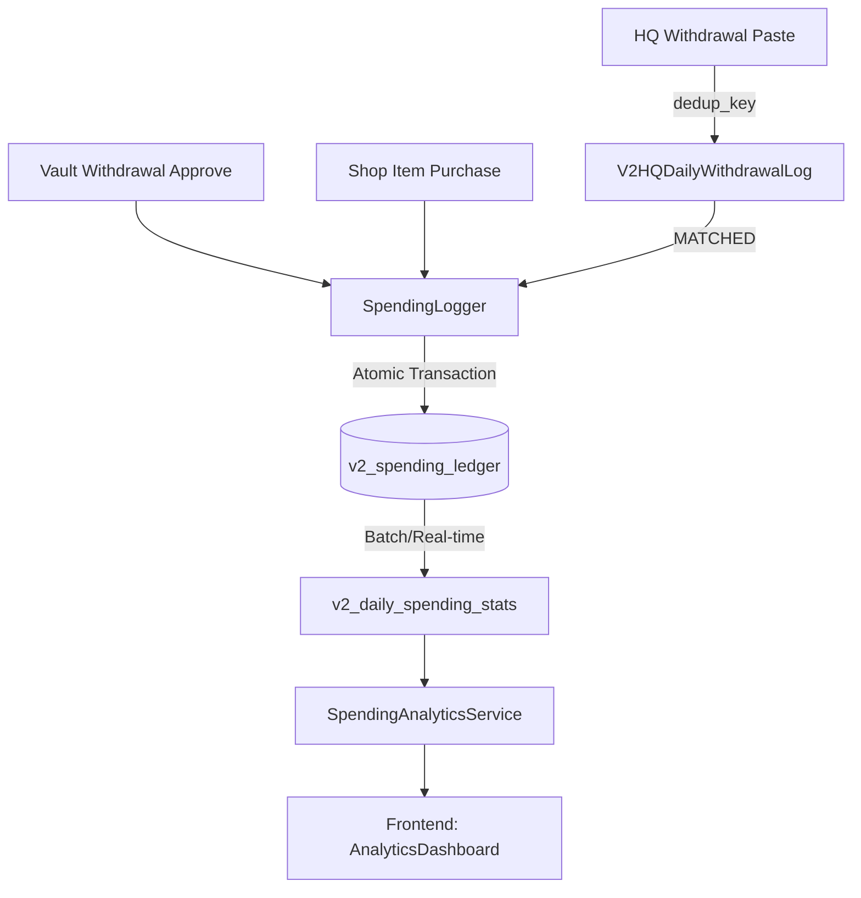

# [SoT] Integrated Spending System v2.2 (System Alignment)

**Status**: Approved / Implementation Pending
**Domain**: Golden Economy
**Owner**: Antigravity
**Date**: 2026-02-04
**Version**: v2.2 (Zero-Error Full Stack Integration)

---

## 1. 개요 (Overview)
본 문서는 `ch25` 서비스의 지출 데이터를 전역적으로 통합하여 **[분석 대시보드](https://cc-jm.com/admin/analytics)**에서 일관된 "오늘 지출" 및 "순수익" 지표를 제공하기 위한 최종 기술 명세서입니다. 

기존의 파편화된 데이터 소스(Game Log, HQ Margin Snapshot, Vault Request)를 `v2_spending_ledger`로 단일화하여 무결성을 보장합니다.

---

## 2. 데이터 흐름도 (Data Pipeline)



---

## 3. 기술적 상세 명세 (Technical Specifications)

### 3.1. DB Layer (Zero-Error Schema)

#### `v2_spending_ledger`
- **transaction_id**: `[SOURCE]_[REF_ID]` (예: `HQ_W_5f3a...`, `VAULT_W_102`, `SHOP_U_505`)
- **amount**: `BigInteger` (V2 표준, 원본 재화 수량)
- **converted_krw_amount**: `BigInteger` (KRW 환산 가치)
- **kst_date**: `Date` (KST 09:00~익일 08:59:59 기준 비즈니스 데이)

```sql
CREATE TABLE v2_spending_ledger (
    id BIGSERIAL PRIMARY KEY,
    transaction_id VARCHAR(100) NOT NULL UNIQUE, 
    user_id INTEGER NOT NULL REFERENCES v2_user(id) ON DELETE CASCADE,
    amount BIGINT NOT NULL,
    currency_type VARCHAR(20) NOT NULL, -- 'KRW', 'POINT', 'G_W'
    converted_krw_amount BIGINT NOT NULL,
    spending_source VARCHAR(20) NOT NULL, -- 'HQ_W', 'VAULT_W', 'SHOP_U'
    kst_date DATE NOT NULL,
    metadata JSONB,
    created_at TIMESTAMP WITH TIME ZONE DEFAULT NOW()
);
```

### 3.2. Backend Layer (Service Logic)

#### `SpendingLogger.log_spending`
```python
def log_spending(db, user_id, amount, currency_type, source, ref_id, metadata=None):
    # 1. kst_date 계산 (비즈니스 데이 기준)
    # 2. ValuationService 호출 (POINT/G_W -> KRW)
    # 3. transaction_id 중복 체크 (IntegrityError 핸들링)
    # 4. v2_spending_ledger Insert
```

#### `PasteImportService.import_daily_withdrawals`
- **Parsing logic**: `text.split('\n')` -> `row.split('\t')`
- **Deduplication**: `withdrawal_at + nickname + amount` 조합의 SHA-256 해시를 `dedup_key`로 사용.

---

## 4. Frontend Integration (Analytics UI)

### 4.1. 데이터 매핑 규칙 (`AnalyticsDashboard.tsx`)
기존의 복잡한 Fallback 로직을 제거하고 `SpendingAnalyticsService` 결과를 최우선으로 적용합니다.

| UI 필드 | 데이터 소스 (v2_spending_ledger 기준) |
| :--- | :--- |
| **오늘 지출 (Today Expenses)** | `sum(converted_krw_amount)` WHERE `kst_date = today` |
| **순수익 (Net Income)** | `Today Revenue (Deposits)` - `Today Expenses` |
| **지출 상세 (Expenses Detail)** | `spending_source`별 그룹화 (HQ 환전 / 금고 출금 / 인벤토리 사용) |

### 4.2. API 엔드포인트 확장
- `GET /api/v2/admin/ops/spending/daily`: 일별 통합 지출 현황 및 소스별 비중 제공.

---

## 5. 구현 시 주의사항 (Zero-Error Checklist)
- [ ] **Transaction Boundary**: 지출 로깅 실패 시 지불 행위(금고 승인 등)도 반드시 Rollback 되어야 함.
- [ ] **Valuation Sync**: `v2_server_config`의 환율 변경 시, 변경 이후의 트랜잭션에만 새 환율 적용 (Historical Data 보존).
- [ ] **Data Format**: HQ CSV 파싱 시 금액의 `,`(쉼표)와 날짜의 공백 유무를 정규식으로 엄격히 검증.

---

## 7. 지출 중복 이슈 방지 및 정합성 증빙 (Spending Integrity Proof)

사용자의 "중복 지출" 우려를 해소하기 위해 물리적 제약 조건과 용어 사전 일치성을 다음과 같이 증빙합니다.

### 7.1 도메인별 중복 발생 확률 (0% 확률의 근거)

| 지출 소스 | 중복 방지 메커니즘 (`transaction_id` 생성 규칙) | 발생 확률 | 비고 |
| :--- | :--- | :--- | :--- |
| **HQ 환전 (HQ_W)** | `dedup_key`: `SHA256(닉네임+금액+환전일시)` + `HQ_W_{dedup_key}` | **Near 0%** | 클립보드 붙여넣기 시 원본 레코드 유니크성 보장 |
| **금고 출금 (VAULT_W)** | `VAULT_W_{vault_withdrawal_request.id}` | **0%** | 승인 시점에 해당 요청 PK를 직접 참조하여 1회만 생성 |
| **상점 사용 (SHOP_U)** | `SHOP_U_{v2_shop_order.id}` | **0%** | 주문 생성 성공 시점에 주문 PK를 직접 참조 |

### 7.2 스키마/용어 사전 일합도 (Terminology Alignment)

본 설계는 `docs/v2_specs/01_core/v2_vault_glossary_sot_ko.md` 및 `v2_user_sot_ko.md`의 표준 영문명(Physical Name)을 100% 준수합니다.

- **`vault_locked_balance` (금고 포인트)**: `v2_vault_glossary_sot_ko.md`의 표준 금고 SoT 필드명을 원장(`amount`)과 1:1 매핑.
- **`cc_id` (외부 식별자)**: V2 User SoT 권고안(`cc_id`)을 따라 원장 매칭 시 `V2User.cc_id`를 최우선 식별자로 사용.
- **`kst_date` (운영일)**: `v2_core_economy_glossary_ko.md` (v2.2)의 **9AM 리셋 정책**을 `SpendingLogger`에 내장하여 데이터 정합성 강화.

---

## 8. 변경 이력
- v2.3 (2026-02-04, Antigravity): 지출 중복 방지 증빙(7.1) 및 용어 사전 일치도(7.2) 섹션 추가.
- v2.2 (2026-02-04, Antigravity): FE[분석 대시보드] 데이터 매핑 및 통합 파이프라인 추가.
- v2.1 (2026-02-04, Antigravity): Paste Import 상세 로직 및 ExternalRankingData 누적액 로직 추가.
- v2.0 (2026-02-04, Antigravity): 최초 통합 지출 설계 수립.
