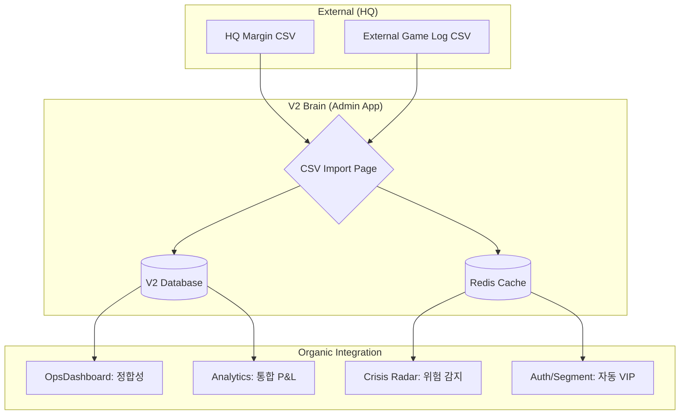

# V2 Admin Dashboard 운영 매뉴얼 (5W1H)

본 문서는 Golden V2 Admin Dashboard의 각 페이지 및 기능에 대한 운영 가이드입니다. 육하원칙(5W1H)에 따라 사용 목적과 방법을 기술합니다.

---

### 1. 통합 관제 센터 (Control Center)
> **PATH**: `/admin/control`
*   **용도**: 전체 시스템 현황, 실시간 게임 중계, 이탈 위험 유입을 한곳에서 모니터링합니다.
*   **하위 탭**:
    *   **현황판**: 전체 자산 및 시스템 상태 (`OpsDashboard`)
    *   **실시간 중계**: 실시간 게임 이벤트 및 개입 로그 (`GoldenRealTimePage`)
    *   **이탈 위험**: AI 기반 이탈 예측 및 위험 유저 추적 (`CrisisRadarPage`)

### 2. 시스템 보안 및 데이터 (System & Security)
> **PATH**: `/admin/system`
*   **용도**: 비상 대응, 증거 승인, 데이터 반입 및 로그 확인을 수행합니다.
*   **하위 탭**:
    *   **비상 정지**: 자산 지급 한도 관리 및 차단 해제 (`CircuitBreakerPage`)
    *   **지연 승인**: 유저 제출 입금 증거 검토 및 승인 (`LatencySurvivalPage`)
    *   **데이터 반입**: 외부 플랫폼 데이터 CSV 임포트 (`CSVImportPage`)
    *   **운영 기록**: 운영진 활동 감사 로그 (`AuditLogPage`)

### 3. 지표 및 인사이트 (Insights)
> **PATH**: `/admin/analytics`
*   **용도**: 리텐션, 수익/지출, 마케팅 효율 등 정밀 지표를 분석합니다.

---

## 2. 세부 기능 설명

### 1) 통합 관제 센터 (Control Center)
*   **Who (누가)**: Ops Manager (운영 총괄), Super Admin
*   **When (언제)**: 매일 업무 시작 시, 시스템 상태 전반을 빠르게 파악할 때 사용합니다.
*   **Where (어디서)**: Admin 패널 로그인 직후 보이는 **메인 화면**입니다.
*   **What (무엇을)**:
    *   **시스템 상태 요약**: 09:00 KST 기준 일간 지표 (VAULT 총액, 인출 대기, 활성 유저 수)
    *   **골든 레이더**: 현재 활성화된 골든 타임 여부 및 Intervention 필요 상태
    *   **활성 유저**: 실시간 접속자 및 금일 활동 유저 수
    *   **HQ 마진 통계**: 금일 HQ 입금(Margin) 현황 요약
*   **Why (왜)**: 시스템의 건강 상태를 한눈에 파악하고, 긴급 대응이 필요한 이슈(예: 인출 대기 급증, 서킷 브레이커 발동)를 즉시 인지하기 위함입니다.
*   **How (어떻게)**:
    1.  상단 카드 섹션에서 주요 숫자(빨간색/초록색 지표)를 확인합니다.
    2.  '유저 상세 드로어' 검색창을 통해 특정 유저 ID/닉네임으로 즉시 조회하여 상세 정보를 확인합니다.

---

## 2. 골든 실시간 중계방 (GoldenRealTimePage)
> **PATH**: `/admin/golden/realtime`

*   **Who (누가)**: 운영자 (게임 마스터, 모니터링 담당자)
*   **When (언제)**: 골든 타임(20:00~23:00)이나 이벤트 중에 유저들이 어떻게 게임을 하고 있는지 **생중계**로 볼 때 사용합니다.
*   **Where (어디서)**: 사이드바 **[골든 관리] -> [실시간 중계]** 메뉴 (또는 Real-time)
*   **What (무엇을)**:
    *   **게임 내역 생중계 (스트림)**: 지금 막 터진 잭팟, 큰 금액 배팅, 주사위나 룰렛 결과가 실시간으로 올라옵니다.
    *   **관리자 특별 조치 기록 (Intervention)**: 운영자가 보상을 더 주거나 승률을 조정하는 등 직접 개입한 내역을 확인합니다.
*   **Why (왜)**: 속임수를 쓰는 사람이 없는지, 너무 한 사람만 계속 이기는 수상한 상황은 아닌지 확인하고 즉시 **운영자 개입(보상 조정 등)**을 결정하기 위해서입니다.
*   **How (어떻게)**:
    1.  화면 가운데에 실시간으로 올라오는 게임 기록들을 살펴봅니다.
    2.  특정 사람이 너무 계속 당첨되어 수상하다면, 이름을 눌러 '상세 창'을 열고 이전에 운영자가 조치한 적이 있는지 확인합니다.
    3.  상황이 너무 심각하다면 오른쪽 상단 '긴급 멈춤(Emergency Stop)' 버튼 사용을 고려합니다.

---

## 3. 위기 레이더 (CrisisRadarPage)
> **PATH**: `/admin/golden/crisis-radar`

*   **Who (누가)**: Retention Manager, VIP 담당자
*   **When (언제)**: 이탈 징후가 보이는 고가치 유저(High Roller)를 사전 식별하여 케어할 때 사용합니다.
*   **Where (어디서)**: 사이드바 **[Golden] -> [Crisis Radar]** 메뉴
*   **What (무엇을)**:
    *   **이탈 위험군 리스트**: 최근 활동 감소, 연패 누적 등으로 이탈 확률이 높은 유저 목록
    *   **위험 지표**: 잔고 급감 속도, 로그인 빈도 저하율 등
*   **Why (왜)**: 소 잃고 외양간 고치기(Churn 후 복구)보다, 이탈 직전의 골든 타임에 개입(쿠폰 지급, 안부 메시지)하여 잔존율을 방어하기 위함입니다.
*   **How (어떻게)**:
    1.  'High Risk' 필터를 적용하여 긴급 관리 대상을 추립니다.
    2.  리스트의 유저를 클릭하여 상세 드로어를 엽니다.
    3.  유저의 최근 승패 로그를 확인하고, 적절한 'Care Action'(메시지 전송 등)을 수행합니다.

---

## 4. 분석 대시보드 (AnalyticsDashboard)
> **PATH**: `/admin/analytics`

*   **Who (누가)**: Data Analyst, Business Owner
*   **When (언제)**: 주간/월간 성과 보고서를 작성하거나, 마케팅 캠페인 효율을 분석할 때 사용합니다.
*   **Where (어디서)**: 사이드바 **[Analytics]** 메뉴
*   **What (무엇을)**:
    *   **보유율(Retention)**: D+1, D+7, D+30 잔존율 추이
    *   **수익/지출(P&L)**: 일자별 입금(Vault In) vs 출금(Vault Out) vs 게임 획득/소모
    *   **마케팅 효율**: 캠페인별 유입 유저 수 및 ROI(투자 대비 수익)
*   **Why (왜)**: 직관적인 감이 아닌, **데이터(SOT)**에 기반하여 다음 운영 전략과 예산 편성을 결정하기 위함입니다.
*   **How (어떻게)**:
    1.  상단 탭(Overview, User, Revenue)을 전환하며 지표를 확인합니다.
    2.  날짜 범위를 선택하여 특정 기간의 데이터를 필터링합니다.
    3.  그래프의 추세선을 분석하여 이상점(Spike/Drop)의 원인을 파악합니다.

---

## 5. 시스템 & 보안 (System & Security)

### A. 서킷 브레이커 (CircuitBreakerPage)
> **PATH**: `/admin/security/circuit-breaker`
*   **Who**: Super Admin (보안 최고 책임자)
*   **When**: 시스템에서 대량 출금 이슈 등으로 자동 지급 정지가 발동되었을 때
*   **What**: 현재 지급 제한 상태(OPEN/CLOSED), 금일 지급 누적액 확인
*   **How**: 위험 요소가 해소된 후, **슬라이드를 밀어서(Slide to Confirm)** 글로벌 한도를 리셋하고 지급을 재개(CLOSE)합니다.

### B. 지연 극복 승인 (LatencySurvivalPage)
> **PATH**: `/admin/security/latency-survival`
*   **Who**: Ops Manager
*   **When**: 유저가 "입금했는데 반영이 안 돼요"라며 증거(스크린샷 등)를 제출했을 때
*   **What**: 유저 제출 증거 목록, 시스템 로그 대조 결과
*   **How**: 증거를 검토한 후 **[승인]** 버튼을 눌러 선지급(Provisional Credit) 처리하거나, 증거 불충분 시 **[반려]** 처리합니다.

### C. 감사 로그 (AuditLogPage)
> **PATH**: `/admin/security/audit-logs`
*   **Who**: Auditor (감사팀), Super Admin
*   **When**: 특정 설정이 누가 언제 바꿨는지 책임 소재를 규명해야 할 때
*   **How**: `Target Type`(예: USER), `Action`(예: FORCE_EDIT) 필터를 걸어 로그를 검색하고, **Before/After JSON**을 비교하여 변경 내역을 증빙합니다.

### D. CSV 임포트 (CSVImportPage)
> **PATH**: `/admin/io/csv-import`

#### 1. 개요
*   **Who**: Data Ops (데이터 담당자)
*   **When**: 외부(HQ) 데이터나 레거시 게임 로그를 V2 시스템으로 대량 이관할 때
*   **What**: 파일 업로드, 데이터 타입 선택(HQ_MARGIN, EXTERNAL_GAME_LOG), 유효성 검증 레포트

#### 2. 핵심 가치: 왜 이 기능이 V2의 심장인가? (Why)
단순한 파일 업로드가 아니라, 외부(HQ)의 **"돈의 흐름(Real Money Flow)"**을 V2 뇌(Brain)로 수혈하는 **핵심 연결 고리**입니다.

1.  **OpsDashboard 연결 (자금 정합성)**: `HQ_MARGIN`을 임포트하면 **"실제 입금액"**이 Ops 대시보드에 즉시 반영됩니다. V2 내부 매출과 HQ 실제 입금을 대조하여 누락/부정을 1초 만에 잡아냅니다.
2.  **Analytics 연결 (통합 P&L)**: `EXTERNAL_GAME_LOG`를 통해 V2 밖에서의 득실까지 합산한 **"유저별 진짜 손익계산서"**를 완성합니다. 이를 통해 진정한 VIP를 가려냅니다.
3.  **Crisis Radar 연결 (이탈 방어)**: 외부 카지노에서의 **연패(Losing Streak)** 기록을 가져와, V2 접속이 뜸한 유저라도 **"위기(High Risk)"** 등급으로 격상시켜 선제적 케어(Golden Care)를 가능케 합니다.
4.  **Golden RealTime 연결 (교차 검증)**: 잭팟 발생 시 과거 외부 기록을 즉시 대조하여, 이것이 조작인지 실력인지 판단하는 **"공정한 개입"**의 근거가 됩니다.

#### 3. [심화] 유기적 연동 시나리오 (Advanced Scenarios)

*   **자동 세그먼트 트리거 (Segment & Marketing)**:
    *   `HQ_MARGIN` 임포트 시 누적 입금액이 특정 임계치를 넘는 유저는 즉시 **'VIP Prospective'** 세그먼트로 분류됩니다.
    *   이 유저가 V2에 접속하는 순간, 일반 유저와는 다른 **"VIP 전용 골든아워"** 보너스 배율이 자동으로 적용됩니다.
*   **지연 극복(Latency Survival) 최종 승인**:
    *   유저가 제출한 입금 증거가 시스템 로그와 일치하지 않을 때, `HQ_MARGIN` CSV를 최종 대조군으로 사용합니다.
    *   본사(HQ) 원장에 입금이 확인되는 즉시, 관리자는 확신을 가지고 **'Latency Survival'** 승인을 처리할 수 있습니다.
*   **서킷 브레이커(Circuit Breaker) 임계값 조정**:
    *   최근 임포트된 HQ Margin 총합이 급증했다면, 시스템은 재정적 여유를 판단하여 V2의 일일 지급 한도(Circuit Breaker Threshold)를 전략적으로 상향 조정할 근거를 얻습니다.

#### 4. 데이터 흐름 시각화

#### 3. 사용 방법 (How)
1.  **데이터 타입 선택**:
    *   `HQ_MARGIN`: 본사 입금 내역 (자금 대조용)
#### 5. CSV 상세 규격 및 샘플 (Specification)

데이터 정합성을 위해 반드시 아래 규격에 맞춘 CSV 파일을 사용해야 합니다.

##### **A. 외부 게임 기록 (EXTERNAL_GAME_LOG)**
*   **용도**: 유저별 통합 P&L 산출, 이탈 위기 감지(연패 분석)
*   **필수 헤더 (한글 또는 영문)**:
    *   `기록 일시` (`timestamp`): ISO 8601 형식 (예: `2026-01-20T10:30:00Z`)
    *   `유저 ID` (`user_id`): V2 시스템 내부 숫자 ID
    *   `게임 종류` (`game_type`): DICE, SLOT, ROULETTE, BLACKJACK, POKER, OTHER
    *   `결과` (`result`): WIN, LOSE, DRAW, JACKPOT
    *   `배팅 금액` (`bet_amount`): 배팅 금액 (숫자)
    *   `지급 금액` (`payout_amount`): 당첨 지급액 (숫자, LOSE일 경우 0)
    *   `게임 후 잔액` (`balance_after`): 게임 후 잔액 (숫자)
*   **선택 헤더**: `외부 아이디` (`external_user_id`), `세션 ID` (`session_id`), `기타 정보` (`game_metadata`)
*   **샘플 다운로드**: [sample_game_log.csv](file:///C:/Users/JAVIS/ch/ch25/docs/v2_specs/CSV_Samples/sample_game_log.csv)

##### **B. 본사 마진 데이터 (HQ_MARGIN)**
*   **용도**: 자금 대조, 수동/자동 세그먼트(VIP 등) 부여
*   **필수 헤더 (한글)**:
    *   `이름 (아이디)`: 본사 식별자 (필수)
    *   `총 운영 마진`: 본사 기준 누적 마진 (필수, 콤마 포함 가능)
    *   `미접속 경과일`: 마지막 접속 후 지난 일수 (필수, 숫자)
*   **선택 헤더**:
    *   `닉네임`: 닉네임 매칭용
    *   `누적 충전 금액`, `누적 환전 금액`: 상세 통계용
    *   `세그먼트`: 지정하려는 그룹 (VIP, WHALE, AT_RISK, COMMON 중 선택)
*   **샘플 다운로드**: [sample_hq_margin.csv](file:///C:/Users/JAVIS/ch/ch25/docs/v2_specs/CSV_Samples/sample_hq_margin.csv)

##### **C. 인코딩 및 주의사항 (Encoding)**
*   **권장 인코딩**: `UTF-8 (BOM 포함)`
    *   엑셀(Excel)에서 작업 후 저장 시 한글 깨짐 방지를 위해 반드시 **'CSV UTF-8 (쉼표로 구분)'** 형식을 선택하거나, 텍스트 에디터에서 BOM을 포함하여 저장하십시오.
*   **중복 체크**: `session_id`가 포함된 경우 시스템은 중복 임포트를 자동 방지합니다.
*   **실시간 연동**: `historical_mode`를 해제하고 임포트할 경우, 분석 데이터뿐만 아니라 실시간 인터벤션(자동 선물 등)이 즉시 트리거될 수 있으니 주의하십시오.

